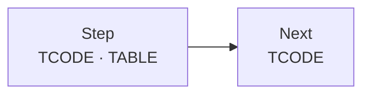
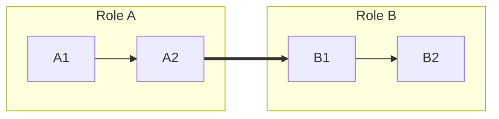
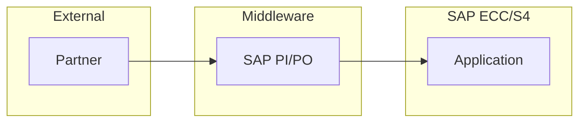
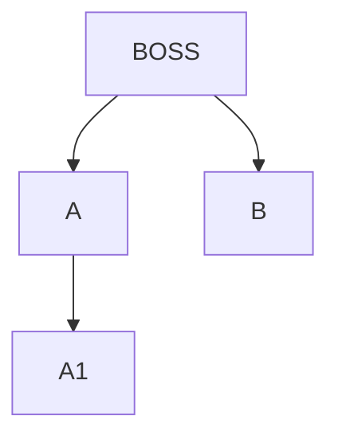
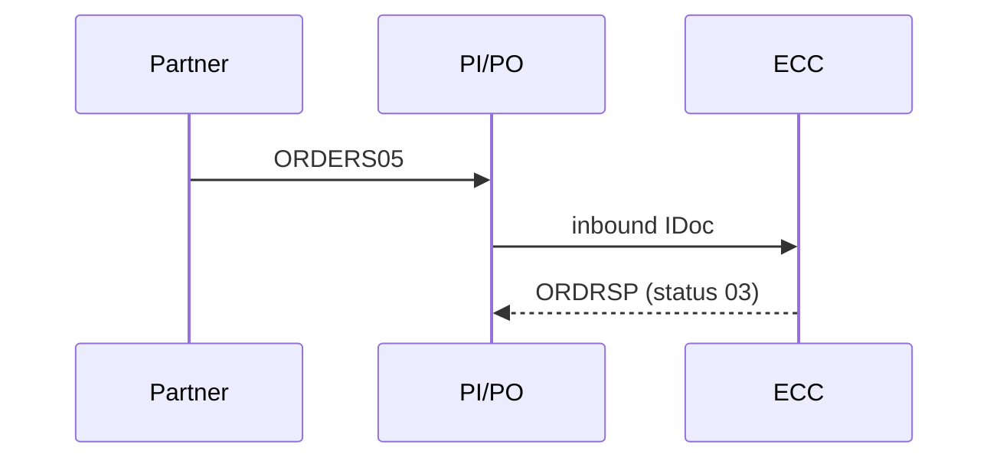
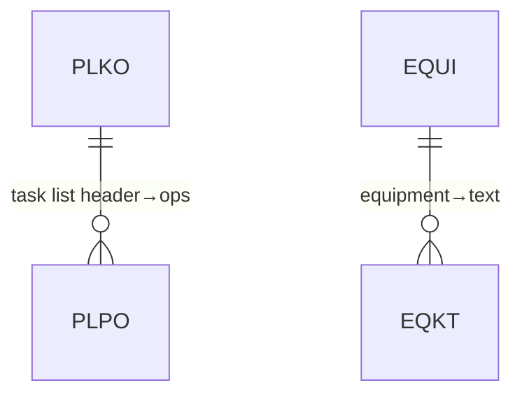

# Mermaid SAP Templates — Reference

Ready-to-render snippets. SAP color tiers:
`classDef ecc fill:#0a6ed1` · `s4 fill:#d62027` · `middleware fill:#6a737d` · `external fill:#107e3e` (white text).

## Flowchart / Process Map (value stream)

Use `LR` for OTC / PTP value streams, `TD` for hierarchy.

## Swimlane (true horizontal lanes)

Rule: **top-level `LR` + each subgraph `direction TB`** = lanes side-by-side. A top-level `TB` collapses lanes into one vertical column.

## Architecture (tiered subgraphs)


## Org Chart


## Sequence (IDoc handshake)


## ER (table relations)


## Render
```bash
bash scripts/render.sh src/file.mmd out/file.svg          # one
bash scripts/render.sh --all src/ out/                     # batch → svg+png
# themes: default | neutral | dark | forest | base
```
Export formats: **SVG** (vector), **PNG** (`-s` DPI scale), **PDF** (`-f` fit), **md** (inlined SVG).
