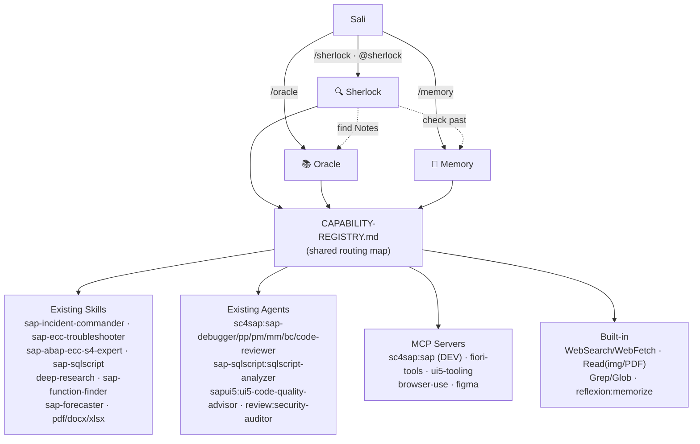

# Flagship Agents — Architecture & Documentation

> **Top layer: `/hq` (SAP Headquarters).** As of 2026-07-23 the single main entry point is `hq`, which sits ABOVE
> Sherlock/Oracle/Memory. Sali types only `/hq <request>`; HQ classifies → health-checks → routes to the right
> manager(s) → returns one short **HQ Summary**. `/sherlock`, `/oracle`, `/memory` remain directly usable
> (backward compatible). HQ adds no plugins/MCP and does not modify the three managers — see `hq/SKILL.md`,
> `hq/CAPABILITY-REGISTRY.md`, `hq/references/routing.md`.
>
> Layer order:  **`/hq`  →  Sherlock | Oracle | Memory  →  internal workers (plugins/skills/agents/MCP/hooks)**

Three orchestrators — **Sherlock** (investigate), **Oracle** (research), **Memory** (recall) — are the **TOP LAYER
and sole user-facing entry points** of the whole SAP environment. Sali interacts only with `/sherlock`, `/oracle`,
`/memory`. Every other capability (46 plugins, ~275 skills, 61 agents, 14 MCP, all hooks) is an **invisible internal
worker** invoked silently behind the scenes. The flagships classify the request, decide which *existing* worker to
run, run it, and return a fixed-format deliverable. They never re-implement anything — see `CAPABILITY-REGISTRY.md`.

Each flagship carries its **own `CAPABILITY-REGISTRY.md`** (scoped worker list + fallback chains) and follows the
shared **`HEALTH-FALLBACK.md`** protocol:
- **Health check** — `scripts/healthcheck.sh` (read-only) probes every internal worker + MCP before use.
- **Fallback** — each capability has an ordered chain; an ❌/failed worker auto-switches to the next; the last link
  is always a built-in, so tasks never dead-end.
- **Explain Mode** — every task ends with a 🔬 Explain block: which workers ran, why, and which fell back.

## System diagram



## Workflow (all three share the shape)

```
INTAKE            → accept any format (screenshot, ST22/SM37/SM58 text, IDoc XML, JSON,
                     Excel/Word/PDF, email, Jira/ALM export)  [Read, pdf, docx, xlsx]
CLASSIFY          → module (PP/PP-PI/PM/MM/…), fault type, severity, involved components
DECIDE (route)    → pick existing skills/agents/MCP from CAPABILITY-REGISTRY.md
                     (need SAP MCP? browser? debugger? SQLScript? ABAP? UI5? integration?)
EXECUTE           → run them; dispatch deep-dives via Agent tool, knowledge via Skill tool
SYNTHESIZE        → return the flagship's fixed output template
```

## The three flagships

### 🔍 Sherlock — Incident Investigation lead
- **When:** any SAP incident/fault/dump/queue-stall/IDoc/interface/auth/performance problem, or an artifact dump.
- **When NOT:** pure "how do I write X" (that's build-time → `sap-abap-ecc-s4-expert`), or knowledge lookup (→ Oracle).
- **Delegates to:** `sap-incident-commander` (primary RCA), `sap-ecc-troubleshooter`, sc4sap module/debug agents,
  `sap-sqlscript:sqlscript-analyzer`, `sapui5:ui5-code-quality-advisor`; calls **Memory** for prior incidents and
  **Oracle** for SAP Notes.
- **Returns:** Executive Summary · Root Cause · Evidence · Investigation Timeline · Diagnostic Tree · Recommended
  Fix · Risks · Validation Steps · Follow-up Actions.

### 📚 Oracle — SAP knowledge brain
- **When:** find/compare SAP Notes/KBAs, release notes, best practices, simplification items, ECC-vs-S/4
  applicability, kernel/SP/upgrade need.
- **When NOT:** live-system diagnosis (→ Sherlock), recalling your own past work (→ Memory).
- **Delegates to:** `deep-research`, `WebSearch`/`WebFetch`, `sap-forecaster`, `sap-function-finder`,
  `sap-abap-ecc-s4-expert`, `sap-api-policy`.
- **Returns:** Knowledge Report · Summary · Relevant SAP Notes · Recommended Reading · Risks · Recommendations.

### 🧠 Memory — organizational knowledge base
- **When:** "did we solve this before?", recall past projects/incidents/runbooks/lessons, search saved SAP docs.
- **When NOT:** brand-new research (→ Oracle), live diagnosis (→ Sherlock).
- **Delegates to:** memory files (`~/.claude/projects/*/memory/*.md`), `Grep`/`Glob` over local SAP folders,
  `pdf`/`docx`/`xlsx`, `sap-document-intelligence`, `sap-israel-knowledge`; persists via `reflexion:memorize`.
- **Returns:** past-match report — when · how we fixed · what worked · what didn't · reuse recommendation.

## How they cooperate

A full incident often runs: **Sherlock** classifies → asks **Memory** "seen this before?" → if partial, asks
**Oracle** "any SAP Note?" → runs the diagnostic agents → synthesizes. Each flagship is independent and callable
alone; Sherlock is the natural entry point for incidents.

## Extending in future

- **Add a capability:** register it once in `CAPABILITY-REGISTRY.md`; all three see it immediately.
- **Add intake format:** add a parser row to the relevant flagship's `references/playbook.md`.
- **Add a flagship:** copy a skill folder, point it at the shared registry, give it a trigger + output template.
- **Connect live SAP:** once a DEV `sc4sap` profile is connected, Sherlock auto-gains the `mcp__plugin_sc4sap_sap__*`
  read tools — no code change needed (guarded read-only by the tier hook).

## Guardrails

No new plugins. No version updates without approval. No duplicated capability. `sc4sap:sap` MCP stays disconnected
until you approve a DEV connection. Existing agents/skills are never replaced — only invoked.
