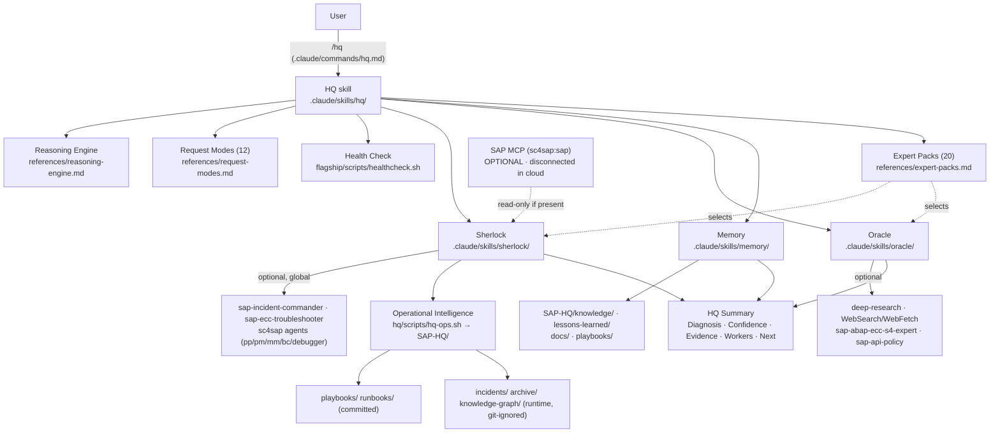

# SAP HQ — Dependency Graph (project-local)

How the single entry point `/hq` drives everything. All paths are repo-relative; nothing depends on a global
`~/.claude`. Missing workers are non-fatal (fallback to files / knowledge / pasted evidence / web).

## Who calls whom
| Caller | Calls | When | If unavailable |
|---|---|---|---|
| `/hq` command | HQ skill | every SAP request | — (required) |
| HQ | Reasoning Engine + Request Modes | always | — (in-repo) |
| HQ | Health Check | before dispatch | degrade to fallbacks |
| HQ | Sherlock | incidents/debug/interface/perf/auth | pasted-evidence reasoning |
| HQ | Oracle | knowledge/Note/design/migration/learning | WebSearch/WebFetch |
| HQ | Memory | "solved before?" / recall | Grep over SAP-HQ + docs |
| HQ | Expert Packs | auto-select domain | generic reasoning |
| Sherlock | global sc4sap agents / MCP | live SAP (local only) | file/pasted evidence, mark "דורש אימות" |
| Sherlock | hq-ops.sh | real incident | in-memory only |

## Portability contract
- Every reference inside the skills is repo-relative (`.claude/skills/...`, `SAP-HQ/...`).
- Scripts derive the repo root from `$CLAUDE_PROJECT_DIR` or their own location.
- `$HOME` appears only in **optional** global-worker probes inside `healthcheck.sh` — never as a required dependency.
- No MCP, no hooks, no secrets required for the core to run (cloud/phone safe).
