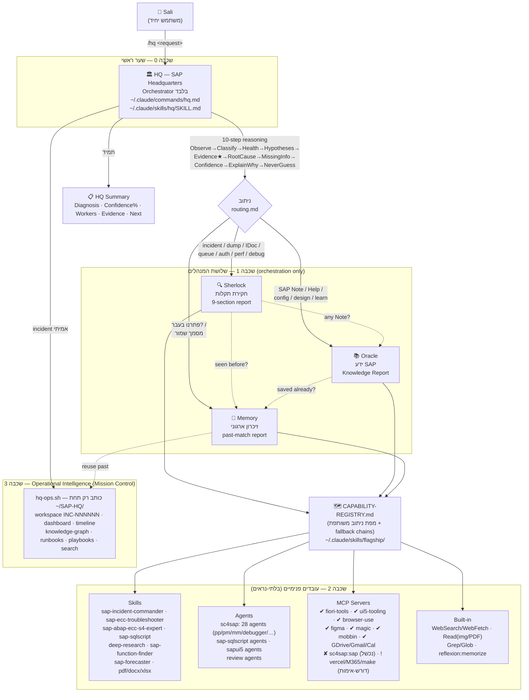

# ארכיטקטורת מערכת ה‑SAP AI

> **תאריך אימות המקור:** 2026‑07‑23 · מבוסס על `/tmp/sap-brain-facts.md` (SOURCE OF TRUTH) + קריאה ישירה (read‑only)
> של `~/.claude/skills/hq/`, `~/.claude/skills/{sherlock,oracle,memory}/`, ו‑`~/.claude/skills/flagship/ARCHITECTURE.md`.
> אין המצאת רכיב/גרסה/SAP Note/מספר. ערך שאינו מאומת מסומן **לא אומת**. הפרדה מפורשת בין
> **מותקן / פעיל / מחובר / דורש‑אימות / נכשל**.

---

## 1. תמונת‑על (למתחיל ב‑SAP AI)

המערכת בנויה **בשכבות**, וה"שער" היחיד שהמשתמש (Sali) נוגע בו הוא `/hq`. כל השאר בלתי‑נראה: HQ מסווג את הבקשה,
בודק בריאות, ומנתב לשלושת המנהלים — **Sherlock** (חקירה), **Oracle** (ידע), **Memory** (היסטוריה) — שבתורם מפעילים
עשרות "עובדים פנימיים" (תוספים, סקילים, סוכנים, MCP). המשתמש לעולם לא צריך לדעת איזה עובד רץ.

סדר השכבות (מקור: `flagship/ARCHITECTURE.md`, בלוק "Layer order"):

**`/hq` → Sherlock | Oracle | Memory → עובדים פנימיים (plugins/skills/agents/MCP/hooks)**

---

## 2. דיאגרמת Mermaid — הארכיטקטורה המלאה



---

## 3. דיאגרמת טקסט (fallback, ללא רינדור)

```
                              👤 Sali
                                │  "/hq <בקשה>"
                                ▼
        ┌───────────────────────────────────────────────┐
        │  שכבה 0 · 🏛️ HQ — SAP Headquarters            │
        │  Orchestrator בלבד (לא פותר בעצמו)             │
        │  commands/hq.md → skills/hq/SKILL.md           │
        │  שרשרת נימוק 10 שלבים + healthcheck read-only   │
        └───────────────────────────────────────────────┘
                                │ ניתוב (routing.md)
        ┌───────────────┬───────┴────────┬───────────────┐
        ▼               ▼                ▼
   🔍 Sherlock      📚 Oracle        🧠 Memory        ← שכבה 1 · שלושת המנהלים
   (חקירה)          (ידע)            (היסטוריה)          כולם orchestration-only
        │               │                │
        │  cross-calls: Sherlock→(Memory,Oracle) · Oracle→Memory
        └───────────────┴────────┬───────┘
                                 ▼
             🗺️ CAPABILITY-REGISTRY.md (מפה משותפת + fallback)
                                 │
        ┌───────────────┬────────┼────────┬───────────────┐
        ▼               ▼        ▼        ▼               ▼
     Skills          Agents    MCP     Built-in       ← שכבה 2 · עובדים פנימיים
  (incident-cmdr,  (sc4sap 28, (fiori✔  (WebSearch,      (בלתי-נראים)
   troubleshooter,  sqlscript,  ui5✔    Read, Grep,
   deep-research…)  ui5, review) browser✔ reflexion)
                              sc4sap:sap ✘ נכשל)
                                 │
                                 ▼
        ┌───────────────────────────────────────────────┐
        │  שכבה 3 · Operational Intelligence            │
        │  hq-ops.sh → ~/SAP-HQ/ (workspace/dashboard/   │
        │  timeline/graph/runbooks/playbooks/search)     │
        └───────────────────────────────────────────────┘
                                 │
                                 ▼
                        📋 HQ Summary (תמיד, קצר)
```

---

## 4. הסבר לפי שכבה

### שכבה 0 — `/hq` (SAP Headquarters)
- **סטטוס:** מותקן + פעיל. קובץ‑פקודה גלובלי יחיד (`~/.claude/commands/hq.md`, facts שורה 143) המפעיל את סקיל
  `~/.claude/skills/hq/SKILL.md`.
- **תפקיד:** Orchestrator בלבד — לא מאבחן, לא חוקר ולא נזכר בעצמו. מריץ שרשרת נימוק בת 10 שלבים
  (`references/reasoning-engine.md`): Observe → Classify → Health‑check → Build Hypotheses → Gather Evidence (★) →
  Root Cause → Missing‑Info Detector → Confidence → Explain‑Why → Never‑Guess.
- **בקרות בטיחות (Guardrails, מקור `hq/SKILL.md`):** orchestrator בלבד; אין תוספים/MCP חדשים; לא משנה את
  Sherlock/Oracle/Memory; `sc4sap:sap` נשאר מנותק ו‑HQ לעולם לא מחבר אותו; תואם‑לאחור ל‑`/sherlock`/`/oracle`/`/memory`.

### שכבה 1 — שלושת המנהלים (orchestration only)
כולם סקילים גלובליים שמסווגים ומנתבים ל‑workers קיימים לפי `CAPABILITY-REGISTRY.md`, ומחזירים תבנית פלט קבועה.
- **🔍 Sherlock** — חקירת תקלות (dumps, IDoc/queue, ממשקים, הרשאות, ביצועים, debug). מחזיר דוח בן 9 מקטעים. מקור:
  `sherlock/SKILL.md`.
- **📚 Oracle** — ידע SAP (Notes/KBA/Help/Community/Release Notes/התאמת ECC↔S/4). מחזיר Knowledge Report. מקור:
  `oracle/SKILL.md`.
- **🧠 Memory** — זיכרון ארגוני (פתרנו בעבר? runbooks/lessons/מסמכים שמורים). מחזיר past‑match report. מקור:
  `memory/SKILL.md`.

### שכבה 2 — עובדים פנימיים (בלתי‑נראים)
מקור: `flagship/ARCHITECTURE.md` + facts (ספירת רכיבים per‑plugin, שורות 88–134). כוללת:
- **Skills:** `sap-incident-commander`, `sap-ecc-troubleshooter`, `sap-abap-ecc-s4-expert`, `sap-sqlscript`,
  `deep-research`, `sap-function-finder`, `sap-forecaster`, `pdf/docx/xlsx`.
- **Agents:** `sc4sap` **28 סוכנים** (facts שורות 126, 136–137) כולל `sap-pp-consultant`/`sap-pm-consultant`/
  `sap-debugger`/`sap-code-reviewer`; סוכני `sap-sqlscript`, `sapui5`, `review`.
- **MCP (סטטוס מדויק, facts שורות 71–86):**
  - **מחובר (✔):** Google Drive, Gmail, Google Calendar, `figma`, `fiori-tools`, `ui5-tooling`, `magic`, `mobbin`,
    `browser-use`.
  - **דורש‑אימות (!):** Microsoft 365, Make, `vercel`.
  - **נכשל (✘):** **`plugin:sc4sap:sap`** — Failed to connect (facts שורות 80, 191). **לא מחובר.**
  - **ממתין לאישור (⏸):** `pptxgenjs` (Pending approval, facts שורה 86).
- **Built‑in:** `WebSearch`/`WebFetch`, `Read` (תמונה/PDF), `Grep`/`Glob`, `reflexion:memorize`.

### שכבה 3 — Operational Intelligence (Mission Control)
מקור: `hq/SKILL.md` (בלוק Phase 3) + `references/operational-intelligence.md`. מנוע: `~/.claude/skills/hq/scripts/hq-ops.sh`,
שכותב **רק** תחת `~/SAP-HQ/`. עבור תקרית אמיתית HQ פותח workspace (`INC-NNNNNN`), מנהל dashboard חי, timeline,
knowledge‑graph, runbooks, playbooks, ו‑`search`. שכבה זו **מתעדת ומארגנת בלבד** — אינה משנה את הנימוק או המנהלים.
מצב נוכחי (facts שורות 176–179): `~/SAP-HQ/playbooks` = 0, `incidents` = 2.

---

## 5. טבלת "מי‑קורא‑למי" (who‑calls‑whom)

| מקור (Caller) | יעד (Callee) | סוג הקריאה | טריגר | מקור |
|---|---|---|---|---|
| Sali | `/hq` | כניסה ידנית | כל בקשת SAP | facts 143; `hq/SKILL.md` |
| HQ | healthcheck.sh | קריאה read‑only | שלב 3 בשרשרת | `hq/SKILL.md`; `flagship/scripts/healthcheck.sh` |
| HQ | Sherlock | dispatch (Skill tool) | incident/dump/IDoc/queue/auth/perf/debug | `routing.md` |
| HQ | Oracle | dispatch (Skill tool) | SAP Note/config/design/ABAP how‑to/learning | `routing.md` |
| HQ | Memory | dispatch (Skill tool) | "פתרנו בעבר?" / מסמך שמור | `routing.md` |
| HQ | hq-ops.sh | ריצת mission (incident אמיתי) | פתיחת workspace/timeline/graph/search | `hq/SKILL.md` Phase 3 |
| Sherlock | Memory | cross‑call | "נראה בעבר?" | `hq/SKILL.md` Cross‑call rules; `ARCHITECTURE.md` |
| Sherlock | Oracle | cross‑call | "יש SAP Note?" | כנ"ל |
| Oracle | Memory | cross‑call | "כבר שמור אצלנו?" | כנ"ל |
| Memory | (מחזיר ידע) | תשובה | לכל אחד מהמנהלים | כנ"ל |
| Sherlock/Oracle/Memory | CAPABILITY‑REGISTRY | קריאת מפת ניתוב | לפני הפעלת worker | `ARCHITECTURE.md` |
| מנהלים | Skills/Agents/MCP/Built‑in | dispatch (Skill/Agent tool) | לפי הרישום ב‑registry + fallback chain | `ARCHITECTURE.md`; `HEALTH-FALLBACK.md` |
| מנהל כלשהו | fallback הבא בשרשרת | אוטומטי | worker/MCP ❌ (למשל `sc4sap:sap` נכשל) → נופל ל"ראיות מודבקות" | facts 80,191; `HEALTH-FALLBACK.md` |
| HQ | Sali | פלט | **HQ Summary** בסוף כל בקשה | `hq/SKILL.md` |

---

## 6. עקרונות‑על שנשמרו (הצהרת יושרה)

- **הפרדת סטטוסים:** MCP `plugin:sc4sap:sap` מסומן במפורש **נכשל/מנותק** בכל מקום (facts 80, 191); לעולם לא מסומן
  כמחובר. HQ אינו מחבר SAP.
- **מותקן ≠ מחובר:** תוספי SAP רבים מותקנים (facts 4–54), אך רק חלק מה‑MCP מחובר בפועל (facts 71–86); שאר מסומנים
  דורש‑אימות/ממתין/נכשל בהתאמה.
- **ללא סודות:** אין הצגת טוקנים/סיסמאות/פרטי חיבור.
- **ללא המצאה:** לא הומצאו רכיבים, גרסאות, SAP Notes או מספרים. כל ערך לא‑ודאי סומן **לא אומת**.
- **read‑only:** לא בוצע חיבור/התקנה/עדכון/מחיקה/commit/push; הבנייה התבצעה מ‑facts + קריאה בלבד.

---

*מסמך זה הוא חלק ממערך "SAP AI Brain". קובץ אחות: `SAP_COMMANDS_CATALOG.md` (קטלוג הפקודות המלא).*
