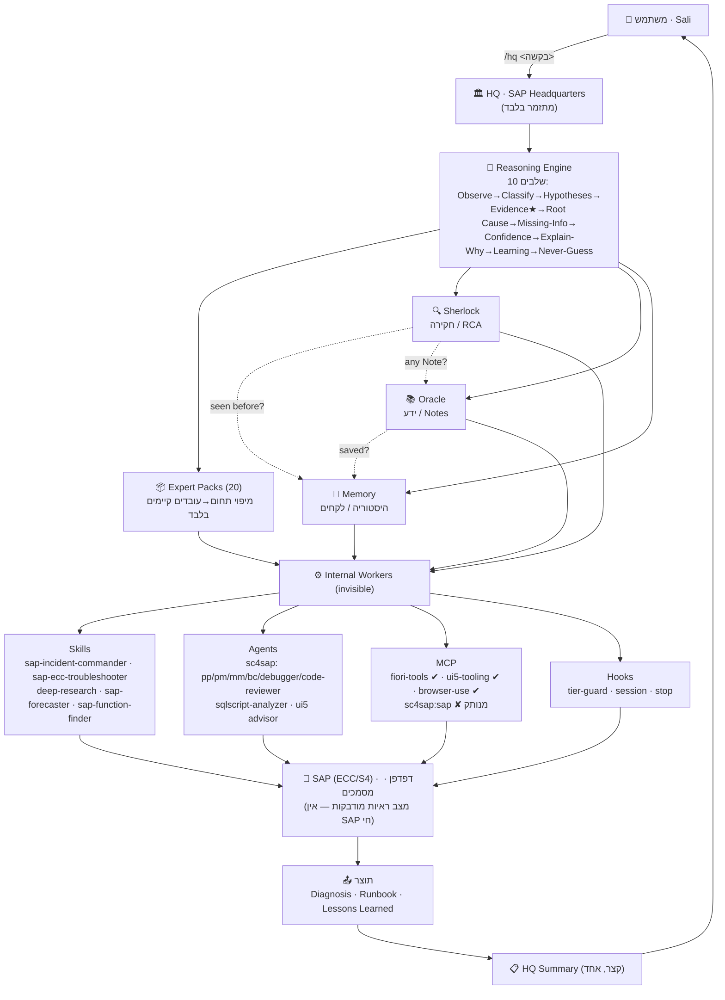

# דוח־על: מערכת ה־SAP AI (SAP AI System Master Report)

> מסמך זה הוא ה"מוח" של מערכת ה־SAP AI. הוא מסביר, ברמה שמתאימה גם למי שרק מתחיל ב־SAP וגם למהנדס מנוסה,
> מהי המערכת, איך היא בנויה, מי מפעיל את מי, מה עובד היום באמת ומה מחכה לחיבור SAP חי.
>
> **תאריך המסמך:** 2026-07-23
> **מקור העובדות:** `/tmp/sap-brain-facts.md` (SNAPSHOT מאומת) + קריאה ישירה (קריאה בלבד) של קבצי המערכת תחת
> `~/.claude/skills/hq/`, `~/.claude/skills/{sherlock,oracle,memory,flagship}/` ו־`~/.claude/skills/hq/references/`.
> כל עובדה מצוינת עם מקורה. ערך שלא אומת נכתב במפורש כ"לא אומת".
>
> **הבהרת מצב קריטית:** רכיב ה־MCP‏ `plugin:sc4sap:sap` נמצא במצב **נכשל / מנותק** (Failed to connect). המערכת
> אינה מחוברת ל־SAP חי; היא עובדת במצב **ראיות מודבקות** (pasted evidence). המסמך לא מציג אף רכיב מנותק כ"מחובר".

---

## 1. תקציר מנהלים (Executive Summary)

### מהי מערכת ה־SAP AI ומה מטרתה
מערכת ה־SAP AI היא סביבת עבודה חכמה שנבנתה סביב Claude Code כדי לתת ל־Sali Halif יועץ SAP בכיר וירטואלי,
שמלווה אותו יום־יום בעבודה מול סביבות **ECC6** ו־**S/4HANA On‑Premise**, בדגש על **PP / PP‑PI / PM / ממשקים
(Interfaces) ופתרון תקלות (Troubleshooting)**. המערכת לא מחליפה את ה־SAP עצמו — היא שכבת תבונה שמעליו: היא
מסווגת בקשות, בונה השערות, אוספת ראיות מדורגות, מגיעה לשורש הבעיה (Root Cause), ומחזירה תשובה מוסברת עם רמת
ביטחון. הכול בעברית מקצועית, ברורה גם למתחיל.

### הערך היום־יומי
- **תקלות (Incidents):** לוקחים דאמפ מ־ST22, IDoc בסטטוס 51, חסימת הרשאה ב־SU53 או תור תקוע ב־SMQ2 — והמערכת
  מנהלת חקירה מסודרת עד שורש הבעיה, במקום ניחוש.
- **ידע (Knowledge):** חיפוש והסבר של SAP Notes / KBAs, תוכן SAP Help, שאלות תכנון (Design/Architecture), קונפיגורציה
  ו־ABAP — תמיד עם ציון תחולה ל־ECC מול S/4HANA.
- **זיכרון ארגוני (Memory):** "האם כבר פתרנו את זה?" — התאמה מול פרויקטים, תקלות ולקחים קודמים לפני שמתחילים מאפס.
- **למידה (Learning):** הסבר שלב־אחר־שלב, טבלאות/טרנזקציות/BAPI/FM/IDoc, השוואת ECC מול S/4HANA — כמו מנטור סבלני.

### מה ייחודי במערכת
1. **נקודת כניסה אחת — HQ.** Sali מדבר רק עם HQ; הוא לא צריך לדעת איזה agent/skill/MCP/hook רץ מאחורי הקלעים.
2. **מנוע חשיבה, לא רק ניתוב.** כל בקשה עוברת שרשרת חשיבה של יועץ בכיר בת 10 שלבים (Observe → Classify →
   Hypotheses → Evidence ★ → Root Cause → Missing‑Info → Confidence → Explain‑Why → Learning → Never‑Guess).
3. **מדיניות Never‑Guess.** ביטחון מתחת ל־70% לא מוצג כפתרון ודאי; מתחת ל־50% המערכת אומרת מפורש "אני צריך עוד
   ראיות" ומבקשת בדיוק את החומר החסר.
4. **אפס המצאות.** Oracle לעולם לא ממציא מספרי Note/KBA; כל טענה עובדתית מצוטטת או מסומנת "לא נמצא מקור".
5. **שקיפות (Explain Mode).** כל משימה מסתיימת בבלוק 🔬 Explain שמראה אילו עובדים פנימיים רצו, למה, ומה נפל ל־fallback.
6. **שימוש חוזר בלבד.** אין יצירת רכיבים חדשים — כל "Expert Pack" ממפה תחום לעובדים קיימים בלבד.

### כיסוי (Coverage)
מודולים בדגש: **PP, PP‑PI, PM** (ליבה), וכן MM, SD, FI, CO, QM; רוחב טכני: ABAP, הרשאות, IDOC, Gateway/OData,
Fiori/UI5, Workflow, Performance, Basis, PI/PO, BTP; סביבות: **ECC6** ו־**S/4HANA On‑Premise** (כולל דלתא מעבר
ECC→S/4). למידה, תכנון, קונפיגורציה וניתוח מסמכים נכללים גם הם.

### מהו HQ ולמה הוא נקודת הכניסה
**HQ (SAP Headquarters)** הוא ה"מטה" — נקודת הכניסה היחידה והראשית לכל המערכת, מופעל ב־`/hq`. HQ הוא **מתזמר
(orchestrator) בלבד — הוא אף פעם לא פותר בעצמו**. הוא מסווג את הבקשה, מריץ בדיקת בריאות (health check), בוחר
Expert Packs, ומנתב לשלושת המנהלים — **Sherlock** (חקירה), **Oracle** (ידע), **Memory** (היסטוריה) — ומחזיר
**HQ Summary** קצר אחד. תאימות לאחור נשמרת: `/sherlock`, `/oracle`, `/memory` עדיין עובדים ישירות; HQ הוא שכבה מעליהם.
(מקור: `hq/SKILL.md`, `flagship/ARCHITECTURE.md`.)

### מה עובד היום מול מה שדורש חיבור SAP אמיתי
- **עובד היום (ללא SAP חי):** כל שרשרת החשיבה, סיווג, בניית השערות, מנוע הביטחון, מדיניות Never‑Guess; מחקר ידע
  (Oracle) דרך WebSearch/WebFetch/deep‑research; זיכרון (Memory) דרך קבצים מקומיים; חקירת תקלות (Sherlock) על בסיס
  **ראיות מודבקות** (טקסט של ST22/SM58/IDoc/XML, צילומי מסך). ה־health check ו־Explain רצים.
- **דורש חיבור SAP אמיתי (לא זמין כרגע):** משיכה חיה של לוגים/טבלאות ישירות מ־SAP דרך `sc4sap:sap` MCP —
  **מנותק/נכשל**. עד לחיבור DEV מאושר, אין קריאה חיה מהמערכת; עובדים מ־Evidence מודבקות. HQ לעולם לא מחבר אותו.

### מספרים נוכחיים (CURRENT NUMBERS)
| מדד | ערך | מקור |
|---|---:|---|
| Plugins (סה"כ מותקנים) | **48** | `installed_plugins.json` |
| מתוכם Plugins של SAP | **20** | ספירת `sap-*` + `sc4sap` |
| Skills (מ־plugins, מצטבר) | **~275** | `flagship/ARCHITECTURE.md` (ספירה מצטברת) |
| Agents (מ־plugins, מצטבר) | **61** | `flagship/ARCHITECTURE.md` |
| Commands גלובליים (`~/.claude/commands`) | **1** (`hq.md`) | snapshot |
| MCP servers (רשומים ב־`claude mcp list`) | **14** | snapshot MCP |
| Hooks (סוגי אירועים ב־`settings.json`) | **20 סוגי אירועים** | snapshot user hooks |
| Marketplaces | **13** | `known_marketplaces.json` |
| Skills מותאמים־אישית (`~/.claude/skills`) | **~50** | snapshot custom skills |
| Expert Packs | **20** | `hq/references/expert-packs.md` |
| Playbooks (`~/SAP-HQ/playbooks`) | **0** | snapshot |
| Incidents (`~/SAP-HQ/incidents`) | **2** | snapshot |

> הערה על ספירות: מספרי ה־Skills/Agents ה"מצטברים" הם ספירה כוללת של כל ה־plugins המותקנים כפי שמצוין ב־
> `flagship/ARCHITECTURE.md` (~275 skills, 61 agents). מספר ה־Plugins המדויק ב־snapshot הוא **48** (לא 46 שמופיע
> בטקסט הישן שבתוך ARCHITECTURE.md) — עדיפות למספר המאומת מה־snapshot. ה־MCP הרשומים הם 14 שרתים; מתוכם חלק
> **מחוברים**, חלק **דורשים אימות**, ואחד (`sc4sap:sap`) **נכשל** — הפירוט בסעיף 5.

---

## 2. ארכיטקטורה כללית (System Architecture)

הארכיטקטורה בנויה בשכבות. Sali נכנס מלמעלה דרך `/hq`. HQ מפעיל את **מנוע החשיבה** (10 שלבים), בוחר **Expert Packs**
(מיפוי תחום→עובדים קיימים), ומנתב לשלושת המנהלים — **Sherlock / Oracle / Memory**. כל מנהל מפעיל בשקט **עובדים
פנימיים** (skills / agents / MCP / hooks), שמדברים עם SAP / דפדפן / מסמכים. התוצר החוזר הוא **אבחון + Runbook +
לקחים**, ולבסוף **HQ Summary** אחד קצר. כל השכבות התחתונות בלתי־נראות למשתמש — הן נחשפות רק בבלוק ה־Explain.

### מי קורא למי (Who calls whom)
| קורא (Caller) | נקרא (Callee) | מתי / למה |
|---|---|---|
| משתמש (Sali) | **HQ** (`/hq`) | כל בקשת SAP — נקודת הכניסה היחידה |
| **HQ** | Reasoning Engine | על כל בקשה — שרשרת 10 השלבים |
| **HQ** | Expert Packs | בחירת חבילת התחום אוטומטית לפי הסיווג |
| **HQ** | Sherlock / Oracle / Memory | ניתוב לפי הסיווג (מטריצת `routing.md`) |
| **HQ** | `healthcheck.sh` | לפני כל דיספאץ' — לראות אילו עובדים למעלה |
| **Sherlock** | Memory | "האם כבר ראינו את זה?" (cross‑call) |
| **Sherlock** | Oracle | "האם יש SAP Note?" (cross‑call) |
| **Oracle** | Memory | "האם זה שמור אצלנו?" (cross‑call) |
| **Sherlock / Oracle / Memory** | Internal Workers | דרך `Skill` / `Agent` / MCP — בשקט |
| כל המנהלים | Built‑in fallback | החוליה האחרונה בכל שרשרת (WebSearch/Grep/pasted‑evidence) |
| **HQ** | המשתמש | HQ Summary אחד בלבד (דוח מלא לפי בקשה) |

(מקורות: `hq/SKILL.md` §"Cross‑call rules", `hq/references/routing.md`, `flagship/ARCHITECTURE.md`.)

---

## 3. פרק HQ — המטה (SAP Headquarters)

**שם:** SAP Headquarters · **הפעלה:** `/hq` (וכן `@hq`, `hq`) · **תפקיד:** מתזמר בלבד — לא פותר בעצמו.
**מנהל:** Sherlock, Oracle, Memory. **גרסה:** 1.0.0. (מקור: `hq/SKILL.md`.)

HQ חושב כמו יועץ SAP בכיר. הוא לא קופץ לפתרון. להלן היכולות המרכזיות:

- **Classify (סיווג):** מתייג את סוג הבעיה — Incident · Configuration · Development · Authorization · Performance ·
  Interface · IDOC · PI/PO · Gateway · Fiori · HANA · Master Data · Business Process. הסיווג מכתיב מה לבקש ולאן לנתב.
- **Health check:** מריץ `bash ~/.claude/skills/flagship/scripts/healthcheck.sh` (קריאה בלבד) לפני כל דיספאץ';
  עובד ❌ → המנהלים עוברים ל־fallback. `sc4sap:sap` מסומן ❌ → מצב ראיות מודבקות.
- **Expert‑pack selection:** בוחר אוטומטית את חבילת התחום (מתוך 20) לפי הסיווג. Sali לעולם לא בוחר.
- **Dispatch:** מנתב ל־Sherlock / Oracle / Memory (או שילוב) דרך כלי `Skill`; לעולם לא משכפל את עבודתם.
- **Fallback:** לכל יכולת שרשרת גיבוי מסודרת; החוליה האחרונה תמיד built‑in, כך שמשימה לא נתקעת אף פעם.
- **Explain mode:** כל משימה נחתמת בבלוק 🔬 Explain — מי רץ, למה, מה נפל ל־fallback, ומה לא נוצל (למשל `sc4sap:sap` — מנותק).
- **Confidence engine:** מחשב אחוז ביטחון מאיכות הראיות ומסביר אותו (90‑100 / 70‑89 / 50‑69 / <50).
- **Never‑Guess:** ביטחון <70% → לא מוצג כוודאי; <50% → "אני צריך עוד ראיות" + בקשת החומר המדויק.
- **Missing‑info detector:** אם אין מספיק ראיות — מבקש בדיוק את הארטיפקטים לפי סוג הבעיה (ST22 dump‑id, SU53, WE02
  + מספר IDoc, payload, וכו'), בלי לנחש.
- **Workspace / Timeline / Runbook / Knowledge graph / Lessons / Knowledge evolution:** שכבת ה־Operational
  Intelligence (Phase 3) — לכל תקלה אמיתית נפתח workspace תחת `~/SAP-HQ/` דרך `hq-ops.sh new`, עם timeline,
  dashboard חי, runbook אוטומטי, knowledge graph (`graph.md`), lessons‑learned, ובסוף — **Reusable Playbook**
  שמאיץ את התקלה הבאה. (מקורות: `operational-intelligence.md`, `knowledge-evolution.md`.)

### 12 מצבי הבקשה (Request Modes)
HQ מזהה אוטומטית את סוג הבקשה ומתאים את ההתנהגות. (מקור: `hq/references/request-modes.md`.)

| # | מצב (Mode) | טריגר (Trigger) | עובדים (Workers) | פלט (Output) | דוגמה |
|---|---|---|---|---|---|
| 1 | **Incident** | תקלה/דאמפ/תקוע/error/"תחקור" + tcode+status | **Sherlock** (+ Memory, Oracle) | RCA אינטראקטיבי + workspace | `/hq יש לי IDOC 51` |
| 2 | **Learning** | "תסביר", "מה זה", "איך עובד", "למד אותי" | **Oracle** (+Memory) | הסבר שלב־שלב + ECC↔S/4 + זרימה טקסטואלית | `/hq תסביר איך עובד backflush` |
| 3 | **Architecture** | "איך לתכנן", "ארכיטקטורה", עיצוב אינטגרציה | **Oracle** | תשובת תכנון ישירה + חבילות תחום | `/hq איך לתכנן ממשק IDoc ל־MES` |
| 4 | **Design** | עיצוב אובייקט/פתרון (CDS/RAP/interface) | **Oracle** (→ ABAP+OData) | הסבר עיצוב + אובייקטים | `/hq תכנן CDS view ל־PP order` |
| 5 | **SAP Note** | "מה אומר Note", מצא/השווה Notes/KBA | **Oracle** (+Memory) | Knowledge Report + מספרי Note מצוטטים | `/hq מה אומר Note על COGI` |
| 6 | **Business Process** | "איך עובד תהליך…", O2C/P2P/PP flow | **Oracle** (+Memory) | תיאור תהליך + זרימה | `/hq איך עובד תהליך O2C` |
| 7 | **Interview** | "תראיין אותי", תרגול Q&A | **HQ‑led** (+Oracle) | תרגול שאלות ותשובות | `/hq תראיין אותי על PP‑PI` |
| 8 | **Migration ECC→S/4** | "מעבר ל־S/4", simplification, impact | **Oracle** (+ sap‑forecaster) | ניתוח השפעה + פריטי simplification | `/hq מה ההשפעה של מעבר על PM` |
| 9 | **Development** | כתוב/איך ABAP/CDS/OData/BAPI/FM | **Oracle** (ABAP+OData) | הדרכת פיתוח + דוגמאות | `/hq איך לכתוב BAPI ל־GR` |
| 10 | **Performance Review** | נתח/שפר ביצועים | **Sherlock** (אם חי) / Oracle | ניתוח ביצועים | `/hq למה COHV איטי` |
| 11 | **Authorization Analysis** | תפקידים/עיצוב הרשאות או חסימה חיה | **Sherlock** (חי) / Oracle | ניתוח הרשאות | `/hq המשתמש חסום ב־MIRO (SU53)` |
| 12 | **Configuration Help** | "איך להגדיר…", SPRO/customizing | **Oracle** | הדרכת קונפיגורציה + צומת SPRO | `/hq איך מגדירים partner profile` |

**כללי מצבים:** בקשה עמומה בצורת תקלה → **Incident** (Interactive Mode). מצבי ידע (2‑9, 12) → תשובה ישירה דרך
Oracle + Expert Packs, ללא פתיחת workspace וללא Missing‑Info gate. Incident בלבד פותח workspace ומריץ את השער.

### מצב חקירה אינטראקטיבי (ברירת מחדל לתקלה חדשה)
HQ מתנהג כמו יועץ בכיר, לא כמחולל דוחות: (1) Observe+Classify בשקט; (2) תשובה קצרה בעברית — **מה אני רואה**
(שורה) + **הפריטים המינימליים החסרים** (רק 2‑4 שמשנים את האבחון), ואז **עוצר ומחכה**; (3) כשמגיעה תשובה —
משלב, ואם צריך שואל שאלה ממוקדת אחת נוספת, אחרת מריץ Sherlock → Oracle (אם צריך) → Memory ובונה RCA;
(4) מסביר את ה־RCA בשש תשובות: **מה קרה · למה · איך הוכחנו · סיכון · פתרון · מניעה עתידית**;
(5) מציע לשמור ל־Memory עם Lessons Learned (רק באישור Sali). (מקור: `hq/SKILL.md`.)

---

## 4. פרקי המנהלים — Sherlock · Oracle · Memory

שלושת המנהלים הם השכבה שמתחת ל־HQ, וגם נקודות כניסה ישירות (`/sherlock`, `/oracle`, `/memory`). כל אחד הוא
**מתזמר בלבד** — לא משכפל עבודה, מנתב לעובדים קיימים, מריץ health‑check + fallback, וחותם ב־🔬 Explain.

### 🔍 Sherlock — ראש חקירת התקלות (Incident Investigation Lead)
**תפקיד:** חקירה של כל תקלה/דאמפ/תור תקוע/IDoc/ממשק/הרשאה/ביצועים, או כל ארטיפקט אבחון שנמסר.
**איך זה עובד:** חמישה שלבים קבועים — **INTAKE** (קליטת כל פורמט: צילום מסך, טקסט ST22/SM58/IDoc, XML/JSON,
Excel/Word/PDF) → **CLASSIFY** (מודול, סוג תקלה, חומרה, רכיבים) → **DECIDE** (בחירת יכולות קיימות) →
**EXECUTE** (דיספאץ' ל־`sap-incident-commander`/`sap-ecc-troubleshooter`, סוכני sc4sap, קריאה ל־Memory/Oracle) →
**SYNTHESIZE**. **פלט קבוע — 9 סעיפים:** Executive Summary · Root Cause · Evidence · Investigation Timeline ·
Diagnostic Tree · Recommended Fix · Risks · Validation Steps · Follow‑up Actions, ואחריהם בלוק 🔬 Explain.
**מצב ראיות:** `sc4sap:sap` מנותק → עובד מ־Evidence מודבקות; אף פעם לא מחבר אותו ולא כותב ל־SAP. (מקור: `sherlock/SKILL.md`.)

### 📚 Oracle — מוח הידע (SAP Knowledge Brain)
**תפקיד:** למצוא ולהסביר ידע SAP — Notes, KBAs, SAP Help, Community, Release Notes, Best Practices, Simplification,
Migration Guides, Clean Core / ABAP Cloud, SAP Learning. **איך זה עובד:** CLARIFY → ROUTE (deep‑research לרוחב,
WebSearch/WebFetch לחיפוש ממוקד ב־help.sap.com/me.sap.com/community.sap.com, sap‑forecaster למעבר S/4,
sap‑function‑finder לאובייקט→דוק, sap‑abap‑ecc‑s4‑expert ל־ECC‑מול‑S/4, sap‑api‑policy לחוקיות API) →
CORRELATE (קישור Notes, פתרון supersessions, השוואת גרסאות) → SYNTHESIZE. **פלט קבוע — Knowledge Report:**
כותרת/scope · Summary · Relevant SAP Notes/KBAs (מספר, כותרת, תחולה ECC/S4, קישור) · Recommended Reading · Risks ·
Recommendations, ואחריהם 🔬 Explain. לכל ממצא מציין: מתאים ל־ECC? ל־S/4HANA? אילו releases/SP? דורש Kernel/SP/Upgrade?

> **דיסציפלינת Oracle (קריטי):** Oracle **לעולם לא ממציא מספרי Note/KBA** או טענות גרסה. כל טענה עובדתית מצוטטת
> עם מקור מדויק (מספר Note/KBA, URL) — ואם אין, נכתב מפורש **"לא נמצא מקור מוודא"**. (מקור: `oracle/SKILL.md`.)

### 🧠 Memory — הזיכרון הארגוני (Organizational Knowledge Base)
**תפקיד:** לזכור מה כבר נעשה/נפתר — "האם כבר פתרנו את זה?", פרויקטים/תקלות/runbooks/לקחים/Notes שמורים.
**איך זה עובד:** UNDERSTAND → SEARCH (מערכת הזיכרון `~/.claude/projects/*/memory/*.md`; Grep/Glob על תיקיות SAP
מקומיות; מסמכים דרך pdf/docx/xlsx, sap‑document‑intelligence, sap‑israel‑knowledge) → MATCH (דירוג לפי דמיון) →
REPORT → CAPTURE (אופציונלי, דרך `reflexion:memorize`, רק באישור). **פלט קבוע לכל התאמה:** מתי · איך פתרנו ·
מה עבד · מה לא עבד · האם כדאי להשתמש שוב (כן/להתאים/לא) + למה. אם אין התאמה — אומר "לא נמצא מקרה דומה בזיכרון"
ומציע לנתב ל־Oracle/Sherlock. **קריאה בלבד** כברירת מחדל; לא מוחק/משנה ידע. (מקור: `memory/SKILL.md`.)

---

## 5. אבטחה, מגבלות ומצב נוכחי

### עקרונות אבטחה ומגבלות
- **מתזמר בלבד, אפס שכפול:** HQ לא בונה יכולות חדשות; מנתב לקיימות. אין plugins/MCP/agents חדשים.
- **קריאה בלבד כברירת מחדל:** health‑check קריא בלבד; Memory לא מוחק; כתיבה רק באישור מפורש של Sali.
- **אין חיבור SAP, אין setup/install/update/delete/commit/push:** המערכת לא מבצעת פעולות אלה.
- **סודות:** לעולם לא מוצגים סיסמאות/טוקנים/secrets.
- **הפרדת מצבים ברורה:** מותקן ≠ פעיל ≠ מחובר ≠ דורש‑אימות ≠ נכשל.
- **Never‑Guess:** אין הצגת פתרון כוודאי מתחת ל־70% ביטחון; אין המצאת מספרי Note/KBA/גרסה.
- **כתיבה מוגבלת ל־`~/SAP-HQ/`:** שכבת ה־Operational Intelligence כותבת רק שם; לא נוגעת בפרויקטים/core.

### הבהרות מצב קריטיות
- **`sc4sap:sap` MCP — מנותק (DISCONNECTED / Failed to connect).** אין גישה חיה ל־SAP. Fallback: **ראיות
  מודבקות** (pasted evidence). HQ ו־Sherlock לעולם לא מנסים לחבר אותו. (מקור: snapshot MCP + healthcheck.)
- **`auto-push.sh` — קיים אך לא רשום (EXISTS, NOT registered → dormant).** הקובץ קיים בפרויקט, אבל **אין project
  hooks רשומים** — כלומר הוא **רדום, אין auto push**. שום דחיפה אוטומטית לא מתרחשת. (מקור: snapshot `auto-push.sh state`.)

### טבלת מצב נוכחי (מותקן / פעיל / מחובר / נבדק / מוכן־לייצור)
| רכיב | מותקן | פעיל | מחובר | נבדק | מוכן לייצור | הערה |
|---|:--:|:--:|:--:|:--:|:--:|---|
| HQ (`/hq`) | ✅ | ✅ | — | ✅ | ✅ | מתזמר; נקודת כניסה יחידה |
| Sherlock / Oracle / Memory | ✅ | ✅ | — | ✅ | ✅ | מנהלים; עובדים על ראיות מודבקות |
| Reasoning Engine (10 שלבים) | ✅ | ✅ | — | ✅ | ✅ | רץ על כל בקשה |
| Expert Packs (20) | ✅ | ✅ | — | ✅ | ✅ | מיפוי לעובדים קיימים |
| `healthcheck.sh` | ✅ | ✅ | — | ✅ | ✅ | 24 workers up (snapshot) |
| MCP `fiori-tools` | ✅ | ✅ | ✅ מחובר | ✅ | ✅ | Connected |
| MCP `ui5-tooling` | ✅ | ✅ | ✅ מחובר | ✅ | ✅ | Connected |
| MCP `browser-use` | ✅ | ✅ | ✅ מחובר | ✅ | ✅ | Connected |
| MCP `magic` / `mobbin` | ✅ | ✅ | ✅ מחובר | ✅ | ✅ | Connected |
| MCP Google Drive/Gmail/Calendar | ✅ | ✅ | ✅ מחובר | ✅ | ✅ | Connected |
| MCP `figma` | ✅ | ✅ | ✅ מחובר | ✅ | ✅ | Connected |
| MCP `vercel` | ✅ | ⏸ | ⚠️ דורש אימות | — | — | Needs authentication |
| MCP Microsoft 365 / Make | ✅ | ⏸ | ⚠️ דורש אימות | — | — | Needs authentication |
| MCP `pptxgenjs` | ✅ | ⏸ | ⏸ ממתין לאישור | — | — | Pending approval |
| **MCP `sc4sap:sap`** | ✅ | ❌ | **✘ נכשל/מנותק** | ✅ נבדק (נכשל) | ❌ | **Fallback: ראיות מודבקות** |
| Operational Intelligence (`~/SAP-HQ/`) | ✅ | ✅ | — | ✅ | ✅ | incidents=2, playbooks=0 |
| `auto-push.sh` | ✅ קיים | ❌ | — | — | ❌ | **לא רשום → רדום, אין auto push** |

---

### נספח מקורות
כל העובדות במסמך נשענות על: `/tmp/sap-brain-facts.md` (snapshot מאומת 2026‑07‑23) וקריאה ישירה (קריאה בלבד) של
`~/.claude/skills/hq/SKILL.md`, `hq/references/{request-modes,reasoning-engine,expert-packs,routing,operational-intelligence,knowledge-evolution}.md`,
`~/.claude/skills/{sherlock,oracle,memory}/SKILL.md`, ו־`~/.claude/skills/flagship/{ARCHITECTURE,HEALTH-FALLBACK}.md`.
ערכים שלא ניתן היה לאמת סומנו "לא אומת". לא בוצע כל חיבור, setup, install, update, delete, commit או push.
