# Chapter 1: SAP Projects in Plant Maintenance

> Book: Configuring Plant Maintenance in SAP S/4HANA · pages 27–78 · 11 figures

## Figures

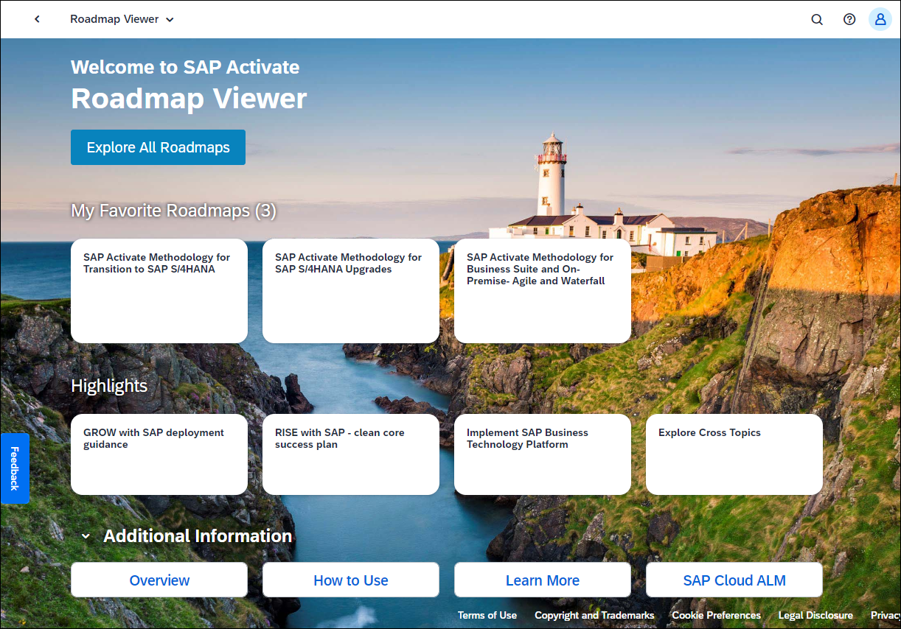

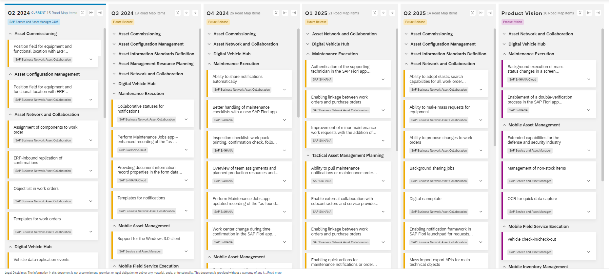

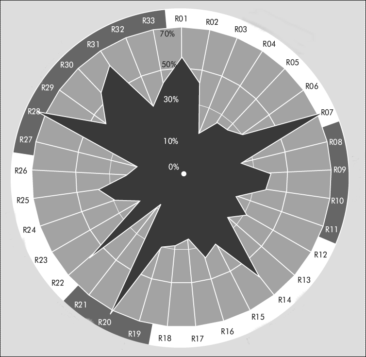

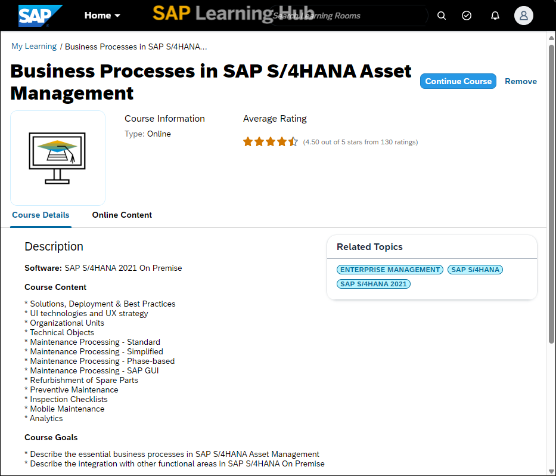

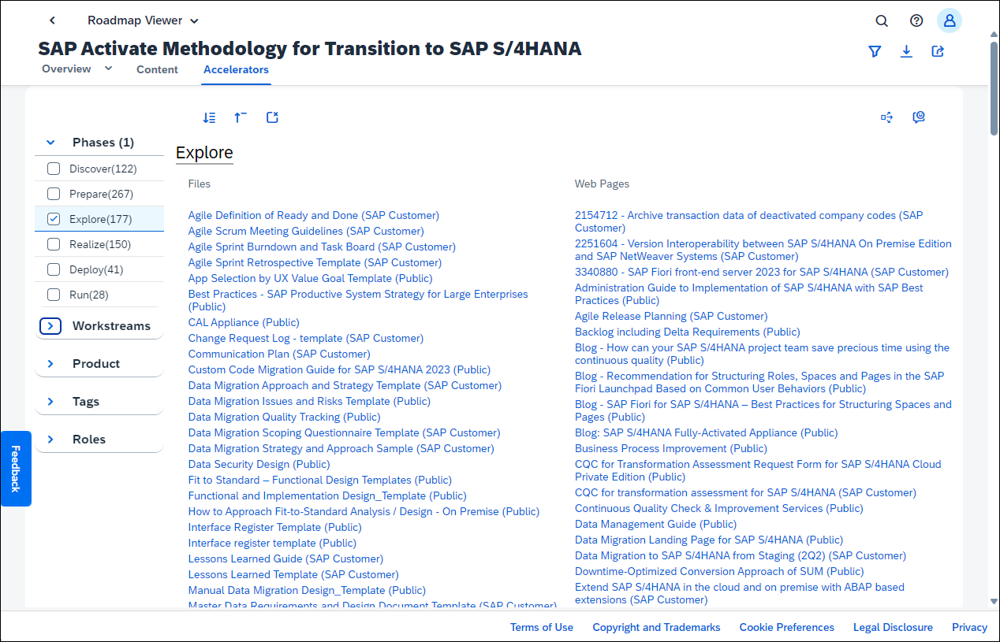

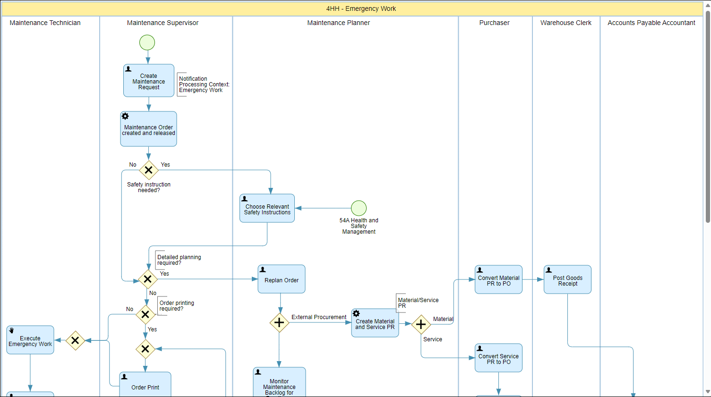

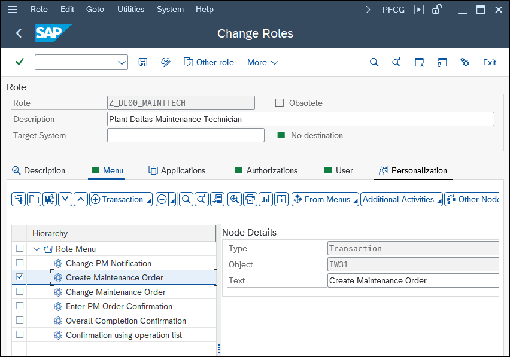

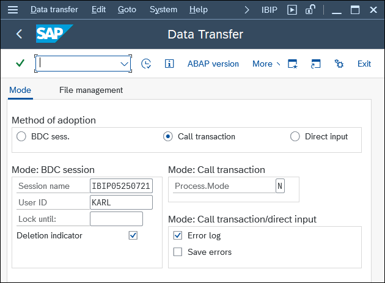

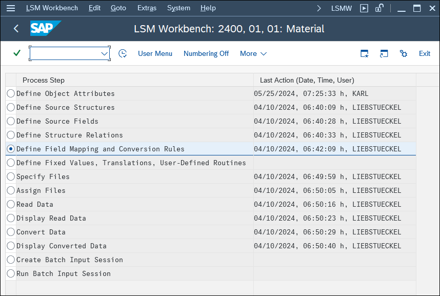

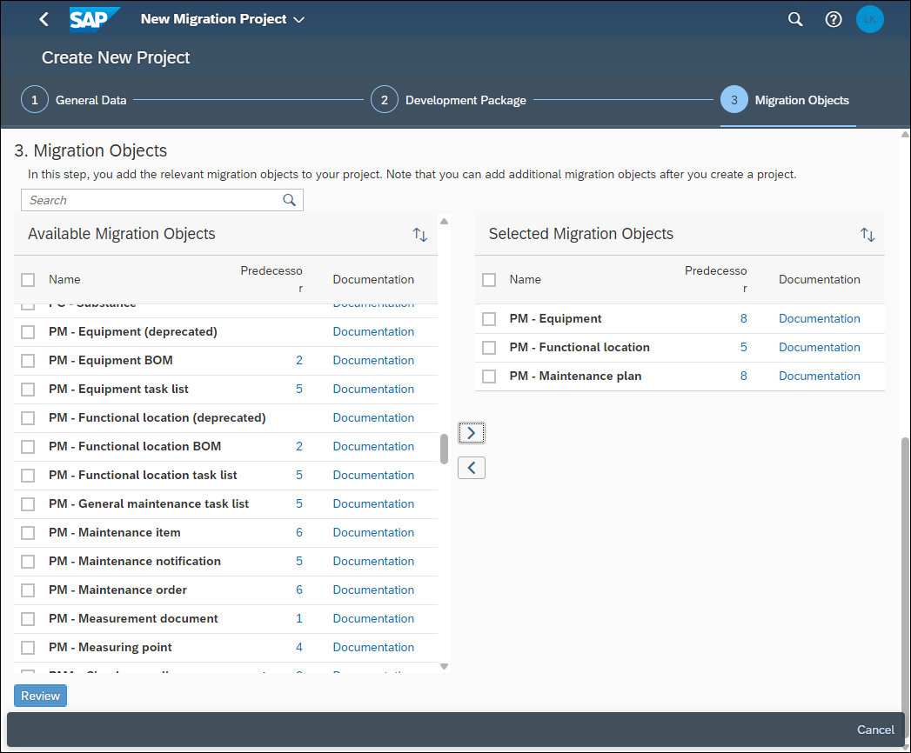

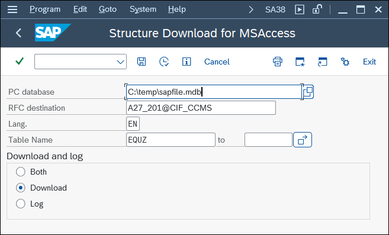

## 1.1 A Possible Process for Your Plant Maintenance Project with SAP

1.1 A Possible Process for Your Plant Maintenance Project with SAP In the basic discussion of a possible process for your plant maintenance project with SAP, you should differentiate between the implementation strategy and its accompa- nying methodological approach.

**עברית:** תהליך אפשרי לפרויקט אחזקת המפעל שלך עם SAP. בדיון הבסיסי על תהליך אפשרי לפרויקט אחזקת מפעל ב-SAP יש להבחין בין אסטרטגיית המימוש (Implementation Strategy) לבין הגישה המתודולוגית המלווה אותה.

## 1.1.1 Implementation Strategy

1.1.1 Implementation Strategy Most enterprises implement plant maintenance in a series of stages rather than in a single step (i.e., implementing the full range of functions in all plants all at once). There- fore, during project planning, you need to make a fundamental decision about the stages in which you’ll implement plant maintenance. There are two aspects of the implementation to consider:  Functional stages  Spatial stages 1 SAP Projects in Plant Maintenance 28 The functional stages of your plant maintenance project can be as follows:  Stage 1 Implement the structuring of technical systems. (You can omit this first stage if you can carry over asset structures from a legacy system.)  Stage 2 Implement work order processing.  Stage 3 Implement preventive maintenance.  Stage 4 Expand the system by adding potential enhancements (e.g., testing equipment pro- cessing, checking list processing, refurbishment processing, subcontracting, pool asset management, mobile solution or plant maintenance projects processing). The spatial stages, for their part, can be as follows:  Stage 1 Implement plant maintenance in a pilot system.  Stage 2 Implement plant maintenance in one plant only.  Stage 3 Roll out plant maintenance to other plants. This is the basis on which you can create a plan that specifies which functions are to be implemented in which operation or plant at which point in time. Once you have imple- mented these stages, you need to make a fundamental decision about which of the fol- lowing strategies you deem the most useful for your project:  Horizontal strategy Order processing implementation in all plants simultaneously  Vertical strategy Full implementation in one plant, followed by a rollout to other plants  Combined strategy Implementation of the full range of functions in one plant, followed by a rollout of order processing to all plants Figure 1.1 shows a summary of the functional and spatial stages. © 29 1.1 A Possible Process for Your Plant Maintenance Project with SAP Figure 1.1 Implementation Strategy

**עברית:** אסטרטגיית מימוש. רוב הארגונים מממשים אחזקת מפעל בסדרת שלבים ולא בצעד יחיד. בתכנון הפרויקט יש להחליט על השלבים. שני היבטים: שלבים פונקציונליים ושלבים מרחביים.

שלבים פונקציונליים: שלב 1 — מימוש מבנה המערכות הטכניות (ניתן לדלג אם מעבירים מבני נכסים ממערכת מורשת); שלב 2 — עיבוד פקודות עבודה; שלב 3 — אחזקה מונעת; שלב 4 — הרחבות (עיבוד ציוד בדיקה, רשימות תיוג, שיפוץ, קבלנות משנה, ניהול מאגר נכסים, פתרון נייד, פרויקטי אחזקה).

שלבים מרחביים: שלב 1 — מערכת פיילוט; שלב 2 — מפעל בודד; שלב 3 — פריסה (Rollout) למפעלים נוספים.

אסטרטגיות: אופקית (מימוש עיבוד פקודות בכל המפעלים בו-זמנית); אנכית (מימוש מלא במפעל אחד ואז פריסה); משולבת (מימוש מלא במפעל אחד ואז פריסת עיבוד פקודות לכל המפעלים).

## 1.1.2 SAP Activate Methodology

1.1.2 SAP Activate Methodology As is the case in all SAP projects, for plant maintenance, it’s recommended that you use SAP’s general methodology for implementation projects: SAP Activate. SAP Activate is SAP’s current methodology for implementing, upgrading, or migrating to an SAP S/4HANA landscape. SAP Activate is the successor to the ASAP methodology, but it’s broader and not only includes the implementation methodology of on-premise projects such as ASAP but also offers roadmaps for cloud projects or migration projects. SAP Activate offers a detailed roadmap to SAP S/4HANA, from scoping the project over prototyping to post go-live. SAP Activate also guides your team through integration with third-party software offerings and cloud solutions, training, project management, and other needs associated with migration. SAP Activate is divided into the following six phases (see Figure 1.2): 1. Discover 2. Prepare 3. Explore 4. Realize 5. Deploy 6. Run Figure 1.2 SAP Activate: Overview Spatial Stages Pilot System Plant 1 Other Plants Functional Stages Structuring of Technical Systems Order Processing Preventive Maintenance Expansion Stages Discover Prepare Explore Realize Deploy Run 1 SAP Projects in Plant Maintenance 30 Figure 1.3 shows the six phases on a more detailed level, as each phase has individual activities and deliverables that are linked into workstreams. There are also quality checks throughout the process and extensive resources (accelerators) linked to each deliverable. These accelerators provide guidance and best practices for each step. Figure 1.3 SAP Activate: Details Phase 1: Discover In the discover phase, customers become familiar with SAP S/4HANA and the imple- mentation project. There are two important activities in this phase:  Perform an as-is analysis and feasibility study as a starting point of the project. You’ll find a detailed question list in Section 1.3.1.  Become familiar with SAP S/4HANA, for example, by using a free two-week trial access to a cloud system. To do this, register at https://www.sap.com/products/try- sap.html#advanced-trials. Phase 2: Prepare In the second phase, prepare, you define the organizational aspects of the project and formulate an implementation concept. The following are the main activities in this phase:  Define the goals of implementing an SAP system―and also define what you don’t want to happen when you implement an SAP system.  Define your implementation strategy. Data Management Extensibility Integration Analytics Testing Run Realize Deploy Explore Prepare Discover Sizing and Scalability Verification IT Infrastructure Setup Execution/Monitoring/Controlling Organizational Change Management (OCM) Analytics Configuration Integration Implementation Quality Assurance System Setup/Conversion Data Migration and Verification Custom Code Quality Closing Stop Start Test Preparation and Execution Configuration Fit-Gap/ Delta Design Activate Solution Product Enhancements Gap Validation Security Design Learning Design Learning Realization Security Implementation UX Activation and Design Team Enablement Data Volume Management Design Data Vol. Mgmt. Configuration and Execution Integration Validation Design Review Sizing Technical Design Operations Impact Evaluation Operations Implementation Custom Code Impact Analytics Design Test Planning Integration Design Data Migration Design Operations Readiness QG1 QG2 QG4 QG3 QG5 Improve and Innovate Solution Application Design and Configuration Technical Arch- itecture and Infrastructure Operations and Support Solution Adoption Project Management Trial System Provisioning Go Live Project Initiation Application Value and Scoping Strategic Planning Cutover Preparation Dress Rehearsal Hypercaare Production Cutover Operate Solution Handover to Support Organization Prototype Transition Planning Transition Preparation Tech. Architecture and Infrastructure Definition Sandbox Setup/ Conversion Dev. Setup/ Conversion © 31 1.1 A Possible Process for Your Plant Maintenance Project with SAP  Define the organizational aspects of the project structure.  Define project standards and a procedure.  Create a preliminary project plan.  Plan your internal marketing.  Create a project application and get it approved.  Decide on and adapt the documentation tools.  Decide on and adapt the monitoring instruments.  Define the change management process.  Set up the system environment.  Train the project team.  Decide on a training strategy for key users and end users.  Design the process map and draft the business process master list (BPML).  Draw up a test strategy for the go-live.  Sort through existing master data material.  Define a data migration strategy.  Perform an interface inventory.  Define which project tools are to be used. Phase 3: Explore The third phase, explore, comprises all activities needed to create a detailed business blueprint. This blueprint contains a detailed to-be concept for using the SAP S/4HANA Asset Management system. During the explore phase, you also build up a prototype and perform the following activities:  Develop a business blueprint for organizational structures.  Develop a business blueprint for master data (in particular, the structuring of tech- nical systems).  Develop a business blueprint for the business processes and functions.  Document and visualize the various business processes (e.g., using event-driven process chains, which are described in more detail in Section 1.3.2).  Design a business blueprint for transferring legacy data, for creating new master data, or both.  Design a business blueprint for reporting and analyses.  Draft and establish a plan for communicating with stakeholders.  Create a fit-gap list.  Create a statement of work and a requirements specification for interfaces.  Create a statement of work and a requirements specification for enhancements (a gap list). 1 SAP Projects in Plant Maintenance 32  Create an archiving concept.  Design an authorization concept.  Create a concept for end-user training.  Perform Customizing for prototypes.  Build prototypes based on sample master data.  Refine the test strategy. Phase 4: Realize The fourth phase, realize, involves implementing and mapping the business blueprint. The following are the main activities in this phase:  Perform final Customizing.  Adapt the layout of screens and lists.  Develop, implement, and test the data transfer programs. Alternatively, configure one of the following SAP tools for data transfer: the Legacy System Migration Work- bench (Transaction LSMW), the plant maintenance-specific tool for data transfer (Transaction IBIP), or the SAP Fiori app Migrate Your Data – Migration Cockpit.  Enter master data (if this isn’t a separate stage in the implementation).  Implement solutions for items on the gap list.  Develop enhancements (e.g., print programs, customer exits, BAdIs, analyses).  Set up roles and authorizations.  Set up the SAP Fiori launchpad.  Create test plans and test cases.  Perform interim and final tests on the application.  Perform system and performance tests.  Perform user acceptance tests.  Configure settings for archiving and other jobs.  Train the key users.  Develop training courses for the end users (e.g., documentation and training exam- ples).  Develop user documentation.  Plan for the transfer from the project phase to live operation.  Develop a cutover plan. Phase 5: Deploy The fifth phase, deploy, comprises all the activities that are required shortly before and in preparation for the system go-live, the go-live itself, and activities during a short phase after go-live. These include the following: © 33 1.1 A Possible Process for Your Plant Maintenance Project with SAP  Train the end users.  Transfer the legacy data to the live system.  Perform the going live check.  Perform the cutover plan.  Go live.  Provide support during live operation (i.e., support during the start-up phase).  Provide additional training for end users.  Hold the kickoff meeting to signal official project completion.  Provide support for users after go-live (telephone hotline, email support, on-site presence, etc.). Phase 6: Run The sixth phase, run, mainly involves improving the operations of the SAP system and identifying any potential for optimization. These improvements include the following:  Optimized documentation  Optimized training  Optimized implementation  Optimized testing  Optimized technical operations  Optimized business processes  Optimized roles and authorizations  Optimized SAP Fiori launchpads  Optimized system upgrades  Optimized system maintenance You can find all the information you need about this new methodology on SAP’s Road- map Viewer (https://go.support.sap.com/roadmapviewer/), where you can learn about SAP Activate in general and all the available roadmaps (see Figure 1.4). Roadmap for SAP S/4HANA Asset Management You should keep up to date not only with the SAP Activate methodology but also with what SAP is planning for further development of SAP S/4HANA Asset Management. You can find this information in the SAP Road Map Explorer (https://roadmaps.sap. com/). Figure 1.5 shows SAP’s roadmap for SAP S/4HANA Asset Management from 2024 to 2025 and further product vision. 1 SAP Projects in Plant Maintenance 34 Figure 1.4 SAP Activate: Roadmap Viewer Figure 1.5 SAP Road Map Explorer for SAP S/4HANA Asset Management Like every project, your plant maintenance implementation project involves success factors and risk factors. It can only help your project if you benefit from the experi- ences of other enterprises rather than making every mistake yourself. For this reason, © 35

**עברית:** מתודולוגיית SAP Activate. כמו בכל פרויקט SAP, מומלץ להשתמש במתודולוגיית SAP Activate — המתודולוגיה הנוכחית של SAP למימוש, שדרוג או מיגרציה ל-S/4HANA, יורשת של ASAP אך רחבה יותר (כולל מסלולי ענן ומיגרציה). מספקת מפת דרכים מפורטת מ-Scoping ועד Post-Go-Live, וכן הנחיה לאינטגרציה, הדרכה וניהול פרויקט.

שישה שלבים: 1. Discover (גילוי) — היכרות עם S/4HANA וניתוח מצב קיים (As-Is) ובדיקת היתכנות; 2. Prepare (הכנה) — הגדרת היבטים ארגוניים, מטרות, אסטרטגיית מימוש, תקנים, תוכנית ראשונית, ניהול שינויים, הקמת סביבה, הדרכת צוות, מפת תהליכים ו-BPML, אסטרטגיית בדיקות ומיגרציה, ספירת ממשקים; 3. Explore (חקירה) — Business Blueprint מפורט: מבנים ארגוניים, נתוני אב (מבנה מערכות טכניות), תהליכים, רשימת Fit-Gap, מפרטי ממשקים והרחבות, מושג ארכוב והרשאות, Customizing לאב-טיפוס; 4. Realize (מימוש) — Customizing סופי, תוכניות העברת נתונים, פתרון פערים, פיתוח הרחבות, תפקידים והרשאות, הקמת Fiori Launchpad, בדיקות (מערכת/ביצועים/קבלה), תוכנית Cutover; 5. Deploy (פריסה) — הדרכת משתמשי קצה, העברת נתוני מורשת, Going-Live Check, ביצוע Cutover, עלייה לאוויר ותמיכה; 6. Run (תפעול) — שיפור מתמיד (תיעוד, הדרכה, בדיקות, תהליכים, הרשאות, Fiori, שדרוגים ותחזוקה).

משאבים: SAP Roadmap Viewer ו-SAP Road Map Explorer מספקים את כל המידע, מפות הדרכים ו-Accelerators (תבניות ושיטות מומלצות) לכל תוצר.

## 1.2 General Risk Factors and Success Factors in SAP Projects: An Empirical Survey

1.2 General Risk Factors and Success Factors in SAP Projects: An Empirical Survey the results of an empirical survey are provided next. Then, based on this survey and my personal experience, this chapter will provide you with several tips for your plant maintenance project. 1.2 General Risk Factors and Success Factors in SAP Projects: An Empirical Survey Learning from the experiences of others was the principle on which an empirical sur- vey was conducted at the Technical University Würzburg-Schweinfurt in Germany, the content and results of which will be discussed in this section. The study was based on empirical data collected from SAP ERP customers, but the findings of the study should be applicable 1:1 to SAP S/4HANA projects. For the survey, a catalog of 33 potential risk sources and 27 potential success factors was developed and then sent to SAP user companies. The companies were asked to rank each risk source in accordance with their own experiences as completely true, true, not completely true, or not true. To rank the success factors, a scale with the values very important, important, neutral, and not important was used. A total of 148 companies participated in the survey, and we analyzed the results. Acknowledgments I would like to thank Mr. Andreas Weber, who conducted this survey as part of his diploma thesis entitled “Risk Management in Business Software Projects: Concept and Empirical Study.”

**עברית:** גורמי סיכון וגורמי הצלחה כלליים בפרויקטי SAP — סקר אמפירי. הסקר נערך באוניברסיטה הטכנית וירצבורג-שווינפורט בגרמניה על בסיס נתוני לקוחות SAP ERP, אך הממצאים ישימים 1:1 לפרויקטי S/4HANA. נבנה קטלוג של 33 מקורות סיכון פוטנציאליים ו-27 גורמי הצלחה ונשלח לחברות. דירוג הסיכונים: נכון לחלוטין / נכון / לא לגמרי נכון / לא נכון. דירוג ההצלחה: חשוב מאוד / חשוב / ניטרלי / לא חשוב. 148 חברות השתתפו.

## 1.2.1 Risk Factors

1.2.1 Risk Factors The following potential risk factors were assigned to various categories:  Risk sources in the project environment – R0 = Insufficient documentation of business processes – R02 = No experience with software implementation projects of this type and scope – R03 = Insufficiently high status of the SAP implementation project – R04 = End-user requirements not adequately considered – R05 = Resistance by parties involved – R06 = Requirements of the SAP system not prioritized – R07 = Change requests made continually throughout duration of project 1 SAP Projects in Plant Maintenance 36  Risk sources associated with the project goals – R08 = Insufficient communication of goals that were set for the implementation of the SAP system – R09 = Hidden goals that were set for the implementation – R10 = Unrealistic goals – R11 = Unclear requirements  Risk sources in project management – R12 = Unstructured projects procedures; milestones unknown – R13 = Insufficient monitoring of deadlines and costs – R14 = Insufficient adaptation of schedule and budget planning when change requests are made – R15 = Poor planning leading to retroactive change requests – R16 = Insufficient control of project on part of project managers – R17 = Insufficient inclusion of project team members in planning – R18 = Poor information flow in project  Risk sources associated with project organization – R19 = Lack of clarity regarding competencies, contact persons, and responsibili- ties – R20 = Work overload; project team members not made free for project work – R21 = Inadequate equipment (e.g., PCs and software)  Risk sources associated with the project team – R22 = Insufficient management of and specialist IT knowledge among project team members – R23 = Insufficient know-how on the part of consultants – R24 = Carelessness in selection of consultants – R25 = Lack of staff; not enough project team members – R26 = Poor motivation among project team members  Risk sources in project flow – R27 = Inadequate project budget – R28 = Not enough time for project planning – R29 = Unrealistic completion date; not enough buffer time – R30 = Unexpected delays; deadline postponements – R31 = Not enough time overall – R32 = Problems with hardware configuration and SAP competence – R33 = Insufficient quality assurance © 37 1.2 General Risk Factors and Success Factors in SAP Projects: An Empirical Survey If we group together the first two categories, completely true and true, we get what is known as a risk radar, as shown in Figure 1.6. The farther away the points are from the center of the grid, the greater the likelihood that an implementation project will be confronted with the risk in question in the course of the project. To summarize, the fol- lowing are the most important risk factors:  In the project environment, a particularly high likelihood of occurrence was recorded for insufficient documentation and change requests during the project.  In terms of project management, it became clear that plans weren’t adjusted when changes occurred.  When it came to project organization, staff work overload and insufficient specialist knowledge stood out.  Finally, under project flow, there was a high likelihood of occurrence of not enough time for planning, unexpected delays, and insufficient time. Figure 1.6 Risk Radar 1 SAP Projects in Plant Maintenance 38

**עברית:** גורמי סיכון (R01–R33), בקטגוריות:
סביבת הפרויקט: R01 תיעוד לקוי של תהליכים; R02 חוסר ניסיון בפרויקטים מסוג והיקף זה; R03 מעמד נמוך מדי לפרויקט; R04 דרישות משתמשי קצה לא נשקלו; R05 התנגדות גורמים; R06 אי-תיעדוף דרישות; R07 בקשות שינוי לאורך כל הפרויקט.
מטרות הפרויקט: R08 תקשורת לקויה של מטרות; R09 מטרות נסתרות; R10 מטרות לא ריאליות; R11 דרישות לא ברורות.
ניהול פרויקט: R12 נהלים לא מובנים, אבני-דרך לא ידועות; R13 ניטור לקוי של מועדים ועלויות; R14 אי-התאמת לוחות וזמנים בעת שינויים; R15 תכנון לקוי המוביל לשינויים בדיעבד; R16 בקרה לקויה של מנהלי הפרויקט; R17 שיתוף לקוי של חברי הצוות בתכנון; R18 זרימת מידע לקויה.
ארגון הפרויקט: R19 חוסר בהירות בסמכויות ואחריות; R20 עומס יתר, צוות לא פנוי; R21 ציוד לא מתאים.
צוות הפרויקט: R22 ידע ניהולי ו-IT חסר; R23 Know-how חסר אצל יועצים; R24 רשלנות בבחירת יועצים; R25 מחסור בכוח-אדם; R26 מוטיבציה נמוכה.
מהלך הפרויקט: R27 תקציב לא מספק; R28 זמן לא מספק לתכנון; R29 מועד סיום לא ריאלי, חוסר באפר; R30 עיכובים בלתי-צפויים; R31 חוסר זמן כללי; R32 בעיות תצורת חומרה וכשירות SAP; R33 הבטחת איכות לקויה.

'מכ"ם הסיכונים' (Risk Radar): ככל שהנקודה רחוקה מהמרכז כך גובר הסיכוי להיתקל בסיכון. הסיכונים הבולטים: תיעוד לקוי ובקשות שינוי, אי-התאמת תוכניות לשינויים, עומס וצוות וידע חסר, וחוסר זמן לתכנון ועיכובים.

## 1.2.2 Success Factors

1.2.2 Success Factors Let’s now look at the success factors, ranked in order of importance, as shown in Table 1.1. For example, 82.2% of respondents said that “E12 = support from top management” is very important. Success Factor Ranking Very Important E12 = Support from top management 1 82.2% E02 = Competent project management 2 78.1% E15 = Good collaboration 3 67.1% E01 = Structured procedures 4 67.1% E10 = Inclusion of all parties involved 5 65.8% E05 = Technical competence of staff 6 64.4% E21 = Clear goals 7 61.6% E16 = Realistic scheduling 8 57.5% E25 = Identification of project team members with project 9 58.9% E19 = Early detection of problems 10 54.8% E03 = Appropriate project organization 11 54.8% E14 = Open information policy 12 52.1% E26 = Appropriate reduction of daily operations tasks in project team members’ workload 13 47.9% E07 = Appropriate number of project team members 14 39.7% E11 = Appropriate budget parameters 15 38.4% E13 = Availability of tools 16 37.0% E24: = Clear competence guidelines 17 45.2% E27 = Quality assurance during project 18 39.7% E04 = Experience from other projects 19 41.1% E22 = High priority of implementation project 20 34.2% E06 = Appropriate milestone planning 21 26.0% E17 = Early training 22 26.0% E18 = Appropriate size of work packages 23 19.4% Table 1.1 Success Factors of SAP Projects © 39

**עברית:** גורמי הצלחה (E01–E27), מדורגים לפי חשיבות (אחוז 'חשוב מאוד'): E12 תמיכת הנהלה בכירה (82.2%, מקום 1); E02 ניהול פרויקט מיומן (78.1%); E15 שיתוף פעולה טוב (67.1%); E01 נהלים מובנים (67.1%); E10 שיתוף כל הגורמים (65.8%); E05 כשירות טכנית של הצוות (64.4%); E21 מטרות ברורות (61.6%); E16 לוחות זמנים ריאליים (57.5%); E25 הזדהות הצוות עם הפרויקט; E19 זיהוי מוקדם של בעיות; ועוד עד E18 (גודל מתאים של חבילות עבודה) ו-E09 (צוות קטן). חמשת הגורמים המכריעים: תמיכת הנהלה בכירה, ניהול פרויקט מיומן, עבודת צוות, נהלים מובנים, וצוות כשיר טכנית.

משקלים לחישוב הדירוג: חשוב מאוד=4, חשוב=3, ניטרלי=2, לא חשוב=1 — לכן הדירוג אינו תואם בדיוק לאחוז ה'חשוב מאוד'.

## 1.3 Tips for Your Plant Maintenance Project

1.3 Tips for Your Plant Maintenance Project Weighting Factors Weighting factors were used to calculate the rankings, and the values were very important = 4, important = 3, neutral = 2, and not important = 1. Therefore, the ranking doesn’t correspond to the percentage value under very important. According to those surveyed, the following were particularly important for the success of the project:  Support from top management  Competent project management  Teamwork  Structured procedures  Technically competent staff 1.3 Tips for Your Plant Maintenance Project Based on the information about the SAP Activate methodology, the results of the empirical survey, and my personal experiences with SAP S/4HANA Asset Management and other plant maintenance projects with SAP, let’s consider some tips and tricks that can help you in your own projects. This section adheres to the time sequence of the SAP Activate roadmap, as described in Section 1.1.2.

**עברית:** טיפים לפרויקט אחזקת המפעל. בהתבסס על מתודולוגיית SAP Activate, תוצאות הסקר האמפירי וניסיון מעשי, מובאים טיפים לפי רצף הזמן של מפת הדרכים של SAP Activate.

## 1.3.1 Discover Phase

1.3.1 Discover Phase There are two important activities in this phase:  Become familiar with SAP S/4HANA, for example, by using a free three-month trial access to a cloud system.  Perform an as-is analysis and feasibility study as a starting point of the project. E23 = Small number of requirements changes 24 23.3% E20 = Detailed project documentation 25 26.0% E08 = Use of external consultants 26 27.4% E09 = Small project team 27 8.2% Success Factor Ranking Very Important Table 1.1 Success Factors of SAP Projects (Cont.) 1 SAP Projects in Plant Maintenance 40 There are different opportunities to become familiar with SAP S/4HANA, including the following:  Start a two-week trial for SAP S/4HANA in the cloud (go to https://www.sap.com/ products/try-sap.html#advanced-trials).  Request a demo from SAP experts.  Use the event finder to attend in-person or online events on SAP S/4HANA topics (go to https://www.sap.com/events.html).  Attend e-learning courses that are available in SAP Learning Hub (https://saplearnin- ghub.plateau.com/). The following courses are available for SAP S/4HANA Asset Management: – S43000: Business Processes in SAP S/4HANA Asset Management (see Figure 1.7) – S43100: Management of Technical Objects in SAP S/4HANA Asset Management – S43200: Preventive Maintenance in SAP S/4HANA Asset Management – S43300: Customizing in SAP S/4HANA Asset Management – S43400: Exploring Advanced Functions in Maintenance Processing Figure 1.7 SAP Learning Hub E-Learning Course © 41 1.3 Tips for Your Plant Maintenance Project Perform an As-Is Analysis (Feasibility Study) Before you do anything with your system, you need to carry out a careful as-is analysis of the framework conditions (in particular, your business processes). The time and effort you put in to perform a full and correct feasibility study will definitely be worth it. A feasibility study should pursue several goals:  Analyze, document, and visualize the master data, plant maintenance processes, and materials management processes used previously as well as the reporting requirements.  Define the range of plant maintenance functions available with the SAP S/4HANA Asset Management software and assign them to potential expansion phases.  Serve as a basis for further planning of the project details (deadlines, efforts, staff, and costs) to establish the training workshops in the explore phase and to use SAP software to draft “to-be” processes (see Figure 1.8). Figure 1.8 As-Is and To-Be Processes ? ?? As-Is Processes To-Be Processes ? 1 SAP Projects in Plant Maintenance 42 To avoid starting from scratch, consider the following list of questions that should be discussed and answered as part of a feasibility study like this. Key Questions Related to System Background  Which release level is in use? Which enhancement package is installed?  Which business functions for SAP S/4HANA Asset Management (LOG_EAM, etc.) are activated?  Which functionality is in use in SAP S/4HANA? – Financial accounting – Asset accounting – Controlling – Purchasing – Inventory management  Are there other SAP products depending on SAP S/4HANA Asset Management? For example: – SAP Supplier Relationship Management (SAP SRM) – SAP NetWeaver Master Data Management (SAP MDM) – SAP Master Data Governance (SAP MDG) – SAP Business Warehouse (SAP BW)  Are there non-SAP systems that should be getting interfaces with SAP S/4HANA Asset Management? For example: – Document management systems – Production data collection systems – Process control systems Key Questions Related to Organizational Structures  In which SAP organizational units is the enterprise structure mapped? – Controlling areas – Company codes – Plants – Storage locations – Maintenance plants – Maintenance planning plants – Purchasing organizations – Purchasing groups © 43 1.3 Tips for Your Plant Maintenance Project  How are the organizational units assigned? – Company codes to controlling areas (for more on this very important assignment, see Chapter 2, Section 2.1.2) – Plant to company codes – Plant to purchasing organization – Maintenance plant to maintenance planning plant Key Questions Related to Technical Asset Structuring  What types of objects are to be managed? – Buildings – Production assets – Machines – Fleet objects – Industrial trucks – Operating resources – Tools – Test equipment  Is there a distinction between fixed assets and inventories with changing installation locations?  How large is the quantity structure? Detailed Questions Related to Technical Asset Structuring  Which information is to be defined for which objects?  Are inventories to be kept in stock?  Are several labels to be displayed in parallel for the assets?  Are the inventories and assets to be classified (e.g., according to e-class or a separate classification procedure)?  Are bills of materials (BOMs) to be managed for spare parts? If so: – Are they single-level or multilevel BOMs? – Do they concern a single aggregate or category? – Are material numbers assigned to spare parts in the SAP system?  Are changes to the asset structure to be documented?  Are documents (e.g., images, drawings, process instructions) to be assigned to the assets and/or inventories? – Are these documents stored electronically? If so:  Where are they stored and how?  Are there master records for the documents? 1 SAP Projects in Plant Maintenance 44  Are warranties to be managed? If so: – Are they to be assigned to the assets and/or inventories? – Are they time-based or performance-based warranties?  Are the assets and/or inventories mapped as asset master records in the SAP system? Key Questions Related to Plant Maintenance Processes  Which plant maintenance processes are to be mapped in the SAP system in the future? – Machine malfunctions – Repair – Preventive maintenance and inspection  Time-based  Performance-based  Time-based and performance-based  Condition-based – Calibration processing or inspection processing – Checklist processing – Use of external companies – Investment measures – Construction of new assets – Manufacture of spare parts – Refurbishment – Subcontracting – Shift notes – Tool and fixture construction  How are the core processes currently handled?  Who is involved in planning and execution, and at what point and to what extent do they become involved?  What do you consider to be the weaknesses and functional deficits of the current plant maintenance processes? What will be or can be improved? Detailed Questions Related to Plant Maintenance Processes  Which workshops need to be mapped (electronics, mechanical engineering, measure- ment and control technology, etc.)?  Are there such things as catalogs for damage codes or cause codes?  Which workshop documents are required? © 45 1.3 Tips for Your Plant Maintenance Project  Should a mobile solution be used?  Is there a need to perform capacity planning (available capacity, capacity load, and capacity leveling)?  Is it necessary to perform resource planning (i.e., which employees are available to work when, for how long, and on which order)?  Are budgets to be assigned to tasks?  Are technical or business approval procedures to be mapped?  What types of completion confirmations are to be mapped? – Time confirmations – Technical completion confirmations – Material confirmations – Shift notes – Counter readings  How are the activities settled to the asset cost centers?  Should shift notes be created? If so: – What kind of information should be recorded? – Should the shift notes be categorized?  Are task lists to be managed? If so: – Do they concern a single object or a category? – What kind of information do task lists contain? – Are spare parts also to be defined there?  How large is the quantity structure for task lists?  Do you want time-based maintenance and inspection? If so: – Are the tasks subject to a cycle? – Are there different cycles within a task list? If so, what are they?  Do you want performance-based maintenance and inspection? If so: – Which types of counters (operating hours, miles, pieces that are produced, etc.) are available? – How should the counter readings be recorded?  In the SAP system  Via mobile devices  By data transfer, such as from a production system – Are the tasks subject to a cycle? – Are there different cycles within a task list? If so, which are they? – Can you assign several counters to one maintenance plan? 1 SAP Projects in Plant Maintenance 46  Do you want to perform condition-based maintenance? If so: – Which types of measuring points (temperature, pressure, rotational speed, flow rate, etc.) are available? – How are the counter readings recorded?  In the SAP system  Via mobile devices  By data transfer, such as from a production system  How large is the quantity structure for maintenance plans? Key Questions Related to Purchase and Warehouse Processes  Which materials management processes are to be mapped in the SAP system in the future? For example: – Procurement of direct materials (free-text purchase orders) – Procurement of spare parts in stock – Use of external companies  Individual commissioning  Outline agreements  Service specifications  Work centers for external companies  How are these processes currently handled?  Who is involved in the planning and execution, and at what point and to what extent do they become involved?  What do you consider to be the weaknesses and functional deficits of the current mate- rials management processes? What is to be or can be improved? Detailed Questions Related to Purchase and Warehouse Processes  Are the vendors and service providers mapped as vendor master records in the SAP sys- tem?  Are outline agreements with vendors and service providers to be mapped? – If so, how is the contract release order to be triggered?  Are there companies for which separate work centers are to be managed? – If so, which is the commissioning and settlement procedure for the work centers?  Are the services to be created as service master data or when commissioning service specifications?  Are spare parts to be mapped as material master data in the SAP system?  Are spare parts to be planned in an order? If so: – Will spare parts catalogs be available on the intranet? © 47 1.3 Tips for Your Plant Maintenance Project – Are automatic reservations to be triggered? – Are spare parts to be subject to inventory management? If so:  What is the withdrawal process?  Are material requirements to be planned for spare parts?  Is reorder point planning to be used or something else? – Are spare parts to be procured for direct consumption only?  Are there vendor consignment stores? If so: – How are these managed? – Who is responsible for replenishment? – How are withdrawals settled?  Are there approval procedures for the procurement processes?  How large is the quantity structure for spare parts, vendors, and outline agreements? Key Questions Related to Reporting and Key Figures  Which lists and reports are currently in use, who uses them, and when are they made available? – Which of these lists and reports must be available as soon as the SAP system goes live? – Which lists could be made available later?  Which key figures are currently in use, who uses them, and when are they made avail- able? – Which of these key figures must be available as soon as the SAP system goes live? – Which key figures could be made available later?  What do you consider to be the weaknesses and functional deficits of the current lists, reports, and key figures? What must be or should be improved? Information Acquisition One question arises in this context: Whom do you approach to get as full and correct a picture as possible of existing processes? From my experience of carrying out as-is analyses, I recommend the following reliable information sources:  People who are involved in executing, controlling, and monitoring business pro- cesses  Users of identical or similar IT systems  Customers who are communicative and often creative knowledge holders  Business partners who work with the process (e.g., vendors)  Subject matter experts (SMEs), who should be asked to give critical feedback  Company management, which ultimately has to approve the processes 1 SAP Projects in Plant Maintenance 48 Another question arises here: What techniques should you use to acquire the informa- tion needed for a full and correct as-is analysis? The following techniques have proven most effective in practice:  Establishing user workshops  Observing the relevant employees at work  Working with the business processes under analysis  Taking on the role of an outsider (e.g., acting as a customer if you’re the production director)  Using questionnaires  Holding interviews  Brainstorming with the parties involved  Having discussions with SMEs  Looking through existing forms, documentation, descriptions, manuals, and other resources  Verbally describing the organizational structure and process structure (e.g., with organigrams) Of course, your company may have other ways of conducting information research. Results of the Feasibility Study The feasibility study should deliver the following results:  Precise knowledge of which master data, plant maintenance processes, materials management processes, and reports are to be mapped in the SAP system  Precise knowledge of which plant maintenance functions are to be implemented in the SAP system, having assigned them to three potential expansion phases: A/B/C (see Appendix A, Section A.1)  Basic understanding to enable further planning of project details such as deadlines, efforts, staff, and costs  A basis on which to decide which user workshops have to be established in the busi- ness blueprint during the explore phase  A basis for using SAP software to draft to-be processes

**עברית:** שלב Discover. שתי פעילויות עיקריות: היכרות עם S/4HANA (ניסיון חינם בענן, דמו ממומחי SAP, אירועים, קורסי SAP Learning Hub: S43000 תהליכים, S43100 ניהול אובייקטים טכניים, S43200 אחזקה מונעת, S43300 Customizing, S43400 פונקציות מתקדמות) וביצוע ניתוח מצב-קיים (As-Is) ובדיקת היתכנות.

בדיקת ההיתכנות (Feasibility) שואפת: לנתח, לתעד ולהמחיש נתוני אב, תהליכי אחזקה ורכש ודרישות דיווח; להגדיר את היקף פונקציות ה-Asset Management ולשייכן לשלבי הרחבה A/B/C; לשמש בסיס לתכנון מועדים, מאמץ, כוח-אדם ועלויות ולגיבוש תהליכי To-Be.

שאלות מפתח: רקע מערכת (Release/Enhancement Package, פונקציות עסקיות LOG_EAM, FI/Asset Accounting/CO/רכש/מלאי פעילים, מוצרי SAP תלויים — SRM/MDM/MDG/BW, מערכות שאינן SAP לממשקים); מבנים ארגוניים (Controlling Areas, Company Codes, מפעלים, אתרי אחסון, מפעלי אחזקה ומפעלי תכנון אחזקה, ארגוני וקבוצות רכש, ושיוכיהם); מבנה נכסים טכני (סוגי אובייקטים — מבנים, נכסי ייצור, מכונות, צי, מלגזות, כלים, ציוד בדיקה; הבחנה בין רכוש קבוע למלאי; מבנה כמותי; BOM לחלקי חילוף חד/רב-שלבי; תיעוד שינויים, מסמכים/שרטוטים, אחריות (Warranty)); תהליכי אחזקה (תקלות, תיקון, אחזקה מונעת מבוססת זמן/ביצועים/מצב, כיול, רשימות תיוג, קבלנים, השקעות, שיפוץ, קבלנות משנה, פתקי משמרת, תכנון קיבולת ומשאבים, אישורים, סוגי דיווחי ביצוע); תהליכי רכש ומחסן (רכש ישיר/חלקי חילוף, ספקים כ-Vendor Master, הסכמי מסגרת, קונסיגנציה, תכנון דרישות, נקודת הזמנה מחדש); דיווח ומדדים.

מקורות מידע: מבצעי/בקרי התהליכים, משתמשי מערכות דומות, לקוחות, שותפים עסקיים, מומחי תוכן (SME), הנהלה. טכניקות: סדנאות משתמשים, תצפית, השתתפות בתהליך, שאלונים, ראיונות, סיעור מוחות, עיון בטפסים ותיעוד קיים, תרשימי ארגון.

## 1.3.2 Prepare Phase

1.3.2 Prepare Phase In the prepare phase, you set the project goals, create a detailed schedule and a budget plan, and perform other tasks that lay the foundations of the actual content of the proj- ect, as we’ll discuss in the following sections. © 49 1.3 Tips for Your Plant Maintenance Project General Information on Project Preparation The importance of good project preparation is often underestimated. Errors in the Prepare Phase Have Serious Repercussions A basic rule of thumb is that the earlier in the project a mistake is made, the greater the effect it will have on the project as a whole. You should therefore proceed with particu- lar caution during the prepare phase. Leave enough time for project planning and devote all your energy to getting the most from this phase. As shown in the empirical survey, those surveyed in the user companies believed that, in retrospect, there had been too little time for preparation in their project. Schedule Sufficient Time for the Prepare Phase After you’ve completed all the tasks relating to project preparation—and only then— should you start with the business blueprint. The poorer the quality of the planning, the more likely it is that improvements will have to be made later on. Similarly, the better the project planning, the better you’ll be able to handle another of the top three problems: change requests throughout the duration of the project. Experience has shown that poor advanced planning means that several retroactive improvements will have to be made later on in the process. None- theless, for the following reasons, you won’t be able to completely avoid changes during the course of your project:  External reasons (e.g., SAP bringing out a new release or top management deciding to restructure)  Project-internal reasons (e.g., feedback from the reference group meaning that cor- rections have to be made, errors have been detected, or the concept has to be refined) Because changes within a project are unavoidable, you should define what form these changes should take. Implement a Change Management Policy Implement a change management policy and define the following guidelines:  Which changes are permitted and which aren’t  What types of changes you anticipate  Which documents are required for each change type  What approval procedure applies to each change type 1 SAP Projects in Plant Maintenance 50 Implementation Goal The goal (i.e., what you want to achieve with this implementation) represents the start- ing point for each SAP implementation. Define the Goal of Your Plant Maintenance Project As soon as you’ve defined a concrete goal, do the following:  Formulate it in writing and publish it (e.g., hang a poster in the project room, send an email to employees, make an announcement on the intranet).  Orient all project activities toward this goal.  Define what you don’t want to happen when you implement the project (e.g., downsizing). In this way, you avoid promulgating any unfounded fears and unful- fillable hopes. Together with your team and intended users, visualize what you want to achieve by implementing the SAP S/4HANA Asset Management system―and also visualize what to avoid. Examples of how seemingly self-evident principles can nonetheless be fre- quently violated are as follows:  A goal may be formulated, but it isn’t followed.  There is a goal, but it’s neither verbalized nor communicated. The following question naturally arises: Which goals do you want to achieve by imple- menting an SAP S/4HANA Asset Management system in your enterprise? As a guide, the following is a short list of goals that customers often set in relation to plant main- tenance with SAP S/4HANA Asset Management:  We want to reduce breakdowns to x%.  We want to increase system availability to y%.  Our customers want comprehensive documentation for our maintenance tasks so that we can continue to deliver high-quality products to them.  Our vendors want comprehensive documentation of maintenance tasks so that we can continue to use their warranty measures.  We want to reduce our technicians’ nonpurposeful travel times and wait times by x%.  We need complete asset master data.  We need cost transparency.  We don’t want to invest any more monitoring resources in maintenance dates, and we want to allow the maintenance dates to vary by z days only.  We want to make more targeted use of our employees’ qualifications and availability.  We have to wind down our previous system Y by a particular key date (December 31) because it’s no longer being maintained. (The goal here is to wind down a legacy sys- tem.) © 51 1.3 Tips for Your Plant Maintenance Project  We need an up-to-date overview of our spare parts stock.  We want to reduce working capital by x%.  We want to improve the delivery behavior of our vendors and service providers. You’ll achieve the utmost success if you specify a concrete goal and work toward it. A good example is a customer in the automotive component supplier industry that wasn’t satisfied with the downtime rate of its assets (6.2% at the time). Thus, reducing downtime was the top priority in the company’s plant maintenance project. Therefore, the first phase of the implementation project was devoted to breakdown management. Breakdowns were recorded and analyzed, and countermeasures were put in place. It quickly became obvious that delayed reporting of breakdowns, especially at the ends of shifts, was causing an order bottleneck in the following shift and, consequently, unnec- essarily long downtimes. To counteract this situation, floating shifts were introduced in the plant maintenance department; as a result, the downtime rate was reduced to 2.8% within six months. Competencies and Responsibilities As the empirical survey and personal experiences repeatedly show, support from top management is the most important success factor in an SAP project. Secure Support from Top Management A must for project professionals is to secure and publicize the active support of top management. Don’t settle for a simple “That’s acceptable” or “Go ahead.” Instead, ensure that top management plays an active role in the project. What exactly could this role consist of? For example, top management could perform the following tasks:  Stressing the importance of the project and confirming its full support publicly at a company meeting  Informing employees about plans for the project in a company-wide email  Getting regular briefings on the progress of the project  Making decisions as members of the steering committee Demand the Necessary Competencies Another must for project professionals is to ensure that the project has the necessary resources and that the project leader has the necessary competencies. In many cases, the project is assigned to an employee who works in the line structure of a subdepartment and, as such, can at best write concepts but doesn’t have the authority to make decisions about them. In this case, a major error is being committed. 1 SAP Projects in Plant Maintenance 52 The project must occupy as high a position as possible within the enterprise organiza- tion; for example, it must be at one of the following levels:  Technical management  Top management  Plant management  Area management Make sure that the project leader can make technical- and project-related decisions (possibly subject to approval by the steering committee). Make the Decision-Making Structure as Compact as Possible An excessive number of decision-making instances is one of the main causes of overly long SAP projects. You want to avoid the situation that arose within one company in the transport sector: three years into the project, the company had just about reached the stage where the structuring of technical systems had been agreed on by all decision makers. Attach Importance to the Right Competencies Avoid the following situation: the people with technical competence can’t decide any- thing, and the people who have to make decisions on disciplinary grounds lack techni- cal knowledge. You should also note the following tip when putting together the project team. Assemble the Right Project Team Ensure that your plant maintenance project has all the right qualitative and quantita- tive components. In your project, you require the following:  Technical competence from the user department (in mechanical engineering, elec- tronics, measurement and control technology, building services, work scheduling, and similar areas)  Technical competence from IT or the organization  A knowledgeable and experienced consultant on your project team The question of how big your project team should be isn’t an easy one to answer. The staff on small plant maintenance projects in SAP sometimes consists of a single person, whereas very large projects often have dedicated teams of more than 25 people. Although this is a broad range, consider the following tip. © 53 1.3 Tips for Your Plant Maintenance Project Have Fully Dedicated Staff on Your Team Make sure that at least one of the project team members is 100% dedicated to the proj- ect. In many projects, a mistaken belief is often put into practice that the same results that one 100%-dedicated project team member can achieve can also be achieved by three team members who are 50% dedicated to the project or six team members who are 30% dedicated to the project. This is a big mistake. From a project management view- point, the following equation applies: 1 × 100 > 3 × 50 > 6 × 30 Although this isn’t mathematically correct, what it means is that an employee who can devote 100% of their time to the project is more productive than three employees at 50%, and three employees at 50% are more productive than six employees at 30%. Why? For one thing, the larger the project team, the more time is required for consulta- tion and communication. Furthermore, 50% can very easily turn into 30%, then 20%, then 10%, and then 5%―until finally, the team member in question has 0% availability for your project. Although you may be thinking that this is just a theory or that it will never work here, you should ensure the following just to be safe. Set Aside Specific Project Days If you don’t succeed in assigning employees 100% to the project, make sure that all project team members attend scheduled meetings. For example, you can tell your team, “Every Thursday and Friday are devoted to work- ing on this project.” However, you should also ensure that your employees can work in peace on certain project days. Obtain a Separate Project Room Employees have too many distractions at their own desks (the telephone, answering colleagues’ questions, etc.) to enable them to fully commit themselves to working on the project there. Furthermore, a project room has its own dynamic and energy, which enables everyone to concentrate solely on the project. Closely linked to these statements is the following tip. 1 SAP Projects in Plant Maintenance 54 Don’t Overwork Your Employees An employee who is already working at 120% capacity on daily tasks is incapable of working on an SAP project as well. Despite this truth, the prevailing impression is that many companies assume that employees can work on the SAP project “alongside” their regular work. Another issue that you should clarify at the outset is the input required for the project (e.g., to get your project budget authorized by top management). Input Planning Project input depends greatly on several factors that you have to consider, including the following:  The spatial distribution of the implementation (Section 1.1.1)  The used and targeted range and depth of functions  Your company’s internal decision-making and approval structures  Your project competence and/or the project lead’s authority to decide  The quality of existing master data  The number of new master data records required  The number and complexity of the interfaces to be created  The quantity and scope of new development work (e.g., reports, print programs, cus- tomer exits, a web user interface [UI])  Integration with other SAP applications  The scope of end-user training  Whether your project concerns winding down a legacy system or a completely new implementation With the last point, in particular, many enterprises mistakenly believe that if a legacy system is already in use, it should take even less time to implement an SAP system because, for example, the master data is already available in electronic form. Unfortu- nately, this isn’t the case. Additional Effort If a Legacy System Exists It takes considerably more effort to wind down a legacy system than to implement a new system. There are several reasons for this:  First, an IT system always revolves around a specific organizational structure and its individual business processes. Furthermore, it’s always necessary to adjust this © 55 1.3 Tips for Your Plant Maintenance Project organizational structure when you change the IT system currently in use. This is always the case when you wind down a legacy system (e.g., replacing Maximo with SAP).  Second, each IT system has a specific range of functions, its own terminology, and an individual layout, all of which the users have become accustomed to over the years. If you install a new IT system, everything is alien at first, looks strange, and just doesn’t seem suitable. You hear concerns such as, “But the field must be on the top left of the screen, not in the middle right of the screen.”  Third, every familiarization process is difficult for all parties involved (the end users, the application consultants, IT, and the decision makers). Reservations creep in and obstacles arise, all of which have to be broken down, and this all happens repeatedly in the implementation phase. In SAP S/4HANA Asset Management projects, project input usually fluctuates between the following values:  Less than 50 days for small, new implementation projects with a high decision-mak- ing competence, existing master data, no interfaces, and very little additional pro- gramming  Significantly more than 1,000 days for the winding down of legacy systems in large international projects with multilevel approval structures, manual entry of new master data, a lot of additional programming, and new connections to non-SAP sys- tems As an additional indicator for estimating project input, the following input distribution over the project phases may be useful:  Discover: 5–10%  Prepare: 5–10%  Explore: 25–40%  Realize: 25–40%  Deploy: 20–30%  Run: ongoing For your own input planning, consider combining two procedures, as in the following tip. Top-Down Estimate and Bottom-Up Planning Follow these steps to carry out the procedures: 1. Carry out a top-down estimate (i.e., a rough input estimate based on the goals and framework conditions). 2. Break it down into the individual project phases. 1 SAP Projects in Plant Maintenance 56 3. Use the planning for individual work packages to perform bottom-up planning. 4. If the two plans are very different, examine your assumptions very closely. Another aspect that you need to specify in the prepare phase is the type of documenta- tion you want to create. Documentation One of the most important risk factors mentioned by the companies who were sur- veyed was insufficient documentation. Therefore, note the following important tip. Create a Documentation Concept (“Document of Documents”) Here, define the following:  What documents are to be created and for what purpose?  What documentation tool will be used?  What names will be assigned to the documents?  Where will they be stored?  Who is responsible for the documentation? During the course of your project, you’ll require the following documents, among oth- ers:  Project plan A general plan that’s focused on milestones and work packages, parties involved in the project, and distribution of responsibilities  Business case A document for calculating the cost effectiveness of the project, which is usually required for budget requests  Monitoring documents Documents that you, being the project lead, can use to monitor milestones, activi- ties, compliance with deadlines, and so on  As-is analysis An inventory of existing master data and business processes  Business process master list An overview of new business processes  Business process procedures A detailed concept of new business processes  Customizing Documents that contain all Customizing settings © 57 1.3 Tips for Your Plant Maintenance Project  Gap list A list of all points not covered in the standard system and for which an organiza- tional or technical solution for the system must be found  WRICEF list A list of all workflows, reports, interfaces, conversions, enhancements, and forms (WRICEF); that is, a list of all programming tasks, giving an overview of the solutions for the gap list  User roles Definitions of roles, including their menus and authorizations  Test plan and test documents Documents for planning and conducting tests as well as recording the results of such tests  Data transfer A document that contains details about the objects that are to be transferred from the legacy system to the SAP system  Program development Detailed programming requirements, which may also be divided into a detailed specification (on the business side) and a technical specification (on the technical side), depending on the variant  Training plan An overview of when, where, and from whom users will receive training, as well as what topics will be covered  User training material Material for holding the requisite training courses before the system goes live  User documentation Reference materials  Cutover plan Details of the transfer to a live system and a go-live  Feedback forms Forms for problem messages  Sprint backlog Documentation you need if you apply Scrum to your project  Project completion report A document that is transferred to the user department involved in the go-live and that is the basis for the final presentation  Document of documents The central document in which you describe the documents available as well as their purpose and content, if you’re using a large number of document types 1 SAP Projects in Plant Maintenance 58 You may not require so many documents, you may choose to combine many of these documents into one document, or you may even need to use other documents not listed here. However, don’t worry. You don’t have to reinvent the wheel for the ump- teenth time, as explained in the next tip. SAP Templates In SAP's Roadmap Viewer and SAP Solution Manager, SAP provides templates for all the documents listed here as well as other documents (e.g., a costing sheet for the busi- ness case or capacity calculations, presentations, checklists, report templates). Figure 1.9 shows a list of accelerators for the SAP Activate explore phase. Figure 1.9 SAP Activate: Accelerators Training Both the empirical survey and my personal experiences have shown me that good training of project team members is a prerequisite for high-quality project work. Provide Comprehensive Training for Project Team Members Another must for project professionals is to train your project team members fully, either through attendance at SAP’s standard courses or an in-house training workshop. © 59 1.3 Tips for Your Plant Maintenance Project It isn’t enough to simply give the project team members a brief introduction. If you want them to successfully perform their conceptual work, they need to have compre- hensive knowledge of SAP S/4HANA Asset Management. SAP currently offers the training courses listed in Figure 1.10. Figure 1.10 SAP Training Courses for Asset Management S43000 and S43300 for Project Team Members At a minimum, your project team members should complete courses S43000 and S43300, as well as others as required. Another aspect of the prepare phase is marketing, which was already explained in Sec- tion 1.1.2 but will be mentioned here again for the sake of completeness. Have the Courage to Leave Some Gaps The full range of functions in the SAP system doesn’t have to be (and shouldn’t be) implemented all at once. Marketing Your project will have a greater chance of success if it has the full support of all employ- ees, especially intended users, right from the start, and if you can create a “power base” S43000 Business Processes in SAP S/4HANA Asset Management 3 days S43100 Management of Technical Objects in SAP S/4HANA Asset Management 3 days S43200 Preventive Maintenance in SAP S/4HANA Asset Management 3 days S43300 Customizing in SAP S/4HANA Asset Management 3 days S43400 Exploring Advanced Functions in Maintenance Processing 1 day 1 SAP Projects in Plant Maintenance 60 for the project. A first step in this direction (there will be others later on) is publicity work. Do Something Good and Talk About It Make your project known within your company (i.e., do in-house marketing). There are many ways to do this. Here are some examples of what other companies have done:  A transportation company designed a flyer and distributed it among its staff.  An energy provider had a presentation playing on a screen in its main foyer.  An automotive supplier set up a homepage to report on the current status of the project.  A chemicals company sent a monthly newsletter to staff—in particular, intended users—and top management.  A transportation company created cloud folders containing a presentation and description of the project as well as the project plan. These cloud folders were acces- sible to all interested staff people.  Many companies convene official kickoff meetings for staff and the project team. There are many inexpensive ways to announce your project. Be creative! Business Process Modeling Methods Now let’s think about the external form in which the business processes will be docu- mented and presented―that is, what business process modeling methods you’ll use. In principle, because of their superior visualization capabilities, graphical and tabular formats are better than a purely textual format. Value chain diagrams (VCDs, see Figure 1.11) are suitable for depicting the flow of complex processes, such as plant mainte- nance projects, on a general level. VCDs represent predecessor-successor relationships (including multilevel ones), such as those in work packaging and sequencing. Figure 1.11 Value Chain Diagram © 61 1.3 Tips for Your Plant Maintenance Project Event-driven process chains (EPCs) are suitable for processes of low and medium com- plexity. Simple and advanced versions of EPCs are available. The simple version of an EPC represents a process flow on a more detailed level than a value chain diagram and consists of two object categories:  Functions (e.g., print the order, check material availability)  Events (e.g., malfunction report received, order confirmed) Advanced EPCs are used when additional object categories have to be modeled:  Documents (e.g., a job ticket, a confirmation slip, an object list)  Organizational units (e.g., work scheduling, a mechanical engineering workshop)  Process interfaces (e.g., purchase order handling, final costing)  Information systems (e.g., Transaction IW31 in SAP S/4HANA)  Files or databases (e.g., AFRU [order confirmation] and BANF [purchase requisition] tables) It’s up to you whether to use object categories in your business process model and, if so, which ones. Figure 1.12 shows a sample extract from such a model. Figure 1.12 Advanced Event-Driven Process Chain Plan components Plan operations AV AV Plan PRT AV Operations planned manually Operations planned with Alpha Components planned manually Components planned with BOM PRT planned manually PRT planned with Apla Print job order card AV Job order card printed and allocated Job order card Check material availability WS WS WS Check available capacity Check PRT availability 1 SAP Projects in Plant Maintenance 62 Transaction/event chain diagrams (ECDs) are suitable for simple processes but not for more complex processes. A central characteristic of transaction/event chain diagrams is the fact that they assign object categories to fixed columns. Transaction/ECDs are available in a purely graphical format or in a verbal tabular format. In graphical format, they have the same object categories as an advanced EPC (see Figure 1.13). Figure 1.13 Transaction/Event Chain Diagram Table 1.2 shows an example transaction/event chain diagram in a verbal tabular format. Medium Data Function Event Org. Unit Batch Dialog Manually Sales Check cust. quot. technically Sales order entered Cust. quot. technically feasible Technical sales Order data Sales order Enter sales order Sales order received Product data Sales order Cust. quot. technically not feasible XOR No. Event/ Result Function/ Activity Input (Data) Output (Data) Parties Involved/ Org. Transac- tion Code 1. Mainte- nance task completed Confirm single entry or, in the operation list, continue with item 3. Order number, personnel num- ber, and time Confirma- tion data record Technician IW41 Table 1.2 Tabular Transaction/Event Chain Diagram © 63 1.3 Tips for Your Plant Maintenance Project Business Process Model and Notation (BPMN) has become very popular in IT projects. Even SAP uses BPMN to visualize its so-called best practice processes. Figure 1.14 shows a part of the 4HH – Emergency Work process. Figure 1.14 Business Process Model and Notation 2. Confirma- tion com- plete Continue with item 4. Confirma- tion data record 3. Operation list created Select PM opera- tions to be con- firmed and branches in sin- gle record entry. Selection data, operation list, personnel num- ber, and time Confirma- tion list Technician IW48 4. Confirma- tions com- plete Check confirma- tion data. Selection data and confirma- tion list Modified data records Technician IW47 5. Difference detected Make correction (cancel or follow up entry). PM order num- ber and correc- tion data Technician IW48 or IW41 No. Event/ Result Function/ Activity Input (Data) Output (Data) Parties Involved/ Org. Transac- tion Code Table 1.2 Tabular Transaction/Event Chain Diagram (Cont.) 1 SAP Projects in Plant Maintenance 64 BPMN uses a set of symbols that are similar to those used by EPC:  An activity is a task that must be completed in a business process (e.g., recording the demand for spare parts).  A gateway is a decision point, like a split/fork (e.g., in stock or not in stock), or a point at which different control flows converge, like a join/merge (e.g., courier booked and material packaged).  An event is something that occurs in a business process (e.g., a message is received; a certain date is reached, such as three days after sending the purchase order; an exception situation arises).  Sequence flows connect activities, gateways, and events. They represent the sequence in which activities are executed.  A pool represents a participant, meaning a user, user role, or system (e.g., a buyer).  A lane is a subdivision of a pool that spans the complete length of the pool (e.g., the process line of the buyer).  A message flow shows two lanes or pools in a business process diagram or two ele- ments of those exchange messages (e.g., the transfer of a requirement from the pro- cess flow of the maintenance planner to the process flow of the buyer).  An annotation is a comment that can be assigned to an element of a business pro- cess.  A data object represents an artifact that is processed by the business process. Data objects can be used to represent electronic objects such as documents or data records (e.g., maintenance orders) as well as physical objects such as spare parts or documents (e.g., pull lists). Visualize the Business Processes Create business process models of the as-is and to-be processes via different model types:  VCDs for an overview of complex business processes  EPCs or BPMN for a detailed representation of complex processes or to represent less complex processes  Transaction/ECDs in a tabular or graphical format for simple processes System Landscape Another error that many companies make in this phase is to make the SAP system landscape available too late. © 65 1.3 Tips for Your Plant Maintenance Project Set Up a Test System Early On At the very latest, a test SAP system must be available after your staff has finished their SAP training. If they don’t have access to a test system at this stage, they won’t be able to practice what they’ve learned and will quickly forget most of it. In other words, plan to set up a test system early on.

**עברית:** שלב Prepare. כאן מגדירים מטרות, לוח זמנים ותקציב מפורטים ומניחים את היסודות. ככל שטעות מוקדמת יותר בפרויקט — השפעתה גדולה יותר; יש להקדיש זמן ואנרגיה רבים.

מדיניות ניהול שינויים: שינויים בלתי-נמנעים (סיבות חיצוניות — Release חדש/ארגון מחדש; פנימיות — משוב, תיקון שגיאות, חידוד מושג). הגדירו: אילו שינויים מותרים, סוגיהם הצפויים, המסמכים הנדרשים ונוהל האישור לכל סוג.

מטרת המימוש: נסחו בכתב ופרסמו (פוסטר/מייל/אינטרא-נט); כוונו אליה את כל הפעילויות; הגדירו גם מה לא רוצים שיקרה (למשל פיטורים) כדי למנוע חששות. דוגמאות מטרה: הפחתת תקלות ל-x%, הגדלת זמינות ל-y%, תיעוד מקיף ללקוחות/ספקים (אחריות), הפחתת זמני נסיעה והמתנה, נתוני אב מלאים, שקיפות עלויות, הפחתת הון חוזר. דוגמה: יצרן רכיבי רכב הפחית זמן השבתה מ-6.2% ל-2.8% תוך חצי שנה (ניהול תקלות ומשמרות צפות).

סמכויות ואחריות: תמיכת הנהלה בכירה היא גורם ההצלחה החשוב ביותר — דרשו מעורבות פעילה (הצהרת תמיכה, מייל ארגוני, תדרוכים, ועדת היגוי). מבנה קבלת החלטות קומפקטי; הצבת הפרויקט גבוה בארגון (הנהלה טכנית/בכירה/מפעל/אזור); הבטחת סמכות למנהל הפרויקט.

צוות: כשירות טכנית מהמחלקה המשתמשת + מ-IT + יועץ מנוסה. כלל: 1×100 > 3×50 > 6×30 — עובד 100% ייעודי פרודוקטיבי יותר ממספר חלקיים. הקצו לפחות אדם אחד 100%; קבעו ימי פרויקט קבועים; חדר פרויקט נפרד; אל תעמיסו על עובדים.

תכנון קלט (Input): תלוי בפיזור מרחבי, היקף ועומק פונקציות, מבני החלטה, איכות נתוני אב, כמות רשומות חדשות, מורכבות ממשקים, פיתוחים, אינטגרציה, הדרכה, ומערכת חדשה מול הורדת מערכת מורשת. הורדת מערכת מורשת דורשת מאמץ רב יותר ממימוש חדש (התאמת מבנה ארגוני, התרגלות, התנגדויות). טווח: <50 ימים לפרויקט חדש קטן ועד >1,000 ימים להורדת מורשת בפרויקט בינלאומי. התפלגות: Discover 5–10%, Prepare 5–10%, Explore 25–40%, Realize 25–40%, Deploy 20–30%, Run מתמשך. שלבו אומדן Top-Down עם תכנון Bottom-Up.

תיעוד ('מסמך המסמכים'): הגדירו אילו מסמכים, באיזה כלי, שמות, אחסון ואחריות. מסמכים: תוכנית פרויקט, Business Case, מסמכי ניטור, ניתוח As-Is, BPML, נהלי תהליך, Customizing, רשימת פערים (Gap List), רשימת WRICEF (Workflows/Reports/Interfaces/Conversions/Enhancements/Forms), תפקידים, תוכנית ומסמכי בדיקה, העברת נתונים, פיתוח (מפרט עסקי+טכני), תוכנית והדרכה, תיעוד משתמש, תוכנית Cutover, טפסי משוב, Sprint Backlog (Scrum), דוח סיום. SAP מספקת תבניות ב-Roadmap Viewer וב-Solution Manager.

הדרכה: הכשירו את הצוות במלואו (קורסי SAP או סדנה פנימית) — לפחות S43000 ו-S43300. שיווק פנימי: גייסו תמיכת כלל העובדים (פלייר, מצגת בלובי, אתר, ניוזלטר, פגישת Kickoff).

שיטות מידול תהליכים: עדיף גרפי/טבלאי על-פני טקסט. VCD (דיאגרמת שרשרת ערך) — תהליכים מורכבים ברמה כללית, יחסי קודם-עוקב; EPC (שרשרת תהליך מונחית-אירועים) — מורכבות נמוכה-בינונית, פונקציות ואירועים, גרסה מתקדמת עם מסמכים/יחידות ארגוניות/ממשקים/מערכות מידע (למשל טרנזקציה IW31, טבלאות AFRU אישור פקודה ו-BANF דרישת רכש); ECD (דיאגרמת תנועה/אירוע) — תהליכים פשוטים, אובייקטים בעמודות קבועות, גרפי או טבלאי (דוגמה: IW41/IW47/IW48 לאישורי אחזקה); BPMN — נפוץ מאוד, SAP משתמשת בו ל-Best Practices (פעילות, Gateway, אירוע, Sequence Flow, Pool/Lane, Message Flow, Annotation, Data Object).

נוף מערכת: הקימו מערכת בדיקה מוקדם — לכל המאוחר לאחר סיום הדרכת הצוות, כדי שיוכלו לתרגל.

## 1.3.3 Explore Phase

1.3.3 Explore Phase In my book Plant Maintenance with SAP S/4HANA: Business User Guide (SAP PRESS, 2021), there are many tips on content that you might want to consider, especially in the explore phase of drawing up a detailed functional concept. The following is a brief list of some subject areas and common questions about them that you can ask during the explore phase:  Organizational units What needs to be done in cross-cost accounting maintenance processing?  Structuring of technical systems To what extent should you perform structuring of technical systems? What ele- ments are to be used?  Business processes How are external companies mapped? How can the layout of orders be determined?  Integration How can equipment and assets be aligned with each other? Which material require- ments planning (MRP) procedure is best for spare parts?  Maintenance control How can active availability control be set up in budgeting? How are dynamic date calculations performed?  New SAP technology Which SAP Fiori apps can support the business processes? Which after-event record- ing options are available to you?  Usability How do you configure maintenance-specific user parameters? How can you adjust table controls to the relevant user requirements? In the explore phase, all of these questions are reflected in your detailed concept. Next, we provide more tips that you should apply in the explore phase, especially in relation to organizational issues. The most important thing is perhaps for the employees to support the project and, in particular, the future system. You should therefore secure their support as early as possible. 1 SAP Projects in Plant Maintenance 66 Involve Your Intended Users in the Explore Phase Only a system that is accepted by its users is a genuinely useful one. Therefore, it’s important that you involve your intended users in the explore phase of the project. Here are some suggestions for involving your users in the explore phase:  Start a reference group, which is a group of selected users who will provide technical input and feedback to the project group.  Present your interim results at regular intervals (in live presentations, in newslet- ters, and on your home page).  Conduct individual surveys and get feedback from respondents. Usability and User Acceptance Chapter 9 of this book provides various usability improvement options. Therefore, this topic isn’t discussed in detail here, but its importance is underlined in the following general tips. Keep the System Design as Simple as Possible Whether it’s the structuring of technical systems or business process handling, user acceptance increases in direct proportion to the simplicity of the system. It’s better to have 80% of the system you want with 100% user acceptance than 100% of the system you want with 20% user acceptance. The SAP system isn’t exactly known for its usability, but we’ll look at the question of whether or not it really has low usability and what you can do about it in your own proj- ect. In Chapter 9, you’ll find a lot of tips and tools to improve the usability of your SAP system (e.g., by using transaction variants, SAP Fiori apps, and mobile solutions). Do Everything You Can to Make the System as User Friendly as Possible Be particularly proactive in addressing the perceived lack of usability of the SAP system. During the implementation phase, be attentive to the concerns of your employees regarding its usability. Don’t dismiss the topic; rather, accept users’ fears and try to alleviate them. The following is another tip on how you can increase user acceptance right from the start. © 67 1.3 Tips for Your Plant Maintenance Project Grab the Low-Hanging Fruit to Entice Employees Use the as-is analysis to identify system aspects with which the users have problems or aspects that are perceived to be suboptimal. Offer them a solution to these specific issues that represents an improvement on the current situation. Your users will then be more prepared to support the new system. Because these aspects are very specific to a project, here are some examples of what other companies have done:  Created a list of information that can only be obtained following extensive research  Created notifications in the production department directly, instead of transferring papers  Automatically calculated maintenance dates, instead of searching through folders  Printed the pull list directly in the warehouse for advance picking, instead of having the maintenance technicians wait a long time for the goods issue  Sent breakdown notifications via a paging system, rather than having the worker walk back to the support desk to pick up orders  Set up the SAP Fiori launchpad with the Maintenance Request app, for example, as an easy way to create outstanding notifications  Automatically issued maintenance lists to production by email to avoid the worker being unable to gain access to the facility to carry out maintenance tasks because the facility was still up and running due to production being unaware of the mainte- nance  Have maintenance technicians use tablets with a configured SAP Fiori launchpad, including having them use SAP Fiori apps for their daily business instead of using printouts If you’re observant, you’ll notice issues like these in your own company―and if you’re a little creative, you’ll be able to provide your users with improvements. Now, let’s deal with an aspect that is sometimes a little neglected at the start of a proj- ect: authorizations. Authorization Concept The authorization concept controls which user in which organizational unit may exe- cute which functions on which objects. This is a general topic, not a maintenance- specific one. As such, responsibility for the authorization concept lies with the IT department, the coordination department, or a similar department. However, you should ensure, in a reasonable amount of time, that an authorization concept is cre- ated to control the use of SAP S/4HANA Asset Management. 1 SAP Projects in Plant Maintenance 68 Authorization Concept: A Project within a Project Don’t forget to design an authorization concept alongside the detailed technical con- cept. Appendix A, Section A.2, contains a summary of the authorization objects that are available in SAP S/4HANA Asset Management and the organizational units, functions, and fields that are checked in each case. This topic won’t be covered in any further detail here; instead, refer to the relevant spe- cialist literature. Specialist Literature For more information, check out Authorizations in SAP S/4HANA and SAP Fiori by Ales- sandro Banzer and Alexander Sambill (SAP PRESS, 2022). The most important settings will be explained in detail there. Examples include the fol- lowing:  How to define authorizations based on authorization objects  How to combine several authorizations to form an authorization profile  How to create single roles using Transaction PFCG (see Figure 1.15) and combine them to form composite roles  How to define users with the requisite authorizations Figure 1.15 Transaction PFCG: Maintain Single Role © 69 1.3 Tips for Your Plant Maintenance Project Legacy Data Transfer and Master Data Maintenance There are always two ways to transfer your master data to the SAP system: manually or automatically. If you’re changing from another maintenance planning and control sys- tem to the SAP system, or if the asset data is available in another electronic format (e.g., in a CAD system), you should always try to transfer this data to the SAP system auto- matically. Use SAP Tools SAP provides the following three standard tools for transferring data from upstream or legacy systems:  A maintenance-specific data transfer (Transaction IBIP)  The general data transfer workbench (Transaction LSMW)  The Migrate Your Data – Migration Cockpit SAP Fiori app All of these tools enable the transfer of maintenance objects and their data to the SAP system. Plant maintenance batch input, as shown in Figure 1.16, is a data transfer program tai- lored to the special database objects in SAP S/4HANA Asset Management. Figure 1.16 Transaction IBIP In contrast, the Legacy System Migration Workbench (Transaction LSMW), shown in Figure 1.17, is a general data transfer workbench that can transfer not only maintenance objects but also objects from all SAP applications. 1 SAP Projects in Plant Maintenance 70 Figure 1.17 Legacy System Migration Workbench (Transaction LSMW) The Migrate Your Data – Migration Cockpit app (see Figure 1.18) also enables the migra- tion of data for all SAP applications. Figure 1.18 Migrate Your Data – Migration Cockpit App © 71 1.3 Tips for Your Plant Maintenance Project The main differences among the three systems are as follows:  Plant maintenance batch input (Transaction IBIP) Plant maintenance batch input requires a source file whose field sequence has to correspond to a predefined structure. You can find the names of these structures (e.g., IBIPEQUI for the equipment master record) in the Transaction IBIP documenta- tion, and you can find the field structure in the Data Dictionary (Transaction SE11). No further prerequisites apply if the structure is adhered to.  Legacy System Migration Workbench (Transaction LSMW) Transaction LSMW doesn’t require any fixed structure. Instead, it uses field map- ping, which assigns the fields of the source structure to the fields of the SAP object. The source structure is described on a per-project basis in the SAP system. This makes Transaction LSMW more flexible but also more complex than Transaction IBIP.  Migrate Your Data – Migration Cockpit app Similar to Transaction IBIP, this SAP Fiori app has a fixed data structure. You can download CSV or XML templates for this purpose. These templates have to be filled in the exact field order and then must be uploaded. This makes the SAP Fiori app less flexible than the Legacy System Migration Workbench. If you’re setting up IT support for your SAP system from scratch (i.e., if you don’t have any master data in electronic form), you’ll have to enter the data manually. Microsoft Office Tools for Data Entry Besides the standard approach of creating data directly in the SAP system, you can use the RIACCESS program in SAP ABAP to export the SAP table structures to Microsoft Access as a local database, enter the data locally on your PC, and then transfer it to the SAP system using Transaction IBIP or Transaction LSMW. Figure 1.19 shows the initial screen of RIACCESS. Figure 1.19 Database Structure Download to Microsoft Access 1 SAP Projects in Plant Maintenance 72 Regardless of what procedure you choose, you need to plan the data entry as detailed in the following tip. Plan the Data Entry Create a detailed data retrieval plan. In this plan, you should specify the following points in particular:  Which employees are involved in the data transfer  What kind of templates (index cards, folders, drawings, etc.) are used  How the data should be formatted and prepared  The dates by which the data should be entered into the system  How the quality of the data is to be monitored  Who is responsible for quality control  How the master data is to be released  How long the individual activities last Customizing for Prototypes Finally, there is an extremely important task in the explore phase: building a proto- type. Build a Prototype During the explore phase, you make a large number of decisions that affect Customi- zing. Don’t delay Customizing until the realize phase. Instead, configure all the Custo- mizing settings in the explore phase and build a prototype in it. The following data belongs to this prototype:  All controlling Customizing settings for the organizational structures  All controlling Customizing settings for the structuring of technical systems  All controlling Customizing settings for the business processes  All controlling Customizing settings for SAP Fiori apps  All controlling Customizing settings for integration with other components  Representative settings in noncontrolling Customizing settings, such as mainte- nance planner groups, purchasing groups, MRP controllers, locations, plant sections, and similar tables, which don’t have to be fully maintained in the prototype  Representative master data (work centers, functional location structure, equipment, task lists, etc.) In such a prototype, you should reproduce the future live system approximately so that your users have an opportunity to see the system in advance. © 73 1.3 Tips for Your Plant Maintenance Project Gap List One of the most important intermediate results at the end of the explore phase is the creation of a gap list. This list should include all points that are required by users but that can’t be responded to in a satisfying way with Customizing or other standard tools. Programming is usually required (customer exits, Business Application Programming Interfaces [BAPIs], business add-ins [BAdIs], additional programs, etc.). Table 1.3 shows an example of what a gap list could look like. Reference Request Solution Update lists 02_01_Work Order Cycle Lists (e.g., IW28 noti- fication list, IW38 order list) update automatically at a defined time inter- val. Must be included in the existing lists, coding template: SAP_TIMER_DEMO Order papers 02_01_Work Order Cycle Specific procure- ment documents required to be avail- able to the depart- ments. Own print programs, own layout Order documents with documents 02_01_Work Order Cycle Plant-specific docu- ments required to be output during print output. Add-on of SEAL Sys- tems Mail at notification creation 02_01_Work Order Cycle Automatic mail to reporters and stake- holders when SAP message is opened by service line. Notification work- flow Technical confirma- tion 02_01_Work Order Cycle Job must not be completed if open purchase requisi- tions remain. Customer exit IWO10004 Mail at appoint- ment overtime 02_01_Work Order Cycle Automatic mail to responsible work- place when end date is exceeded. Order workflow Shop floor paper 02_01_Work Order Cycle Layout of the order paper. Printing program and form Table 1.3 Gap List Example 1 SAP Projects in Plant Maintenance 74 A gap list includes the following information:  Topic  Business blueprint source document that the topic comes from  Request  Acceptable solution

**עברית:** שלב Explore. נושאים ושאלות לקונספט המפורט: יחידות ארגוניות (עיבוד אחזקה חוצה-עלויות); מבנה מערכות טכניות (היקף ורכיבים); תהליכים עסקיים (מיפוי קבלנים, פריסת פקודות); אינטגרציה (התאמת ציוד ונכסים, איזו שיטת MRP לחלקי חילוף); בקרת אחזקה (בקרת זמינות בתקצוב, חישובי תאריך דינמיים); טכנולוגיית SAP חדשה (אילו אפליקציות Fiori, רישום בדיעבד); שמישות (פרמטרי משתמש, התאמת Table Controls).

שיתוף משתמשים: רק מערכת מקובלת היא שימושית. הקימו קבוצת ייחוס (Reference Group), הציגו תוצאות ביניים, ערכו סקרים.

שמישות וקבלה: שמרו על תכנון פשוט — עדיף 80% מהמערכת עם 100% קבלה מאשר 100% עם 20% קבלה. היו פרואקטיביים מול חששות שמישות. 'קטפו פירות נמוכים' (Low-Hanging Fruit): הציעו פתרון לכאבים שזוהו ב-As-Is (יצירת הודעות ישירות, חישוב מועדים אוטומטי, הדפסת Pull List במחסן, התראות תקלה ב-Paging, אפליקציית Maintenance Request ב-Fiori, טאבלטים עם Fiori לטכנאים).

מושג הרשאות: שולט מי, באיזו יחידה ארגונית, רשאי לבצע אילו פונקציות על אילו אובייקטים — באחריות IT. עצבו אותו לצד הקונספט הטכני. נספח A.2 מסכם את אובייקטי ההרשאה. טרנזקציה PFCG ליצירת תפקידים בודדים ומורכבים. (ספרות: Authorizations in SAP S/4HANA and SAP Fiori, SAP PRESS 2022).

העברת נתוני מורשת ותחזוקת נתוני אב: ידנית או אוטומטית — אם הנתונים קיימים אלקטרונית (למשל CAD) העדיפו אוטומטי. שלושה כלי SAP: IBIP (Batch Input ייעודי-אחזקה — דורש קובץ מקור במבנה קבוע מראש, מבנים כגון IBIPEQUI לאב ציוד, מבנה השדות ב-Data Dictionary טרנזקציה SE11); LSMW (Legacy System Migration Workbench — כללי, ללא מבנה קבוע, מיפוי שדות, גמיש אך מורכב יותר); אפליקציית Fiori 'Migrate Your Data – Migration Cockpit' (מבנה קבוע, תבניות CSV/XML). אם אין נתונים אלקטרוניים — הזנה ידנית; תוכנית RIACCESS ב-ABAP מייצאת מבני טבלאות ל-Microsoft Access להזנה מקומית ואז העברה ב-IBIP/LSMW. תכננו את הזנת הנתונים (מי מעורב, תבניות, פורמט, מועדים, בקרת איכות, שחרור).

Customizing לאב-טיפוס: אל תדחו ל-Realize — בצעו את כל הגדרות ה-Customizing ובנו אב-טיפוס ב-Explore (כל הגדרות הבקרה למבנים ארגוניים, מבנה טכני, תהליכים, Fiori ואינטגרציה + נתוני אב מייצגים).

רשימת פערים (Gap List): כל מה שלא ניתן לכסות ב-Customist או כלים סטנדרטיים ודורש תכנות (Customer Exits, BAPIs, BAdIs, תוכניות). דוגמאות: עדכון אוטומטי של רשימות IW28/IW38, מסמכי פקודה ייעודיים, מייל אוטומטי ביצירת הודעה (Notification Workflow), Customer Exit IWO10004 לאישור טכני, מייל בחריגת מועד (Order Workflow), טופס Shop-Floor. רכיבי רשומת פער: נושא, מסמך מקור ב-Blueprint, בקשה, פתרון מקובל.

## 1.3.4 Realize Phase

1.3.4 Realize Phase In the realize phase, the plans and concepts created in the explore phase must be turned into action. To do this, you need to complete the following tasks:  Finalize the Customizing settings. You already made some controlling Customizing settings in the explore phase so that you could build a prototype. However, in the noncontrolling Customizing settings (e.g., maintenance planner groups, purchasing groups, MRP controllers, locations, plant sections), you made representative entries only. You must now complete these settings.  Attend to all items from the gap list.  Implement and configure SAP Fiori launchpads (see Chapter 8).  If necessary, set up transaction variants (see Chapter 9, Section 9.2.1).  If necessary, implement and configure a mobile solution, such as SAP Service and Asset Manager (see Chapter 9, Section 9.2.4).  If necessary, configure frontends with GuiXT (see Chapter 9, Section 9.2.6).  If necessary, configure frontends with SAP Screen Personas (see Chapter 9, Section 9.2.7).  If necessary, develop a web frontend (see Chapter 9, Section 9.3.3).  Develop the required enhancements.  If necessary, program customer exits or BAdIs (see Chapter 9, Section 9.3.4 and Sec- tion 9.3.5, respectively).  If necessary, set up workflows (see Chapter 9, Section 9.3.6).  Develop interface programs.  Prepare the legacy data for transfer to the new system and set up the transfer tools, namely the Legacy System Migration Workbench, batch input for plant mainte- nance, or the Migrate Your Data – Migration Cockpit app.  Enter the master data directly into the SAP system.  Set up the users, roles, and authorizations.  Develop the end-user training courses and documentation.  Arrange for the end-user training courses to be held. © 75 1.3 Tips for Your Plant Maintenance Project These are defined tasks that don’t require any further explanation here, so let’s discuss the important topic of testing. Before going live, you should test your implemented concept extensively. Conduct Sufficient Testing Extensive testing in the implementation phase is a prerequisite for a successful go-live. Therefore, you should schedule ample time for testing and conduct all tests in full. There are various types of tests:  Functional tests These are tests at the most basic level. They examine programs and transactions for errors and evaluate them. These tests focus on the program’s internal functions, and their main purpose is to help you become familiar with the system in terms of your own requirements.  Scenario tests During the Customizing process, it’s necessary to test transaction chains that are dependent on one another and reflect central business processes and scenarios. These tests focus on complete business processes.  Integration tests These are final tests that examine integration aspects by using predefined business processes or scenarios that simulate the processes in your system. These business processes already use the migrated data and are executed in the actual IT infrastruc- ture, which comprises the SAP system, third-party software, system interfaces, and various hardware and software components.

**עברית:** שלב Realize. מימוש ומיפוי ה-Business Blueprint: ביצוע Customizing סופי; התאמת פריסת מסכים ורשימות; פיתוח, מימוש ובדיקת תוכניות העברת נתונים — או הגדרת כלי SAP (LSMW, IBIP הייעודי-אחזקה, או אפליקציית Migrate Your Data – Migration Cockpit); הזנת נתוני אב; מימוש פתרונות לרשימת הפערים; פיתוח הרחבות (תוכניות הדפסה, Customer Exits, BAdIs, ניתוחים); הגדרת תפקידים והרשאות; הקמת SAP Fiori Launchpad; יצירת תוכניות ומקרי בדיקה; בדיקות ביניים וסופיות, בדיקות מערכת וביצועים, בדיקות קבלה (UAT); הגדרת ארכוב ועבודות רקע; הדרכת Key Users ופיתוח קורסי משתמש-קצה ותיעוד; תכנון המעבר לתפעול חי ותוכנית Cutover.

## 1.3.5 Deploy Phase

1.3.5 Deploy Phase The deploy phase comprises all activities that are required shortly before, during, and shortly after system go-live. These include transferring legacy data to the production system, but because the data transfer process rarely runs smoothly and in full, you’ll need some time to correct and complete the data. How much time you’ll need for this depends on the volume of changes required. Allow One Day to One Week for Data Maintenance Schedule sufficient time (one day or several days) to correct errors and complete the master data. Another activity that you need to complete in this phase is end-user training. Although SAP training courses are recommended for project team members, this doesn’t apply to end users because SAP training is generally unsuitable for end users. 1 SAP Projects in Plant Maintenance 76 Conduct In-House End-User Training End-user training should be provided by employees in your company, ideally by the rep- resentatives of the user department in the project team. For this training, use the sys- tem environment as well as examples of the technical objects that the end users will encounter in their work later on. It’s also important to provide end-user training close to the go-live date. Otherwise, the users will have forgotten much of what they learned by the time the system goes live. Cutover Plan At the very least, you should create a complete cutover plan by the time you conduct end-user training. A cutover plan contains all the activities that are to be carried out either directly before, during, or shortly after the go-live. Develop a Cutover Plan The cutover plan serves the function of a “string tied around your finger,” that is, a reminder to ensure that you don’t forget anything. This plan often deals with what appear to be minor issues, but it’s precisely the minor things that are easily forgotten in something big like a system go-live. This plan can contain the following items:  Any master data that still has to be created manually because it isn’t worthwhile to transfer it manually  The settings that have to be made to the system because they can’t be transported  Any selection and display variants that need to be set  The batch jobs that need to be triggered  Number ranges that have to be created manually or whose transport has to be trig- gered manually Go Live Your new system then goes live on the planned key date, and you start to process the first notifications and orders there. The most important thing in this phase is to ensure that your employees support the systems. Arrange for Project Team Members to Attend the Workshop Organize end-user support for the first few days after the go-live. Ideally, this should be on-site user support by members of the project team. Furthermore, publish a central hotline number and an email address so that problems can be resolved quickly. © 77

**עברית:** שלב Deploy. כל הפעילויות לקראת ובזמן העלייה לאוויר ומיד אחריה: הדרכת משתמשי קצה; העברת נתוני המורשת למערכת החיה; ביצוע Going-Live Check; ביצוע תוכנית ה-Cutover; עלייה לאוויר (Go-Live); תמיכה בשלב ההתנעה; הדרכה נוספת למשתמשי קצה; פגישת Kickoff לסימון סיום רשמי; ותמיכה לאחר העלייה (קו חם טלפוני, תמיכת מייל, נוכחות באתר).

## 1.4 Summary

1.4 Summary Provided that the tests were carried out in a targeted and intensive manner, you shouldn’t experience any design difficulties or system problems in this phase. Experi- ence shows that the issues that arise in this phase tend to relate to working with the software or concern detailed questions, and even these issues taper off after the initial familiarization phase.

**עברית:** סיכום. הפרק הציג תהליך אפשרי לפרויקט אחזקת מפעל ב-SAP — אסטרטגיית המימוש (שלבים פונקציונליים ומרחביים, אסטרטגיה אופקית/אנכית/משולבת) ומתודולוגיית SAP Activate (Discover, Prepare, Explore, Realize, Deploy, Run) — לצד תוצאות סקר אמפירי על גורמי סיכון והצלחה, וטיפים מעשיים לכל שלב. הפרקים הבאים עוברים להגדרות ה-Customizing בפועל.

## 1.3.6 Run Phase

1.3.6 Run Phase The final phase (run) mainly involves improving the operations of SAP S/4HANA Asset Management and identifying which measures in the project phase offer potential for optimization in future projects. These measures include optimizing the following:  Documentation  Training  Implementation  Testing  Technical operations  Business processes  SAP Fiori launchpads  System upgrades  System maintenance This chapter concludes the project-related questions and tips. In the next chapter, we’ll turn our attention to the first set of system-related questions―that is, questions related to the organizational structures that you need to set up. 1.4 Summary As major takeaways from this chapter, you should do the following things in your plant maintenance project with SAP:  Organize support of the top management.  Acquire the necessary decision-making competence.  Define clear goals for your project.  Create your own implementation strategy.  Follow the SAP Activate methodology.  Take enough time to plan your project.  Perform an as-is analysis (a feasibility study) as a starting point of the project.  Set up the right team for this project.  Avoid overworking your project team members. 1 SAP Projects in Plant Maintenance 78  Take care of sufficient documentation via SAP templates.  Involve your end users during the project.  Do everything you can to make the system as user-friendly as possible.  Start with low-hanging fruit.  Build a prototype along the implementation path.  Conduct sufficient testing and end-user training. This chapter has provided processes and tips to help with these issues, with a focus on the SAP Activate methodology. ©

**עברית:** שלב Run. בעיקר שיפור תפעול המערכת וזיהוי פוטנציאל אופטימיזציה: תיעוד מיטבי, הדרכה מיטבית, מימוש מיטבי, בדיקות מיטביות, תפעול טכני מיטבי, תהליכים עסקיים מיטביים, תפקידים והרשאות מיטביים, Fiori Launchpads מיטביים, שדרוגי מערכת מיטביים ותחזוקת מערכת מיטבית.

---
Source: Configuring Plant Maintenance in SAP S/4HANA pp.27-78
