# Chapter 2: Configuring Organizational Structures

> Book: Configuring Plant Maintenance in SAP S/4HANA · pages 79–108 · 25 figures

## Figures

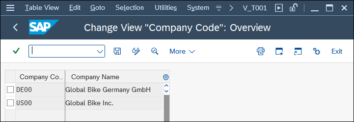

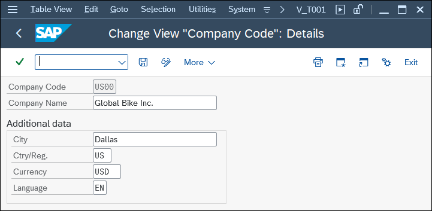

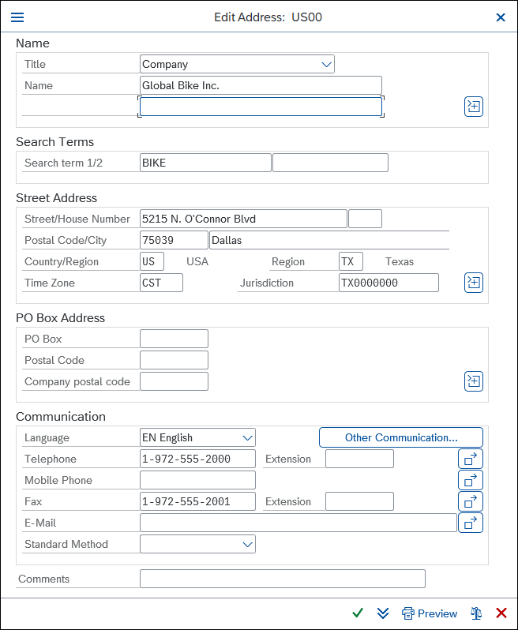

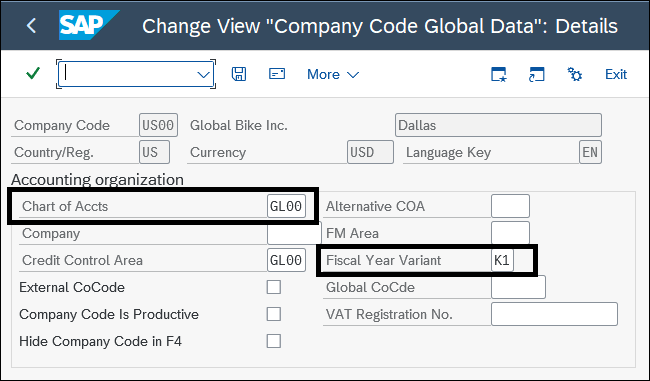

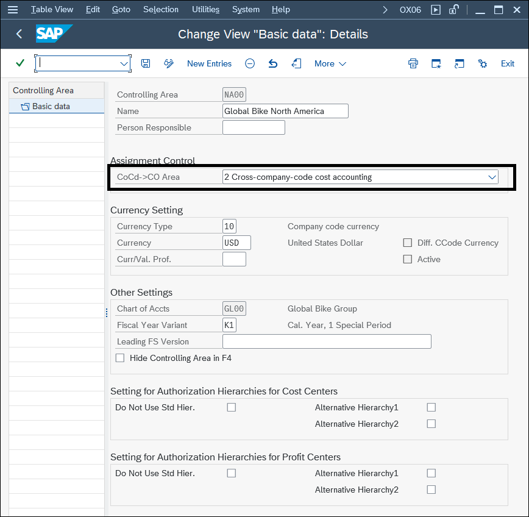

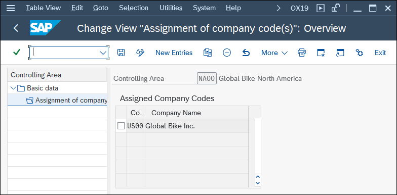

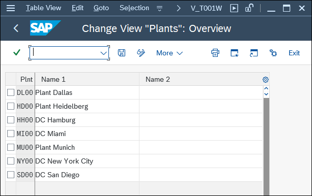

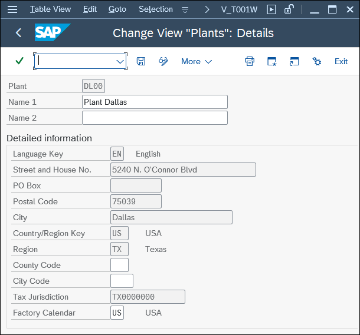

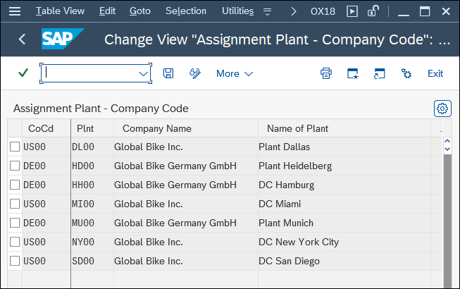

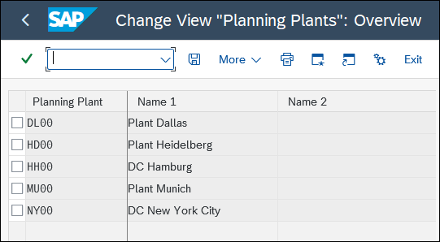

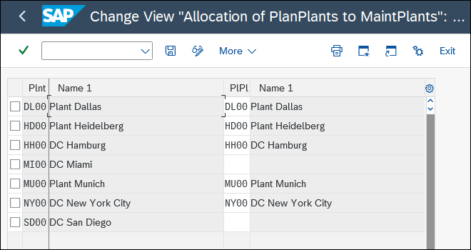

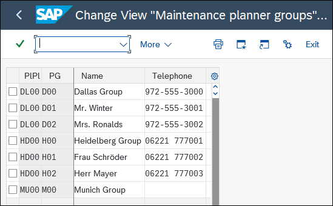

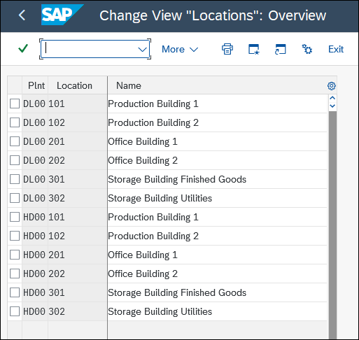

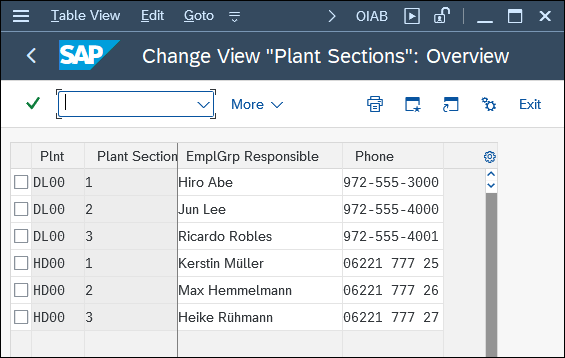

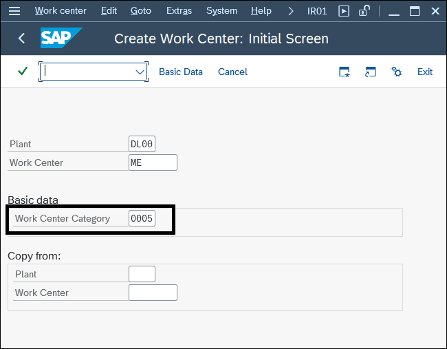

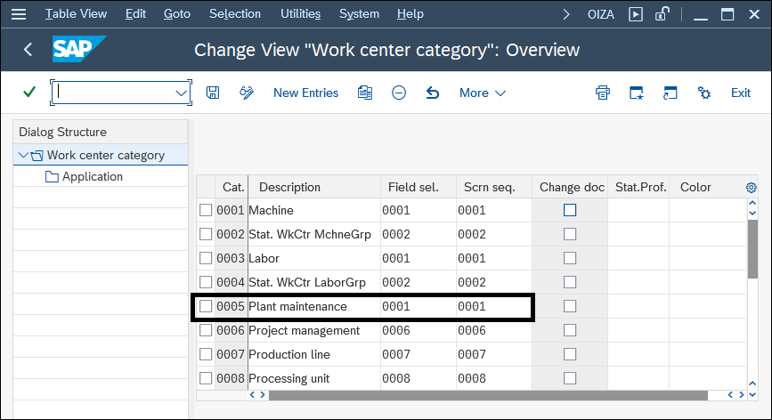

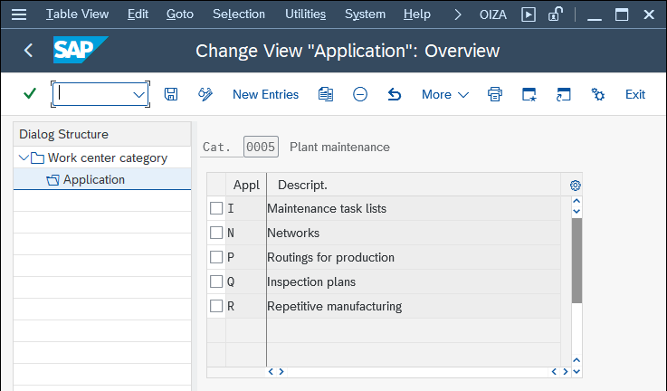

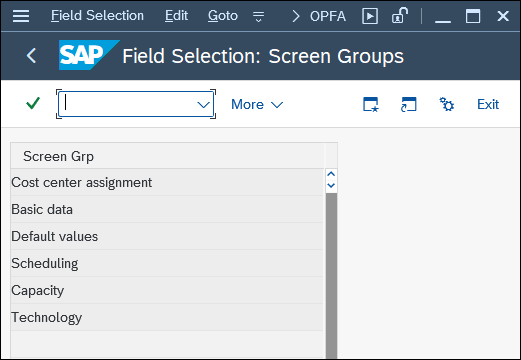

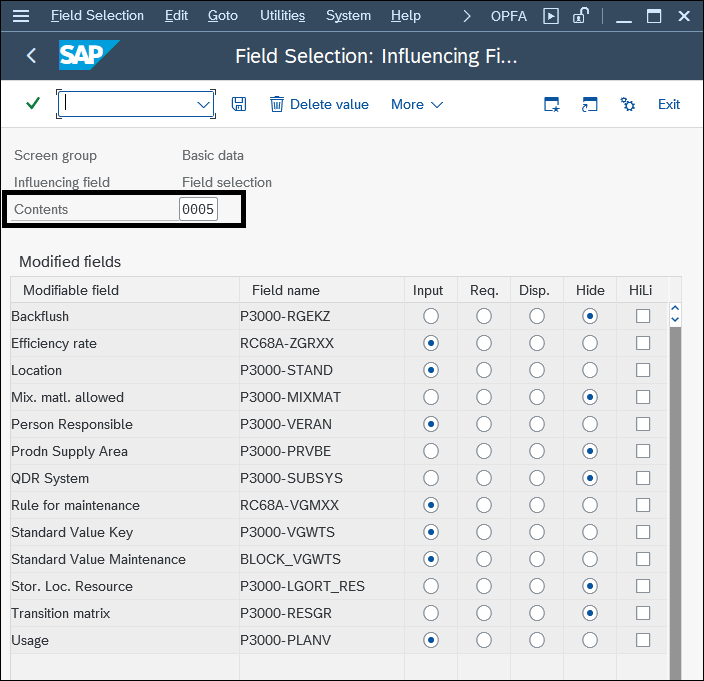

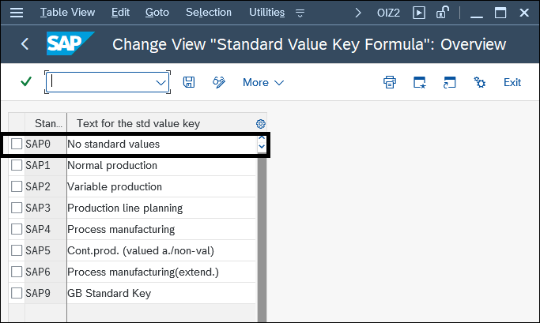

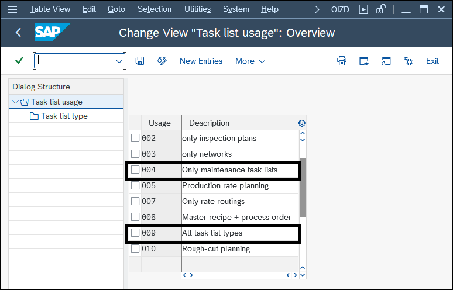

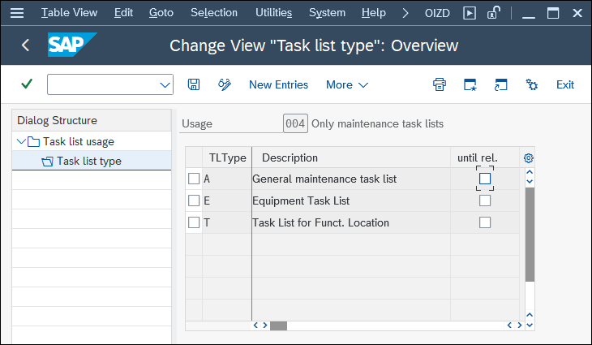

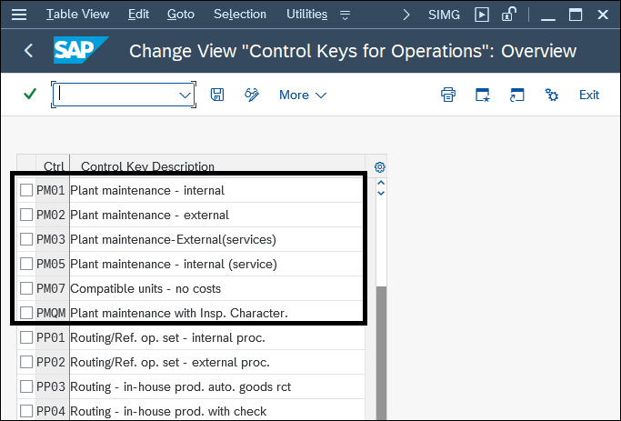

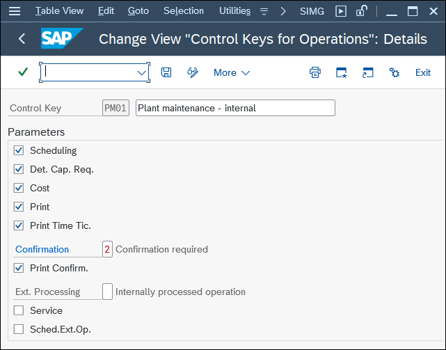

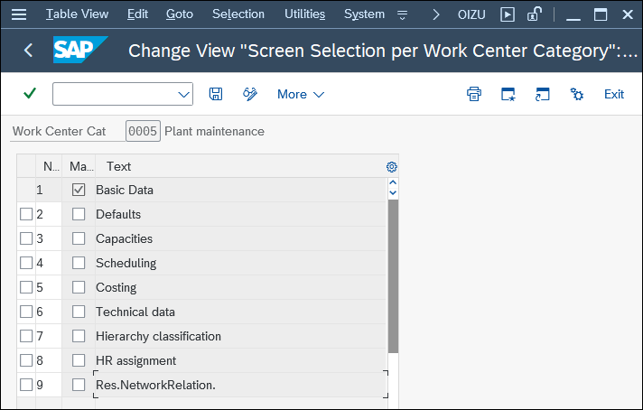

## 2.1 General SAP Organizational Units

2.1 General SAP Organizational Units Organizational units are the basis of all master data and business processes in SAP S/4HANA Asset Management. In the following sections, you’ll get to know the most important organizational units from the perspective of SAP S/4HANA Asset Manage- ment and learn how you should use the associated Customizing functions. Figure 2.1 shows some typical general organizational units. Figure 2.1 General Organizational Units General Organizational Units Are Usually Predefined If you implement SAP S/4HANA Asset Management, the general organizational units in the SAP system (e.g., company code, controlling area, plant in general) are usually predefined because you defined them when you implemented other functionalities, such as controlling and materials management. Therefore, you can only influence the Controlling area Company code Plant General Organizational Units © 81 2.1 General SAP Organizational Units design if SAP S/4HANA Asset Management is implemented from the outset, or if you define separate organizational units from a pure maintenance perspective.

**עברית:** יחידות ארגוניות כלליות ב-SAP. היחידות הארגוניות הן הבסיס לכל נתוני האב והתהליכים העסקיים ב-S/4HANA Asset Management. סעיף זה מציג את היחידות החשובות מנקודת מבט האחזקה ואת פונקציות ה-Customizing הקשורות.

שים לב: היחידות הארגוניות הכלליות (Company Code, Controlling Area, Plant) מוגדרות בדרך-כלל מראש — כי הוגדרו בעת מימוש מודולים אחרים (Controlling, Materials Management). לכן ניתן להשפיע על עיצובן רק אם Asset Management מיושם מההתחלה, או אם מגדירים יחידות נפרדות מנקודת מבט אחזקה טהורה.

## 2.1.1 Company Code

2.1.1 Company Code In SAP S/4HANA, the company code maps an independent accounting unit and is therefore the smallest organizational unit in SAP S/4HANA Finance. You therefore use a company code to map, within your corporate group (client), a company that is required to create a balance sheet, a profit and loss account, and other year-end docu- ments. Edit the Company Code The company code provides the basis for many other applications, including SAP S/4HANA Asset Management. You use this Customizing function to create new com- pany codes and to make changes to existing company codes. Prerequisites You must maintain the countries, languages, and currencies beforehand. Customizing Path Enterprise Structure • Definition • Financial Accounting • Edit, Copy, Delete, and Check Company Code Transaction V_T001 Settings Choose the Edit Company Code Data subfunction. The system then displays a table of defined company codes (see Figure 2.2). Figure 2.2 Company Code: Overview On the Details screen, you maintain key parameters such as Ctry/Reg. and Currency (see Figure 2.3). 2 Configuring Organizational Structures 82 Figure 2.3 Company Code: Details You can then use the icon to specify the address data for the company code (see Figure 2.4). Figure 2.4 Company Code: Address Data © 83 2.1 General SAP Organizational Units Global Parameters for the Company Code You can use this Customizing function to make key specifications in relation to the company code. These include, among other things, the chart of accounts and the fiscal year variant. Prerequisites You must define these specifications in advance, either as master data (e.g., Chart of Accts) or in other Customizing functions (e.g., Company, Credit Control Area, Fiscal Year Variant). Customizing Path Financial Accounting • Financial Accounting Global Settings • Global Parameters for Company Code • Enter Global Parameters Settings From a plant maintenance perspective, the following fields are the most important: Chart of Accts and Fiscal Year Variant (see Figure 2.5). Figure 2.5 Company Code: Global Parameters These fields represent the following:  Chart of Accts The chart of accounts is a directory of all general ledger accounts. It provides the basis for all business transactions in SAP S/4HANA. For each business transaction, postings are made in the background to one or more general ledger accounts. For example, in the case of a material withdrawal to a maintenance order, at least one material stock account and a consumption account are used. A chart of accounts must be assigned to each company code, and the assigned chart of accounts is known as an operational chart of accounts; that is, the day-to-day postings are made 2 Configuring Organizational Structures 84 to the accounts of the operational chart of accounts. The operational chart of accounts is used by SAP S/4HANA Finance.  Fiscal Year Variant The fiscal year variant defines the fiscal year and the posting periods. The fiscal year can correspond to the calendar year, but it doesn’t have to (for example, if you don’t want to perform year-end closing operations during the public holidays in Decem- ber). The posting periods usually contain the number of posting periods (generally twelve monthly posting periods) and the number of special periods. A special period is a special posting period that subdivides the last regular posting period for closing operations. A fiscal year can have a maximum of twelve posting periods and four special periods.

**עברית:** Company Code (קוד חברה). ב-S/4HANA קוד החברה ממפה יחידה חשבונאית עצמאית והוא היחידה הארגונית הקטנה ביותר ב-S/4HANA Finance — חברה שחייבת להפיק מאזן, דוח רווח והפסד ומסמכי סוף-שנה בתוך הקבוצה (Client).

עריכת קוד חברה: ליצירה ושינוי של קודי חברה.
• דרישות קדם: יש לתחזק מראש מדינות, שפות ומטבעות.
• נתיב Customizing: Enterprise Structure ► Definition ► Financial Accounting ► Edit, Copy, Delete, and Check Company Code.
• טרנזקציה: V_T001 (תת-פונקציה Edit Company Code Data). במסך הפרטים מתחזקים Ctry/Reg ו-Currency, ובאמצעות אייקון — נתוני כתובת.

פרמטרים גלובליים לקוד החברה (נתיב: Financial Accounting ► Financial Accounting Global Settings ► Global Parameters for Company Code ► Enter Global Parameters). מנקודת מבט אחזקה השדות החשובים:
• Chart of Accounts (תרשים חשבונות) — מדריך כל חשבונות ה-G/L; בסיס לכל התנועות. לכל תנועה נרשמים ברקע חשבונות (למשל במשיכת חומר לפק"ע — חשבון מלאי וחשבון צריכה). לכל קוד חברה משויך 'תרשים חשבונות תפעולי' שאליו נרשמות התנועות היומיומיות.
• Fiscal Year Variant (וריאנט שנת כספים) — מגדיר את שנת הכספים ותקופות הרישום. השנה יכולה להתאים לשנה הקלנדרית אך לא חייבת. בדרך-כלל 12 תקופות רישום חודשיות + עד 4 תקופות מיוחדות (תקופה מיוחדת מחלקת את תקופת הרישום האחרונה לפעולות סגירה). מקסימום: 12 תקופות + 4 מיוחדות.

## 2.1.2 Controlling Area

2.1.2 Controlling Area The controlling area is the main organizational unit in SAP S/4HANA controlling and is the basis for all other master data (e.g., cost centers, activity types). Maintain a Controlling Area A controlling area is defined as an organizational unit within a company that is used to represent a closed system for cost accounting purposes. A controlling area may include single or multiple company codes that may use different currencies. These company codes must use the same operational chart of accounts and the same fiscal year variant. Prerequisites You must define the currency, chart of accounts, and fiscal year variant beforehand. Customizing Path Enterprise Structure • Definition • Controlling • Maintain Controlling Area Transaction OX06 Settings Choose the Maintain Controlling Area subfunction to check or change the settings for a Controlling Area (see Figure 2.6). A company code maps a company from an external perspective and is primarily cre- ated for tax reasons. In other words, company codes are created to optimize an enter- prise’s tax burden, so a company code doesn’t necessarily reflect the actual set of services the company provides. In contrast, a controlling area maps a company from an internal perspective and is created for the company’s actual business processes and the exchange of services among the company’s various business units. © 85 2.1 General SAP Organizational Units Figure 2.6 Controlling Area: Basic Data For example, Mr. Miller, a production planner, and Mr. Lawrence, a maintenance plan- ner, work in the same office and once belonged to the same company (company code) before the decision was made to outsource plant maintenance. Since then, Mr. Law- rence has continued to plan the repair orders and maintenance tasks for Mr. Miller’s machine facilities. He still works in the same office as Mr. Miller, but he now belongs to another company (company code). The day-to-day processes haven’t changed. Mr. Law- rence can continue to plan his orders in the same way as before because, from an inter- nal perspective (controlling area), his company belongs to the same company as Mr. Miller’s production, and the 2 Cross-company-code cost accounting option is activated there. 2 Configuring Organizational Structures 86 Company Code: Assign a Controlling Area You use this Customizing function to assign to a controlling area the company code that you want to perform common cost center accounting. You only have to explicitly assign company codes to the controlling area if you want to perform cross-company code cost accounting. Prerequisites You must define the company code and controlling area beforehand. Also, both must have the same chart of accounts and fiscal year variant. Customizing Path Enterprise Structure • Assignment • Controlling • Assign Company Code to Controlling Area Transaction OX19 Settings As shown in Figure 2.7, you call the affected controlling area (here, “NA00”) and assign the necessary company codes (here, “US00”). Figure 2.7 Controlling Area: Assignment of Company Codes Due to poor experiences with other enterprise structures, I unreservedly agree with the recommendation from SAP that you only use one controlling area for the entire enter- prise. In other words, you should assign all company codes to one controlling area. The advantages of this are as follows:  A company code is permitted to be assigned to a controlling area only if both use the same fiscal year variant and chart of accounts. This is the only way you can ensure that all company codes use the same chart of accounts and thus ensure a basic level of standardization. © 87 2.1 General SAP Organizational Units  You must create master data such as cost elements, cost centers, and profit centers for each controlling area. If you have only one controlling area, it reduces the time and effort needed for master data maintenance considerably.  You can run cross-company-code analyses in controlling areas in SAP S/4HANA Finance. It’s not possible to display data from different controlling areas in one report.  Basic controlling functions―such as cross-company-code sales, transfer prices, allo- cations or cross-plant costing, and, of course, cross-plant and cross-company code plant maintenance―are only possible within a controlling area.

**עברית:** Controlling Area (תחום בקרה). היחידה הארגונית המרכזית ב-Controlling של S/4HANA ובסיס לכל נתוני האב (מרכזי עלות, סוגי פעילות).

תחזוקת תחום בקרה: יחידה ארגונית המייצגת מערכת סגורה לחשבונאות עלויות; עשויה לכלול קוד חברה אחד או יותר במטבעות שונים — אך כולם חייבים אותו תרשים חשבונות תפעולי ואותו וריאנט שנת כספים.
• דרישות קדם: הגדרת מטבע, תרשים חשבונות ווריאנט שנת כספים מראש.
• נתיב: Enterprise Structure ► Definition ► Controlling ► Maintain Controlling Area. טרנזקציה: OX06.

הבחנה: קוד החברה ממפה את החברה מנקודת מבט חיצונית (בעיקר לצרכי מס), ואילו תחום הבקרה ממפה אותה מנקודת מבט פנימית (התהליכים העסקיים בפועל וחילופי השירותים בין יחידות). דוגמה: לאחר Outsourcing של האחזקה, מתכנן האחזקה עבר לקוד חברה אחר אך ממשיך לתכנן עבור הייצור — כי מבחינת תחום הבקרה שתי החברות שייכות לאותו תחום והאפשרות '2 — חשבונאות עלויות חוצת-קודי-חברה' מופעלת.

שיוך קוד חברה לתחום בקרה (נתיב: Enterprise Structure ► Assignment ► Controlling ► Assign Company Code to Controlling Area; טרנזקציה OX19). שיוך מפורש נדרש רק לחשבונאות עלויות חוצת-קודי-חברה.

המלצת SAP (ומומלצת בחום): השתמש בתחום בקרה יחיד לכל הארגון — שייך את כל קודי החברה לתחום אחד. יתרונות: אכיפת תרשים חשבונות ווריאנט שנה אחידים (תקינה); צמצום ניכר בתחזוקת נתוני אב (סוגי עלות, מרכזי עלות, מרכזי רווח מוגדרים פר-תחום); ניתוחים חוצי-קודי-חברה (לא ניתן להציג נתונים מתחומים שונים בדוח אחד); פונקציות בקרה חוצות (מכירות, מחירי העברה, הקצאות, וכמובן אחזקה חוצת-מפעל וחוצת-קוד-חברה) אפשריות רק בתוך תחום בקרה.

## 2.1.3 Plant in General

2.1.3 Plant in General The plant is the central and most important organizational unit in logistics. Define, Copy, Delete, Check Plant You require a plant for the following areas:  Production planning for production order processing and capacity requirements planning  Purchasing as a purchasing or supplying plant  Shipping as a delivering plant  Inventory management as an organizational unit in which you manage stocks and values  Quality management as a unit in which you edit inspection lots  Materials management for forecasts, MRP, and product costing  Management of all logistics master data (work centers, task lists, BOMs, and materi- als) Prerequisites You must maintain the language keys, country keys, regions, and factory calendar beforehand. Customizing Path Enterprise Structure • Definition • Logistics – General • Define, Copy, Delete, Check Plant Transaction V_T001W Settings Choose the Define Plant subfunction to access an overview of existing plants (see Figure 2.8). 2 Configuring Organizational Structures 88 Figure 2.8 Plants: Overview On the Details screen for plants, you can maintain plant addresses in particular (see Figure 2.9). These addresses are later required as object addresses for technical objects like functional location and equipment or as delivery addresses for spare parts. Figure 2.9 Plant: Details © 89

**עברית:** Plant (מפעל) — באופן כללי. המפעל הוא היחידה הארגונית המרכזית והחשובה ביותר בלוגיסטיקה. נדרש עבור: תכנון ייצור (עיבוד פק"ע ותכנון קיבולת); רכש (מפעל רוכש/מספק); משלוח (מפעל מספק); ניהול מלאי (ניהול כמויות וערכים); ניהול איכות (עיבוד מנות בדיקה); ניהול חומרים (חיזוי, MRP, תמחיר); וניהול כל נתוני אב הלוגיסטיקה (מרכזי עבודה, רשימות משימות, BOM, חומרים).
• דרישות קדם: תחזוקת מפתחות שפה ומדינה, אזורים ולוח-שנה תעשייתי מראש.
• נתיב: Enterprise Structure ► Definition ► Logistics – General ► Define, Copy, Delete, Check Plant. טרנזקציה: V_T001W (תת-פונקציה Define Plant). במסך הפרטים מתחזקים בעיקר כתובות המפעל — הדרושות בהמשך ככתובות אובייקט למיקומים פונקציונליים וציוד, או ככתובות אספקה לחלקי חילוף.

## 2.2 The Plant from a Maintenance Perspective

2.2 The Plant from a Maintenance Perspective Plant: Assign a Company Code You use the Customizing function Plant • Assign Company Code to assign a plant to its company code. At any one time, a plant can only ever be assigned to one company code. Conversely, this means that, over time, you can assign a plant to another com- pany code. This is necessary, for example, if you outsource your maintenance area and it becomes a separate company. Prerequisites You must define the plant and company code beforehand. Customizing Path Enterprise Structure • Assignment • Logistics – General • Assign Plant to Company Code Transaction OX18 Settings As shown in Figure 2.10, you simply define a new entry when you assign the plant (e.g., DL00) to a company code (e.g., US00). Figure 2.10 Plant: Assign Company Code 2.2 The Plant from a Maintenance Perspective The plant is, without a doubt, the most important organizational unit for plant mainte- nance. It fulfills several maintenance functions as both a maintenance planning plant and as a maintenance plant. We’ll look at both functions in the following sections, in addition to the topics of plant-specific maintenance and cross-plant maintenance. 2 Configuring Organizational Structures 90 An overview of the various organizational units in SAP S/4HANA Asset Management is provided in Figure 2.11. Figure 2.11 Organizational Units in SAP S/4HANA Asset Management Maintain a Maintenance Planning Plant A plant is responsible for planning maintenance activities. This type of plant is called a maintenance planning plant (or planning plant for short). You use the Maintain Mainte- nance Planning Plant Customizing function to convert a plant to a planning plant. Prerequisites You must define the maintenance planning plant as a normal logistics plant before- hand (Section 2.1.3). Customizing Path Enterprise Structure • Definition • Plant Maintenance • Maintain Maintenance Plan- ning Plant Settings You obtain an overview of existing maintenance planning plants (see Figure 2.12), and you can add new plants to this overview. e.g., mechanical engineering, electronics e.g., foreman, work scheduling Plant section Location-Specific Organizational Units Planning-Specific Organizational Units Planner group Maintenance plant Location Planning plant Work center e.g., production, plant engineer e.g., area, buildings, coordinates e.g., presses, turning shop Work center supervisor © 91 2.2 The Plant from a Maintenance Perspective Figure 2.12 Maintenance Planning Plant: Overview Maintenance Plant: Assign a Maintenance Planning Plant All the technical objects to be maintained are physically present in a plant (functional location, equipment, and serial number). Here, this plant is known as a maintenance plant. A plant becomes a maintenance plant if you create a technical object there. Main- tenance plants aren’t stored in a separate Customizing table. Every plant in which maintenance processes are to be planned or executed must have an assignment from the maintenance plant to the planning plant. You use the Assign Maintenance Planning Plant Customizing function to perform this assignment (see Figure 2.12). Prerequisites You must define both plants (the maintenance plant and the planning plant) as normal logistics plants beforehand (Section 2.1.3). If a plant isn’t assigned to a planning plant (e.g., plant MI00), you can’t create any technical objects there (at the maintenance plant), nor can you plan or execute maintenance tasks (at the planning plant). Customizing Path Enterprise Structure • Assignment • Plant Maintenance • Assign Maintenance Planning Plant to Maintenance Plant Settings As shown in Figure 2.13, in the PlPl column, you should assign a maintenance planning plant to a maintenance plant (in the Plnt column) if it contains assets or if you want to plan or perform maintenance work. For business processes in SAP S/4HANA Asset Management, you need to differentiate between order planning and execution in only one plant and order planning and exe- cution in different plants. 2 Configuring Organizational Structures 92 Figure 2.13 Maintenance Plant: Assign Maintenance Planning Plant Plant-Specific Maintenance In practice, you most frequently encounter a situation where the maintenance require- ment is planned in the plant in which it originates, the orders are fulfilled by work- shops in the same plant, and the spare parts are stored within the same plant. In Figure 2.14, this plant is known as Plant 1000. Here, the following applies: maintenance plant = planning plant = spare parts storage plant. Figure 2.14 Plant and Plant Maintenance Plant 1200 PM Requirement PM Requirements Planning PM Requirement Work Center PM Requirement Work Center Plant 1100 Plant 1000 Materials Stock © 93 2.2 The Plant from a Maintenance Perspective Cross-Plant Maintenance There are other options in addition to plant-specific maintenance:  There is a maintenance requirement in a plant (plant 1200 in the situation depicted in Figure 2.14) because an asset is to be maintained there (i.e., in the maintenance plant), but all other functions (planning, order execution, and spare parts storage) are the responsibility of another plant (plant 1000).  There is a maintenance requirement in a plant (plant 1100), and additional partial functions (order execution) are also the responsibility of this plant, but other partial functions (order planning and spare parts storage) are the responsibility of another plant (plant 1000). Cross-plant maintenance isn’t a problem if the maintenance plant of the technical object and the plant of the executing work center are in the same company code. The same applies if the plants are in different company codes but belong to the same con- trolling area. This is also a standard scenario. However, a problem occurs if the plants belong to different controlling areas. In that situation, there is no standard scenario but rather a customer-vendor relationship. Therefore, in this case, the maintenance plant (the customer) has to trigger purchase orders, and the plant of the work center (the vendor) triggers a sales order and its asso- ciated invoice. The invoice is, in turn, recorded as an incoming invoice in the mainte- nance plant. All in all, this is a very cumbersome procedure, but it can be simplified as described next. Plants in Different Controlling Areas If you implement cross-plant maintenance and your plants are in different controlling areas, the following approach is recommended:  In the work center plant, create a cost center for the actual maintenance plant.  Assign all the technical objects to the work center plant (as a maintenance plant) and to this cost center.  Process all maintenance orders in the work center plant.  Manually issue periodic invoices (e.g., monthly) from the work center plant, whereby the customer maintenance plant is debited the amount and the cost cen- ter is credited the same amount. This procedure saves you from having to create purchase orders, sales orders, and indi- vidual invoices, as well as posting individual incoming invoices. 2 Configuring Organizational Structures 94

**עברית:** המפעל מנקודת מבט האחזקה. שיוך קוד חברה למפעל: Enterprise Structure ► Assignment ► Logistics – General ► Assign Plant to Company Code (טרנזקציה OX18). מפעל משויך בכל רגע נתון לקוד חברה אחד בלבד (ניתן לשנות שיוך עם הזמן — למשל ב-Outsourcing של האחזקה).

המפעל הוא היחידה החשובה ביותר לאחזקה וממלא שני תפקידים — מפעל תכנון אחזקה ומפעל אחזקה:

• מפעל תכנון אחזקה (Maintenance Planning Plant): מפעל האחראי על תכנון פעולות האחזקה. נתיב להמרה: Enterprise Structure ► Definition ► Plant Maintenance ► Maintain Maintenance Planning Plant. דרישת קדם: המפעל מוגדר תחילה כמפעל לוגיסטי רגיל.

• מפעל אחזקה (Maintenance Plant): המפעל שבו נמצאים פיזית האובייקטים הטכניים (מיקום פונקציונלי, ציוד, מספר סידורי). מפעל הופך למפעל אחזקה כאשר יוצרים בו אובייקט טכני — אינו נשמר בטבלת Customizing נפרדת. כל מפעל שבו מתוכננת או מבוצעת אחזקה חייב שיוך מ-מפעל אחזקה ל-מפעל תכנון. נתיב: Enterprise Structure ► Assignment ► Plant Maintenance ► Assign Maintenance Planning Plant to Maintenance Plant. ללא שיוך — לא ניתן ליצור אובייקטים טכניים ולא לתכנן/לבצע אחזקה.

אחזקה ספציפית-מפעל (Plant-Specific): המקרה הנפוץ — הדרישה מתוכננת במפעל המקור, הפקודות מבוצעות בבתי-מלאכה באותו מפעל וחלקי החילוף מאוחסנים באותו מפעל. כלומר: מפעל אחזקה = מפעל תכנון = מפעל אחסון חלקי חילוף.

אחזקה חוצת-מפעל (Cross-Plant): דרישת אחזקה במפעל אחד (מפעל אחזקה) בעוד התכנון, הביצוע והאחסון באחריות מפעל אחר; או חלוקה חלקית של הפונקציות בין מפעלים. אין בעיה אם מפעל האחזקה ומפעל מרכז העבודה המבצע באותו קוד חברה, או בקודי חברה שונים אך באותו תחום בקרה. בעיה מתעוררת כשהמפעלים בתחומי בקרה שונים — שם נוצר יחס לקוח-ספק: מפעל האחזקה (הלקוח) מפיק הזמנות רכש, ומפעל מרכז העבודה (הספק) מפיק הזמנת מכירה וחשבונית הנרשמת כחשבונית נכנסת אצל הלקוח. נוהל מסורבל.

מפעלים בתחומי בקרה שונים — הגישה המומלצת: צור במפעל מרכז העבודה מרכז עלות עבור מפעל האחזקה בפועל; שייך את כל האובייקטים הטכניים למפעל מרכז העבודה (כמפעל אחזקה) ולמרכז עלות זה; עבד את כל פקודות האחזקה במפעל מרכז העבודה; הפק ידנית חשבוניות תקופתיות (למשל חודשיות) שבהן מפעל האחזקה-הלקוח מחויב והמרכז עלות מזוכה. כך נחסכות הזמנות רכש/מכירה וחשבוניות פרטניות.

## 2.3 Maintenance-Specific Organizational Units

2.3 Maintenance-Specific Organizational Units Additional maintenance-specific organizational units (either maintenance plant spe- cific or planning plant specific) play an important role within a plant. Technical objects (functional locations and equipment) also contain all the maintenance plant-specific and planning plant-specific data, which is then copied to notifications and orders. This data is explained in more detail in this section. Work centers either perform or are responsible for maintenance tasks. They reference a planning plant or a maintenance plant (Section 2.4). Define Planner Groups A maintenance planner group is responsible for planning maintenance tasks, and it also references a planning plant. You use the Define Planner Groups Customizing function to maintain maintenance planner groups. Prerequisites Because maintenance planner groups are always created for a specific maintenance planning plant, you must create the plant as both a general logistics plant and a main- tenance planning plant beforehand. Customizing Path Plant Maintenance and Customer Service • Maintenance and Service Processing • Basic Settings • General Data • Define Planner Groups Settings Assign a three-digit key, a description, and, if necessary, a telephone number to each maintenance planner group (see Figure 2.15). Figure 2.15 Maintenance Planner Groups © 95 2.3 Maintenance-Specific Organizational Units Recommendation for Using Maintenance Planner Groups You set up maintenance planner groups, for example, if you want to map work sched- uling or individual maintenance planners known by name. Define the Location You use a label to indicate the physical location of a technical object, and you always define a location with reference to a maintenance plant. Furthermore, you use the Define Location Customizing function to maintain locations. Prerequisites Because a location is always created for a specific plant, you must define the mainte- nance plant as a normal logistics plant beforehand. You must come to an agreement on this with your colleagues from production planning and asset accounting because they will also use the location table for work centers and assets. Customizing Path Enterprise Structure • Definition • Logistics – General • Define Location Settings Assign a number (10-digit maximum) and a name to each location (see Figure 2.16). Figure 2.16 Locations: Overview 2 Configuring Organizational Structures 96 Recommendation for Assigning Names to Locations In practice, either building numbers (e.g., F141 or WDF21) or, if they exist, plant coordi- nates (e.g., A01 or K15) are commonly used locations. Define Plant Sections The plant section enables you to divide a maintenance plant into production areas. The person responsible for the plant section is the contact person for all coordination between production and plant maintenance. A plant section can be assigned to each piece of equipment and each functional location, and you can also specify a plant sec- tion when processing notifications and orders. You define the responsibilities associated with operating a (production) facility as a plant section. To this end, you use the Define Plant Sections Customizing function to maintain plant sections. Prerequisites Because plant sections are always assigned to a plant, you must define the plant as a general logistics plant beforehand. Customizing Path Plant Maintenance and Customer Service • Maintenance and Service Processing • Basic Settings • General Data • Define Plant Sections Transaction OIAB Settings Assign a three-digit number, a name, and, if necessary, a telephone number to each plant section (see Figure 2.17). Figure 2.17 Plant Sections: Overview © 97

**עברית:** יחידות ארגוניות ייעודיות לאחזקה (ספציפיות למפעל אחזקה או למפעל תכנון). האובייקטים הטכניים (מיקומים פונקציונליים וציוד) מכילים את כל הנתונים הספציפיים, המועתקים להודעות ולפקודות.

• קבוצות מתכננים (Planner Groups): קבוצת מתכנני אחזקה האחראית לתכנון משימות ומתייחסת למפעל תכנון. נתיב: Plant Maintenance and Customer Service ► Maintenance and Service Processing ► Basic Settings ► General Data ► Define Planner Groups. הקצה מפתח תלת-ספרתי, תיאור וטלפון. שימוש: מיפוי תזמון עבודה או מתכננים בודדים בשמם.

• מיקום (Location): תווית המציינת את המיקום הפיזי של אובייקט טכני, תמיד ביחס למפעל אחזקה. נתיב: Enterprise Structure ► Definition ► Logistics – General ► Define Location. הקצה מספר (עד 10 ספרות) ושם. יש לתאם עם עמיתי תכנון הייצור וחשבונאות הנכסים — הם משתמשים באותה טבלת מיקומים. בפועל נהוג להשתמש במספרי בניין (F141, WDF21) או בקואורדינטות מפעל (A01, K15).

• מקטעי מפעל (Plant Sections): מאפשרים לחלק מפעל אחזקה לאזורי ייצור. האחראי על המקטע הוא איש הקשר לתיאום בין הייצור לאחזקה. ניתן לשייך מקטע לכל ציוד/מיקום פונקציונלי ולציינו בהודעות ובפקודות. נתיב: Plant Maintenance and Customer Service ► Maintenance and Service Processing ► Basic Settings ► General Data ► Define Plant Sections. טרנזקציה: OIAB. הקצה מספר תלת-ספרתי, שם וטלפון. בפועל מקובל שהמקטע = המהנדס האחראי על הנכס או אזור הייצור.

## 2.4 Work Centers

2.4 Work Centers Recommendation for the Plant Section In practice, either the plant engineer responsible for the asset or the production area belonging to the asset has proven themselves as a plant section. 2.4 Work Centers From a maintenance perspective, a work center represents either an individual person (e.g., Mr. John Smith, a technician) or a workshop (i.e., a group of people). In practice, the following types of workshops are commonly used:  Mechanical  Electrical  Measurement and control  Machine center  Welding  Paint shop  Cleaning line  Building services engineering In SAP S/4HANA Asset Management, work centers are used in many locations:  A main work center in equipment master records and functional location master records  A main work center in a maintenance item  A main work center in the header of a task list  A main work center in the operations of a task list  A main work center in the notifications  A main work center in SAP Fiori apps  A main work center in the order header  A planned work center in the operations of an order  An actual work center in time confirmations  A main work center as a selection criterion in SAP GUI reports (e.g., IW38 Order List)  A work center as a selection criterion in SAP GUI reports (e.g., IW47 Confirmation List)  A main work center as a selection criterion in SAP Fiori apps (e.g., Find Orders and Notifications) 2 Configuring Organizational Structures 98  An actual work center as a selection criterion in SAP Fiori apps (e.g., Find Confirma- tions)  A planned work center as a selection criterion in SAP Fiori apps (e.g., Perform Main- tenance Jobs) The following sections cover the most important Customizing functions for creating and maintaining work centers. Define Work Center Types and Link to the Task List Application You use the Define Work Center Types and Link to Task List Application Customizing function to define the work center category. When you create a work center, you must always assign a Work Center Category (see Figure 2.18). Figure 2.18 Create Work Center: Initial Screen The work center category determines the following:  The permitted task list application (e.g., SAP S/4HANA Asset Management, produc- tion planning, quality management)  The screen sequence (e.g., Basic Data and Capacities)  The field selection  The use of change documents to document changes Prerequisites There are no prerequisites. © 99 2.4 Work Centers Customizing Path Plant Maintenance and Customer Service • Maintenance Plans, Work Centers, Task Lists, and PRTs • Work Centers • General Data • Define Work Center Types and Link to Task List Application Transaction OIZA Settings SAP delivers work center category 0005 Plant maintenance (see Figure 2.19). Usually, this work center category is sufficient. Therefore, you only need to create your own work center category if you require other control options or advanced control options. Figure 2.19 Work Center Category: Overview To use the work center category in SAP S/4HANA Asset Management, you must assign it to a task list application (Application; see Figure 2.20). Make sure that your work cen- ter category is assigned to task list application I for plant maintenance. If you also want to use your work centers in other applications (e.g., in production orders as a produc- tion aid), you need to add other task list applications. Work Center Category 0005 Should Suffice Usually, work center category 0005 is sufficient for assignments to SAP S/4HANA Asset Management, and you don’t have to define any other work center category. 2 Configuring Organizational Structures 100 Figure 2.20 Work Center Category: Assign to Applications Define Field Selection You use this Customizing function to define field attributes when maintaining work centers. You can choose from the following options:  Required entry field  Hidden field  Display field  Normal entry field These fields are divided into Screen Groups (see Figure 2.21). Figure 2.21 Work Center: Screen Groups © 101 2.4 Work Centers Prerequisites Because I recommend that you don’t configure a general field selection for all work center types but instead configure a specific field selection for each work center type, you must maintain the work center type beforehand. Customizing Path Plant Maintenance and Customer Service • Maintenance Plans, Work Centers, Task Lists, and PRTs • Work Centers • General Data • Define Field Selection Transaction OPFA Settings In the overview screen, click the Influencing button to configure the field selection on the detail screen on the basis of the relevant work center type. Figure 2.22 shows an example of the field selection for the Basic data screen group. Figure 2.22 Work Center: Field Selection 2 Configuring Organizational Structures 102 Define Standard Value Keys You use this Customizing function to define standard value keys. The standard values are plan values for determining the execution time for operations in the task list and order. Prerequisites There are no prerequisites. Customizing Path Plant Maintenance and Customer Service • Maintenance Plans, Work Centers, Task Lists, and PRTs • Work Centers • General Data • Define Standard Value Keys Transaction OIZ2 Settings The task lists and orders in SAP S/4HANA Asset Management always take into account the duration of an operation for scheduling orders and the work associated with cost- ing and capacity requirements planning. For work centers used solely by SAP S/4HANA Asset Management, use the standard value key for which no standard values are defined. SAP delivers the standard value key SAP0 for this purpose (see Figure 2.23). Assign this key to each of your work centers in SAP S/4HANA Asset Management. Figure 2.23 Work Center: Standard Value Key Assign Standard Value Key SAP0 The standard value key in the standard SAP system is sufficient. You don’t have to define any other standard value keys, but make sure to assign the standard value key to each of your SAP work centers. © 103 2.4 Work Centers Define Task List Usage Keys You use this Customizing function to specify the task lists and order categories in which a it is permitted use a work center. For example, you could differentiate between whether you want to use work centers in maintenance processing or inspection pro- cessing. Prerequisites There are no special prerequisites. Customizing Path Plant Maintenance and Customer Service • Maintenance Plans, Work Centers, Task Lists, and PRTs • Work Centers • Task List Data • Define Task List Usage Keys Transaction OIZD Settings For plant maintenance purposes, SAP delivers task list usage 004 Only maintenance task lists and task list usage 009 All task list types (see Figure 2.24). Figure 2.24 Work Center: Task List Usage You should assign one of these task list usages to each of your work centers in SAP S/4HANA Asset Management. Specify the relevant task list types on the detail screen (e.g., E = equipment task lists, A = general maintenance task lists, T = functional location task lists) as shown in Figure 2.25. 2 Configuring Organizational Structures 104 Figure 2.25 Work Center: Task List Types Assign Task List Usage Key 004 or 009 The task list usage keys in the standard SAP system are sufficient. You don’t have to define any other task list usage keys, but make sure to assign one of the standard task list usage keys to each of your work centers. Maintain Control Keys On the Default Values screen, you can assign a control key to a work center. From here, the control key is transferred as a default value to the operations associated with a task list or order. You can use the control key of an operation to define which business func- tions you want to execute or how you want to handle the operation. Prerequisites There are no technical prerequisites. Because, however, the control key is used not only in SAP S/4HANA Asset Management but also for production planning, quality manage- ment, project management, and customer service, you should consult with your col- leagues from these areas on the naming convention for the control key (see Figure 2.26). Customizing Path Plant Maintenance and Customer Service • Maintenance Plans, Work Centers, Task Lists, and PRTs • Work Centers • Task List Data • Maintain Control Keys © 105 2.4 Work Centers Figure 2.26 Work Center: Control Keys Overview Settings You use the control key to define which of the following business functions are to be executed in the order at a later stage (see Figure 2.27):  Whether the operation is to be part of costing  Whether the operation is to be scheduled  Whether the operation is to generate capacity requirements  Whether completion confirmations are expected for the operation  Whether the operation is to be assigned to an external company  Whether an externally processed operation is to be taken into account in scheduling  Whether service specifications are to be set up in the operation  Whether the operation is to be printed  Whether time tickets or completion confirmation slips are also to be printed for the operation  Whether inspection characteristics are to be assigned to the operation Using the Control Key You can use the control key to control, in detail, the business functions that an opera- tion is to have (cost, print, confirm, assign externally, schedule, etc.). You require at least two control keys: a key for internal processing and a key for exter- nal processing. You can use other control keys as required. 2 Configuring Organizational Structures 106 You should always define the control key in the work center as a default value so that you don’t always have to manually enter it in the task list and order. Figure 2.27 Work Center: Control Key Details Configure the Screen Sequence for the Work Center You use this Customizing function to define which screens are to appear when you maintain a work center, as well as the order in which they are to appear. Prerequisites Because the work center type determines the order in which the screens are displayed, you must define the work center type beforehand. Customizing Path Plant Maintenance and Customer Service • Maintenance Plans, Work Centers, Task Lists, and PRTs • Work Centers • Configure Screen Sequence for Work Center Transaction OIZU Settings or Recommended Settings Figure 2.28 shows an overview of the screens most commonly used for the work center. The following screens are available:  Basic Data  Defaults © 107

**עברית:** מרכזי עבודה (Work Centers). מנקודת מבט האחזקה מרכז עבודה מייצג אדם בודד (למשל טכנאי) או בית-מלאכה (קבוצת אנשים). סוגי בתי-מלאכה נפוצים: מכני, חשמלי, מדידה ובקרה, מרכז מכונות, ריתוך, צביעה, קו ניקוי, הנדסת מבנים.

מרכזי עבודה משמשים במקומות רבים: מרכז עבודה ראשי באב ציוד ובאב מיקום פונקציונלי, בפריט אחזקה, בכותרת רשימת משימות ובפעולותיה, בהודעות, באפליקציות Fiori ובכותרת הפקודה; מרכז עבודה מתוכנן בפעולות הפקודה; מרכז עבודה בפועל בדיווחי זמן; וכקריטריון בחירה בדוחות GUI (IW38 רשימת פקודות, IW47 רשימת אישורים) ובאפליקציות Fiori (Find Orders and Notifications, Find Confirmations, Perform Maintenance Jobs).

פונקציות ה-Customizing המרכזיות:
• הגדרת קטגוריות מרכז עבודה וקישור ליישום רשימת משימות: ביצירת מרכז עבודה תמיד משייכים Work Center Category. הקטגוריה קובעת: יישום רשימת המשימות המותר (PM/PP/QM), רצף המסכים (Basic Data, Capacities), בחירת השדות, ושימוש במסמכי שינוי. נתיב: Plant Maintenance and Customer Service ► Maintenance Plans, Work Centers, Task Lists, and PRTs ► Work Centers ► General Data ► Define Work Center Types and Link to Task List Application. טרנזקציה: OIZA. SAP מספקת קטגוריה 0005 (Plant maintenance) — בדרך-כלל מספיקה. חובה לשייכה ליישום רשימת משימות I (אחזקה); לשימוש ביישומים אחרים (כעזר ייצור) יש להוסיף יישומים.
• הגדרת בחירת שדות (Field Selection): מאפיינים — שדה חובה / מוסתר / תצוגה / רגיל, מחולקים לקבוצות מסך (Screen Groups). נתיב: ...Work Centers ► General Data ► Define Field Selection. טרנזקציה: OPFA. מומלץ להגדיר בחירת שדות ספציפית לכל סוג מרכז עבודה (לחצן Influencing).
• הגדרת מפתחות ערך תקן (Standard Value Keys): ערכי תקן הם ערכי תכנון לקביעת זמן ביצוע פעולות ברשימה ובפקודה. נתיב: ...Define Standard Value Keys. טרנזקציה: OIZ2. למרכזי עבודה של אחזקה בלבד השתמש במפתח שאין בו ערכי תקן — SAP מספקת את SAP0; הקצה אותו לכל מרכז עבודה.
• הגדרת מפתחות שימוש רשימת משימות (Task List Usage Keys): קובעים באילו רשימות וקטגוריות פקודה מותר השימוש במרכז העבודה. נתיב: ...Task List Data ► Define Task List Usage Keys. טרנזקציה: OIZD. SAP מספקת 004 (רק רשימות אחזקה) ו-009 (כל הסוגים). ציין סוגי רשימה במסך הפרטים (E = רשימות ציוד, A = רשימות אחזקה כלליות, T = רשימות מיקום פונקציונלי).
• תחזוקת מפתחות בקרה (Control Keys): במסך Default Values משייכים מפתח בקרה למרכז עבודה, המועבר כברירת מחדל לפעולות. נתיב: ...Task List Data ► Maintain Control Keys. מפתח הבקרה קובע אילו פונקציות עסקיות תתבצענה בפעולה: האם נכללת בתמחיר; האם מתוזמנת; האם מייצרת דרישות קיבולת; האם צפויים אישורי ביצוע; האם מוקצית לחברה חיצונית; האם עיבוד חיצוני נלקח בתזמון; האם מוקמות מפרטי שירות; האם מודפסת; האם מודפסים כרטיסי זמן/אישור; והאם מוקצים מאפייני בדיקה. נדרשים לפחות שני מפתחות — לעיבוד פנימי ולעיבוד חיצוני. הגדר את מפתח הבקרה במרכז העבודה כברירת מחדל. (מאחר שהמפתח משמש גם ב-PP/QM/PS/CS — תאם מוסכמת שמות עם העמיתים).
• הגדרת רצף המסכים למרכז העבודה: קובעת אילו מסכים יופיעו ובאיזה סדר. נתיב: ...Work Centers ► Configure Screen Sequence for Work Center. טרנזקציה: OIZU. מסכים זמינים: Basic Data, Defaults, Capacities, Scheduling, Costing, Technical data, Hierarchy classification, HR assignment, Res.NetworkRelation — סדר התצוגה נקבע בעמודת N.

## 2.5 Summary

2.5 Summary  Capacities  Scheduling  Costing  Technical data  Hierarchy classification  HR assignment  Res.NetworkRelation Use the N... column to define the order in which these screens are displayed. Figure 2.28 Work Center: Screen Sequence 2.5 Summary Following are the major takeaways from this chapter for SAP S/4HANA Asset Manage- ment organizational structures:  With organizational units, you define your enterprise’s organizational structure in general and your plant maintenance structures in particular.  Organizational structures provide a basis for all master data and business processes.  In SAP S/4HANA Asset Management projects, the general organizational units in the SAP system (e.g., company code, controlling area, plant) are usually predefined.  The best approach to all logistical processes is to only use one controlling area for the entire enterprise, if possible.  The plant is the central and most important organizational unit in logistics. 2 Configuring Organizational Structures 108  From a plant maintenance perspective, you must define maintenance planning plants and maintenance plants.  SAP S/4HANA Asset Management supports plant-specific maintenance and cross- plant maintenance.  From a maintenance perspective, a work center represents either an individual per- son or a workshop.  In SAP S/4HANA Asset Management, work centers are used in many loca- tions―both in SAP GUI and in the SAP Fiori apps.  With several Customizing functions, you differentiate plant maintenance work cen- ters from other uses (e.g., production). This chapter has provided you with instructions for defining your organizational units, plants, and work centers. ©

**עברית:** סיכום — מבני ארגון ב-S/4HANA Asset Management: היחידות הארגוניות מגדירות את המבנה הארגוני בכלל ואת מבני האחזקה בפרט, ומהוות בסיס לכל נתוני האב והתהליכים. היחידות הכלליות (קוד חברה, תחום בקרה, מפעל) מוגדרות בדרך-כלל מראש. הגישה המיטבית — תחום בקרה יחיד לכל הארגון. המפעל הוא היחידה המרכזית בלוגיסטיקה; מנקודת מבט אחזקה יש להגדיר מפעלי תכנון אחזקה ומפעלי אחזקה, והמערכת תומכת באחזקה ספציפית-מפעל וחוצת-מפעל. מרכז עבודה מייצג אדם או בית-מלאכה ומשמש במקומות רבים (GUI ו-Fiori); באמצעות מספר פונקציות Customizing מבחינים מרכזי עבודה של אחזקה משימושים אחרים (כגון ייצור).

---
Source: Configuring Plant Maintenance in SAP S/4HANA pp.79-108
