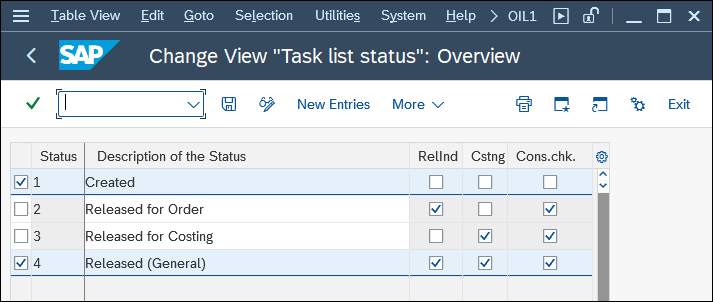
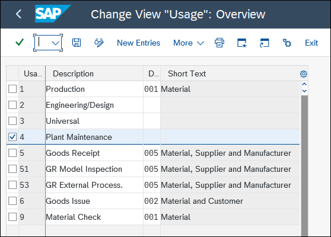
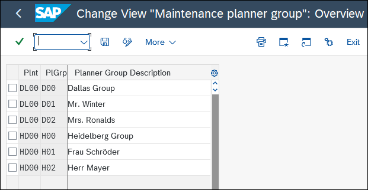
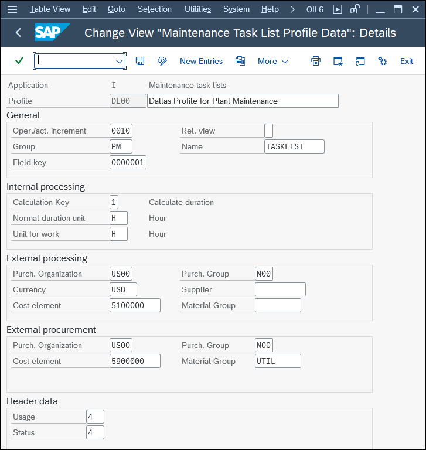
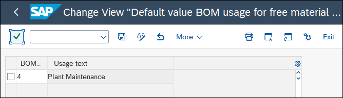
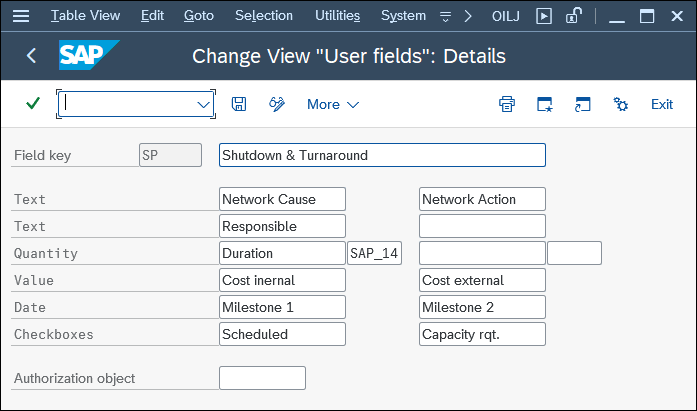
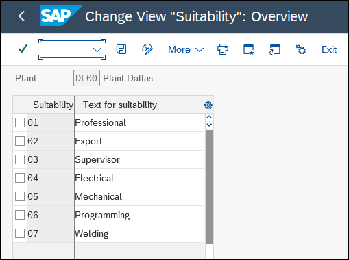
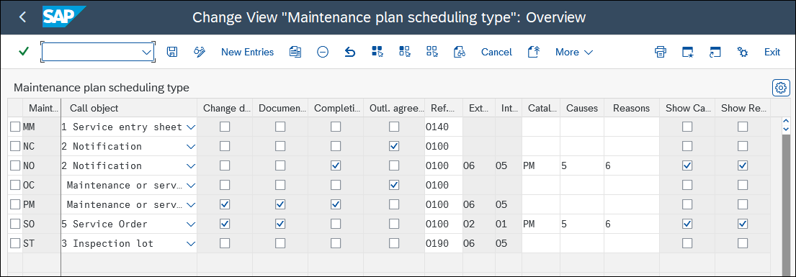
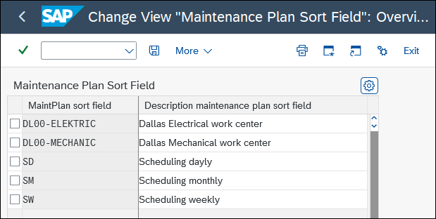
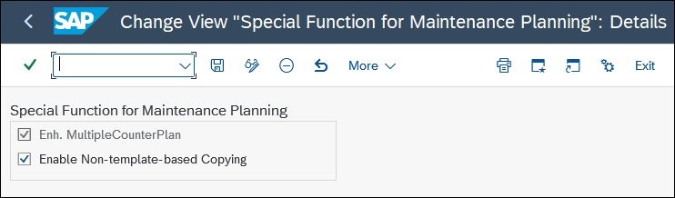

# Chapter 6: Configuring Preventive Maintenance

> Book: Configuring Plant Maintenance in SAP S/4HANA · pages 415–432 · 10 figures

## Figures

## 6.1 Task Lists

6.1 Task Lists A task list essentially describes activities (operations) and contains materials that are required during activity processing. From a maintenance perspective, there are three different types of task lists:  Equipment task list You create an equipment task list for exactly one piece of equipment if you want to map its specific features. However, you can only use this task list in connection with this one piece of equipment.  Functional location task list You create a functional location task list for exactly one functional location if you want to map its specific features. As with equipment task lists, you can only use this functional location task list in connection with this one functional location.  General maintenance task list A general maintenance task list isn’t object specific, which means that it isn’t assigned to any particular piece of equipment or functional location. In fact, you can indirectly make a general maintenance task list available for several pieces of equip- ment and/or functional locations. To do this, use the Construction Type field in the Structuring screen group in the master record for the piece of equipment or func- tional location. All pieces of equipment and functional locations for which a mate- rial number is entered in the Construction Type field can then access general maintenance task lists for which the same material number is entered in the Con- struction Type field in the general maintenance task list header. A task list comprises the following elements (see Figure 6.2):  Header data Header data is information that is used to identify and manage the task list. This data applies to the entire task list (e.g., number, group counter, plant, responsible work center).  Operations Operations are used to describe the work that is to be performed when implement- ing the task list.  Material list The material list contains spare parts that are required and consumed when imple- menting the task list.  Production resources/tools (PRTs) PRTs (e.g., tools, protective clothing, hand pallet trucks) are also required for imple- menting the task list. However, unlike materials, they aren’t consumed.  Inspection characteristics If inspections are to be conducted within an operation (e.g., inspections of length, weight, and function), you can define them as inspection characteristics. © 417 6.1 Task Lists  Maintenance packages If the task list is used in a strategy maintenance plan, you use maintenance packages to control the frequency with which the maintenance work is performed—either on a time-dependent basis (e.g., once every 3 months) or on a performance-dependent basis (e.g., once every 1,200 operating hours). Figure 6.2 Task List: Structure and Content The following Customizing functions are available for adjusting the management and use of task lists to your requirements. Maintain Task List Status You use this Customizing function to define which task list status you want to manage, and you then use the task list status to control whether the task list is still locked or to control the functions for which it’s released. Prerequisites There are no special prerequisites. Customizing Path Plant Maintenance and Customer Service • Maintenance Plans, Work Centers, Task Lists, and PRTs • Task Lists • General Data • Maintain Task List Status Transaction OIL1 E.g., document, material, equipment E.g., material, quantity, quantity unit, item category E.g., work center, control key, description, standard time, activity type, time tickets Operations Components Production resources/ tools E.g., master inspection characteristic, target value, tolerance Inspection characteristics E.g., monthly, quarterly, annually Maintenance packages E.g., description, plant, object (equipment, functional location, assembly), maintenance strategy, priority Task list header 6 Configuring Preventive Maintenance 418 Settings The standard SAP delivery contains the following statuses, among others (see Figure 6.3):  1 Created Checking the box for this status doesn’t release the task lists for orders (RelInd) or costing (Cstng).  4 Released (General) Checking the box for this status releases the task lists for orders and costing. Figure 6.3 Task List: Status Task List Statuses 1 and 4 Usually Suffice If you nevertheless want to define your own statuses, make sure that you check the box to define at least one status that releases the task lists for both costing and orders. Define Task List Usage In the SAP system, task lists are used not only in SAP S/4HANA Asset Management but also in the following other areas of SAP S/4HANA:  Production planning for discrete industries, where they are used as routing or as ref- erence operation sets  Production planning for process industries, where they are used as master recipes  Project systems, where they are used as standard networks  Quality management, where they are used as inspection plans You use this Customizing function to define task list usages. Prerequisites There are no special prerequisites. © 419 6.1 Task Lists Customizing Path Plant Maintenance and Customer Service • Maintenance Plans, Work Centers, Task Lists, and PRTs • Task Lists • General Data • Define Task List Usage Settings The standard SAP delivery provides task list Usage 4 for Plant Maintenance (see Figure 6.4). Figure 6.4 Task List: Usage Task List Usage 4 Usually Suffices If you nevertheless want to define your own task list usages, make sure to make the right selection in all follow-up actions (e.g., when assigning the task list usage in the work center). Configure Planner Group You use this Customizing function to define the groups or persons responsible for maintaining task lists for each plant. Prerequisites You must maintain the plants beforehand. Customizing Path Plant Maintenance and Customer Service • Maintenance Plans, Work Centers, Task Lists, and PRTs • Task Lists • General Data • Configure Planner Group 6 Configuring Preventive Maintenance 420 Settings At the plant level, you can define descriptive or numeric planner groups that contain a maximum of three numbers or characters (see Figure 6.5). Figure 6.5 Task List: Planner Group Overview Not All Planner Groups Are the Same Note that the SAP system recognizes two different types of planner groups:  Planner group You assign this group as the responsible planner group to a task list at the header level.  Maintenance planner group You assign this group as the responsible planner group to a piece of equipment, functional location, notification, order, or maintenance item. Define Profiles with Default Values You use this Customizing function to maintain default values such as increment or unit. When you create a task list, you can call one of the profiles and transfer its values to the new task list as default values. Prerequisites If necessary, you must maintain the following values as default values beforehand:  Graphic profile (see the Network • Define Graphic Profiles Customizing function)  Field key for user fields (see the Define User Fields Customizing function)  Purchasing organization  Purchasing group  Vendor  Cost element © 421 6.1 Task Lists  Material group  Task list usage (see the Define Task List Usage Customizing function)  Task list status (see the Maintain Task List Status Customizing function) Customizing Path Plant Maintenance and Customer Service • Maintenance Plans, Work Centers, Task Lists, and PRTs • Task Lists • Control Data • Define Profiles with Default Values Transaction OIL6 Settings You can assign the following default values to a profile (see Figure 6.6):  Oper./act. increment Use this option to determine the number assignment for operations (generally, 0010).  Group and Name Use these two fields to assign a previously defined graphic profile so that you can create a network within a task list.  Field key Use this field to assign additional fields to the task list that are relatively freely defin- able and don’t exist in the standard system.  Calculation Key Use this field to control the relationship between the Work and Duration fields. Here, you have the following options: – 0 = Maintain manually – 1 = Calculate duration – 2 = Calculate work – 3 = Calculate no. of capacities  Unit for work Use this field to determine the units to be defined as default values for the Work and Duration fields.  External procurement In this field group, define default values for the purchasing organization, purchasing group, currency, vendor, cost element, and material group if an operation is pro- cessed externally.  Usage and Status Use these two fields to assign default values to the task list for task list usage and the task list status, respectively. 6 Configuring Preventive Maintenance 422 Figure 6.6 Task List: Profile with Default Values Define and Use Default Value Profiles Create different default value profiles so that your users don’t have to repeatedly enter the same data manually. Define Presetting for Free Assignment of Material In the maintenance task lists, you can use free material assignment, which means you don’t have to create a BOM beforehand. Instead, you can assign the materials directly to the task list. Purely for technical reasons, the system automatically generates a BOM in the background for the materials and the task list. Don’t use the normal dialog trans- actions (e.g., Transactions CS02, IB02, IB12) to maintain this BOM. Every BOM requires a BOM usage, and you use this Customizing function to define the BOM usage, which is assigned to those BOMs that are automatically generated by the system when you use free material assignment. © 423 6.1 Task Lists Prerequisites You must define the BOM usage beforehand (see the Define BOM Usages Customizing function). Customizing Path Plant Maintenance and Customer Service • Maintenance Plans, Work Centers, Task Lists, and PRTs • Task Lists • Control Data • Define Presetting for Free Assignment of Material Settings In the standard SAP delivery, the maintenance BOMs are assigned BOM Usg 4 (see Figure 6.7). Figure 6.7 Task List: Default Value for BOM Usage BOM Usage 4 Is Generally Used The only time you must enter a different BOM usage is when you define your own usages for maintenance BOMs. Define User Fields You can use this Customizing function to define fields that aren’t contained in the stan- dard system but are required in your maintenance task lists. You can then choose Ope- ration • User Data to call or assign these fields in the task list, and then, you can use the Define Profile with Default Values Customizing function to propose field keys. Prerequisites There are no special prerequisites. Customizing Path Plant Maintenance and Customer Service • Maintenance Plans, Work Centers, Task Lists, and PRTs • Task Lists • Operation Data • Define User Fields Transaction OILJ 6 Configuring Preventive Maintenance 424 Settings In particular, the following field types are available (see Figure 6.8):  Two 20-digit Text fields  Two 10-digit Text fields  Two Quantity fields  Two Value fields  Two Date fields  Two Checkboxes fields Figure 6.8 Task List: User Fields Maintain Suitabilities You use this Customizing function to define, for each plant, the requisite suitability for performing a particular activity. Then, on the Default Values in Work Center master data screen, you decide whether you want to define the suitability as a reference or as a default value in the task list. Otherwise, you can assign a suitability for each operation manually. Prerequisites You must define the plants beforehand. Customizing Path Plant Maintenance and Customer Service • Maintenance Plans, Work Centers, Task Lists, and PRTs • Task Lists • Operation Data • Maintain Suitabilities © 425

> _תרגום עברי בהכנה._

## 6.2 Maintenance Plans

6.2 Maintenance Plans Settings Figure 6.9 shows a sample list of potential suitabilities. In each case, you check the box to assign a two-digit Suitability number, and you enter a description (under Text for suitability) that contains a maximum of 30 characters. Figure 6.9 Task List: Suitabilities 6.2 Maintenance Plans SAP S/4HANA Asset Management provides you with maintenance plans that support the business processes associated with preventive maintenance. The following mainte- nance plan types are available for selection (see Figure 6.10):  Single cycle plans You create single cycle plans when you have to perform the same maintenance action tasks in full at regular intervals (time based or performance based). In this case, including a task list is optional.  Maintenance strategies and strategy plans You create maintenance strategies and strategy plans when you have to perform maintenance action tasks that are interrelated or supersede each other—either as a time-based strategy (e.g., every three, six, or twelve months) or as a performance- based strategy (e.g., every 10,000, 20,000, or 40,000 kilometers). In this case, you must include a task list, specifically one that pursues the same strategy as the main- tenance plan.  Multiple counter plans with one cycle You create multiple counter plans if determination of the maintenance date is dependent on several influencing factors (e.g., every 6 months, 10,000 kilometers, or 1,000 operation hours). Including a task list here is optional. 6 Configuring Preventive Maintenance 426  Multiple counter plans with multiple cycles Multiple counter plans with multiple cycles enable you to define several cycles that are based on one another as the following examples show: – Cycle set 1: every 1,000 operation hours, 5,000 miles, or 12 months – Cycle set 2: every 3,000 operation hours, 15,000 miles, or 36 months Including several task lists is necessary here.  Inspection rounds plans How do the functions for inspection rounds differ from those for maintenance plan- ning described in the previous sections? Maintenance planning usually involves a single object for which a series of activities, some rather complex, are to be executed. When it comes to inspection rounds, this occurs in the reverse direction. With an inspection round, you’ll process a large number of objects, executing the same or similar activities on each object. These activities aren’t usually overly complex and require the same tools, spare parts, and qualifications. You can map inspection rounds in the SAP system in two different ways: by using an object list (different objects but the same activity) or a task list (different objects and different activities). Figure 6.10 Maintenance Plans Overview The following Customizing functions are available for adapting the management and use of maintenance plans to your needs. Set Maintenance Plan Categories You use this Customizing function to define all the control parameters for the mainte- nance plans (the maintenance call object or reference object, among others). Prerequisites If you want to assign reasons and causes to maintenance items, you must activate busi- ness function LOG_EAM_CI_13. Multiple Counter Plan Inspection Round Plan Maintenance Plan One Cycle Multiple Cycles Time-Based Performance-Based Single Cycle Plan Strategy Plan Object List Task List © 427 6.2 Maintenance Plans Customizing Path Plant Maintenance and Customer Service • Maintenance Plans, Work Centers, Task Lists, and PRTs • Maintenance Plans • Set Maintenance Plan Categories Settings Figure 6.11 shows the potential call objects. You can use this setting (see Figure 6.12) to define which of the following maintenance call objects are to be called from the main- tenance plan when they are due:  <Blank> = Maintenance or service order Select this if you generate an order and want to execute the maintenance plan spec- ifications unchanged, without any further planning.  1 = Service entry sheet Select this if you have an outline agreement on regular services with an external company and you want the system to automatically generate, at regular intervals, the service entry sheets required for acceptance.  2 = Notification Select this if you want to perform other detailed planning when it’s due (e.g., if you want to combine several tasks into an order on the basis of the current capacity usage). In such cases, several task lists are then copied into a single order as an oper- ations list.  3 = Inspection lot Select this if you conduct stability studies in quality management and therefore require corresponding inspection lots at regular intervals. Figure 6.11 Maintenance Plan: Call Objects In addition to the maintenance call object, you can use the maintenance plan category to specify the following (see Figure 6.12):  Change document Check the box to set this indicator if you want to activate change documents. The change documents will later contain information for this maintenance plan category, Inspection Lot Call Object Order Notification Maintenance Plan Category Service Entry Sheet 6 Configuring Preventive Maintenance 428 such as who changed the maintenance plan, what change was made, and when the change was made.  Document release Check the box to set this indicator if you want to activate change documents when a maintenance call is released. The change documents will later contain information for this maintenance plan category, such as who released the maintenance call from the maintenance plan, which maintenance call was released, and when the mainte- nance call was released. Figure 6.12 Maintenance Plan Categories  Completion data Check the box to set this indicator so you can do the following: – When you complete one of the maintenance call objects (e.g., notification or order) generated from a maintenance plan, you can enter a reference time that applies to the maintenance plan only. – When you complete a notification or order, the fields related to the maintenance plan, Completion date and Completion time, are also displayed, and you can use that data as a basis for future maintenance plan scheduling. These fields are pre- filled with the original planned date and the current time. If, however, the original planned date lies in the future, the system date is proposed.  Outl. agreement Check the box to set this indicator to establish a reference to an outline agreement within the maintenance plan (e.g., if you call service entry sheets).  Ref. object Set this to define the technical object that you want to assign to the maintenance item: – O100 = Functional location + piece of equipment + assembly – O110 = Equipment + assembly – O120 = Functional location (30) + equipment + assembly © 429 6.2 Maintenance Plans – O130 = Serial number + material number + device data – O140 = Without a reference object – O150 = Equipment only – O160 = Functional location only – O170 = Equipment + serial number + material number – O180 = Functional location 1:1 + equipment + assembly – O190 = Physical sample A new functionality comes up with business function LOG_EAM_CI_13: each mainte- nance plan is created for some reasons and addresses a certain cause that has an impact on the deterioration mechanism of equipment or functional locations. If cause and rea- son aren’t captured and documented well, it is quite challenging to evaluate the effec- tiveness of preventive tasks. Inefficient preventive measures will affect too much or too little maintenance intensity, which may result in unnecessary costs. To enable this feature, you have to configure the maintenance plan category indicating which default Catalog profile would be used for a maintenance plan, which catalog type would be used for documenting reasons, and which would be used for documenting causes. In the example shown in Figure 6.12, there is a maintenance plan category NO that allows users to capture reasons and causes. Here, the default catalog profile is PM, the default catalog type for causes is 5, and the default catalog type for reasons is 6. Recommendations Concerning the Maintenance Plan Category The following settings are used most often:  Maintenance or service order call object  Change documents (Change document and Document release)  Completion data  Ref. object (functional location and/or equipment) Define Sort Fields for Maintenance Plan You use this Customizing function to define the potential content of the sort field for the maintenance plan. You assign the sort field to a maintenance plan on the Mainte- nance Plan: Additional Data tab (see the next section). The sort field then becomes an important grouping and selection criterion during maintenance plan scheduling (Transaction IP30H [Mass Scheduling Maintenance Plans] or program RISTRA20H). Prerequisites There are no special prerequisites. 6 Configuring Preventive Maintenance 430 Customizing Path Plant Maintenance and Customer Service • Maintenance Plans, Work Centers, Task Lists, and PRTs • Maintenance Plans • Define Sort Fields for Maintenance Plan Settings You can freely determine the sort field (see Figure 6.13) via the following categorization criteria:  Object type (e.g., PC, pump, engine, fleet object)  Scheduling frequency (daily, weekly, monthly)  Object location (e.g., country, plant, building) Figure 6.13 Maintenance Plan: Sort Field Configure Special Functions for Maintenance Planning This Customizing function offers you two options:  First, you can activate the enhanced multiple counter plan, which enables you to define several interrelated cycles, as illustrated previously in Figure 6.10. If you don’t activate this enhancement function, you can define only one cycle in the multiple counter plan (Transaction IP43 [Add Multiple Counter Plan]).  Second, you can activate the nontemplate copying of maintenance plans. If you don’t activate this enhancement function, you can only copy maintenance plans that you’ve characterized as Reference Maintenance Plan (Transactions IP41, IP42, and IP43 or menu path Create Maintenance Plan • Functions • Copy Template • Allow). Prerequisites If you want to copy maintenance plans, you must activate business function LOG_EAM_ CI_10. © 431

> _תרגום עברי בהכנה._

## 6.3 Summary

6.3 Summary Customizing Path Plant Maintenance and Customer Service • Maintenance Plans, Work Centers, Task Lists, and PRTs • Maintenance Plans • Configure Special Functions for Maintenance Planning Settings If you want to activate enhancement functions, check the boxes to set the Enh. Multi- pleCounterPlan indicator for the enhanced multiple counter plan and the Enable Non- template-based Copying indicator for the opportunity to copy all maintenance plans (see Figure 6.14). Figure 6.14 Maintenance Plan: Special Functions Take Care When Enhancing the Multiple Counter Plan After you check the box to set the Enh. MultipleCounterPlan indicator, you cannot uncheck it. However, there are no negative consequences if you set the indicator and don’t create any enhanced multiple counter plans. Enable Non-Template-Based Copying You should enable this option because it’s much easier to allow all maintenance plans as references than to characterize maintenance plans manually for reference plans. 6.3 Summary SAP S/4HANA Asset Management offers only a few Customizing functions for preven- tive maintenance. In this chapter, the focus was on the options available for adjusting task lists and maintenance plans to your requirements. The key takeaways from this chapter regarding preventive maintenance are as follows:  For task lists, you’ll configure task list status and task list usage. Normally you can stay with SAP’s standard values. 6 Configuring Preventive Maintenance 432  You’ll define maintenance plan categories that determine, for example, reference call objects, number assignments, completion information, causes and reasons assignments, and creation of change documents.  You can activate the enhanced multiple counter plan.  You can set all maintenance plans to be available as reference plans. ©

> _תרגום עברי בהכנה._

---
Source: Configuring Plant Maintenance in SAP S/4HANA pp.415-432
